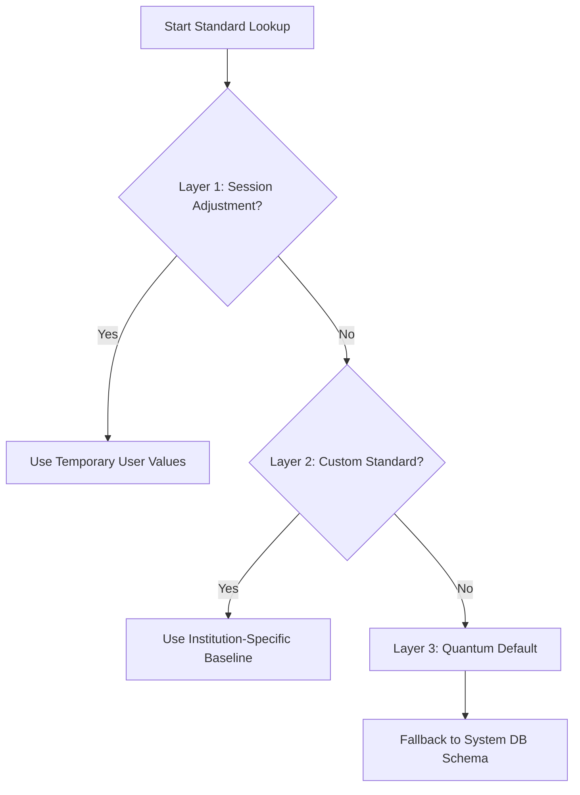
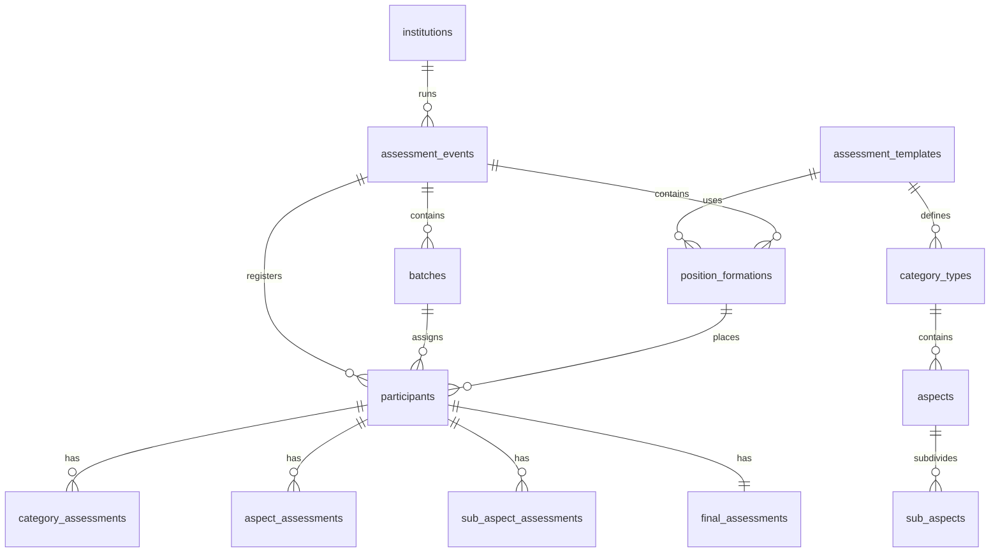

# SPSP (Sistem Pemetaan & Statistik Psikologi) Application Overview

SPSP is a **Business Intelligence (BI) assessment system** designed for large-scale psychological mapping and statistical analysis. Unlike standard CRUD applications, SPSP focuses on exploring, filtering, ranking, and simulating scenarios on top of preloaded historical assessment data.

---

## 🏗️ Core Business Concepts & Logic

### 1. The 3-Layer Priority System

SPSP calculates dynamic baselines (weights and standards) using a strict hierarchical priority system. Any lookup of aspect weights or standard ratings must proceed through this pipeline:

1. **Layer 1: Session Adjustment (Highest Priority)**
    - **Scope**: Temporary, per-user, stored in Session (`standard_adjustment.{template_id}`).
    - **Use Case**: Real-time "What-If" analysis (e.g., sliding weights, enabling/disabling aspects, adjusting tolerance).
2. **Layer 2: Custom Standard (Medium Priority)**
    - **Scope**: Permanent configuration in DB (`custom_standards` table).
    - **Use Case**: Institution-specific requirements (e.g., Kejaksaan prioritizes Integrity, while Kemenkumham prioritizes Leadership).
3. **Layer 3: Quantum Default (Lowest Priority)**
    - **Scope**: Default baseline values stored in `aspects` and `sub_aspects` tables.
    - **Use Case**: System baseline fallback.

### 2. Dual Category Assessment & Data-Driven Rating Calculation

Every assessment is divided into two category types:

1. **Potensi (Potential / Psychometric)**: Aspects contain sub-aspects. The aspect rating is calculated as the average rating of its active sub-aspects.
2. **Kompetensi (Competency)**: Aspects have **no sub-aspects**. Ratings are assigned directly at the aspect level.

---

## 🗄️ Database Structure

The database utilizes a relational schema to map institutions, events, and templates to candidate results:

### Table Definitions & Purpose

| Category                 | Table Name                                                                                                                              | Key Columns                                                                                       | Purpose                                                                 |
| :----------------------- | :-------------------------------------------------------------------------------------------------------------------------------------- | :------------------------------------------------------------------------------------------------ | :---------------------------------------------------------------------- |
| **Master Configuration** | [assessment_templates](file:///c:/laragon/www/spsp_new/database/migrations/2025_10_06_034104_create_assessment_templates_table.php)     | `id`, `code`, `name`                                                                              | Defines overall structure (e.g., Staff, Supervisor, Manager templates). |
|                          | [category_types](file:///c:/laragon/www/spsp_new/database/migrations/2025_10_06_034112_create_category_types_table.php)                 | `id`, `template_id`, `code`, `weight_percentage`                                                  | Divisions within template (typically `potensi` and `kompetensi`).       |
|                          | [aspects](file:///c:/laragon/www/spsp_new/database/migrations/2025_10_06_034116_create_aspects_table.php)                               | `id`, `template_id`, `category_type_id`, `code`, `weight_percentage`, `standard_rating`           | Individual dimensions (e.g., Integritas, Kecerdasan).                   |
|                          | [sub_aspects](file:///c:/laragon/www/spsp_new/database/migrations/2025_10_06_034121_create_sub_aspects_table.php)                       | `id`, `aspect_id`, `code`, `standard_rating`                                                      | Sub-dimensions (used for Potensi/Psychometrics calculations).           |
| **Tenant / Events**      | [institutions](file:///c:/laragon/www/spsp_new/database/migrations/2025_10_06_034049_create_institutions_table.php)                     | `id`, `code`, `name`                                                                              | Multiple tenancy owner (e.g., Kemenkes, BKN).                           |
|                          | [assessment_events](file:///c:/laragon/www/spsp_new/database/migrations/2025_10_06_034358_create_assessment_events_table.php)           | `id`, `institution_id`, `code`, `name`, `status`                                                  | Assessment occurrences.                                                 |
|                          | [batches](file:///c:/laragon/www/spsp_new/database/migrations/2025_10_06_034411_create_batches_table.php)                               | `id`, `event_id`, `code`, `name`                                                                  | Batches within events.                                                  |
|                          | [position_formations](file:///c:/laragon/www/spsp_new/database/migrations/2025_10_06_034415_create_position_formations_table.php)       | `id`, `event_id`, `template_id`, `code`, `quota`                                                  | Formations link positions to their specific assessment templates.       |
| **Participants & Data**  | [participants](file:///c:/laragon/www/spsp_new/database/migrations/2025_10_06_034700_create_participants_table.php)                     | `id`, `event_id`, `batch_id`, `position_formation_id`, `name`, `test_number`                      | Candidate registry (approx. 46,100 total participants in DB).           |
|                          | [category_assessments](file:///c:/laragon/www/spsp_new/database/migrations/2025_10_06_034701_create_category_assessments_table.php)     | `id`, `participant_id`, `category_type_id`, `total_individual_score`                              | Calculated category-level aggregates.                                   |
|                          | [aspect_assessments](file:///c:/laragon/www/spsp_new/database/migrations/2025_10_06_034702_create_aspect_assessments_table.php)         | `id`, `participant_id`, `aspect_id`, `individual_rating`, `individual_score`                      | Pre-calculated historical ratings per aspect.                           |
|                          | [sub_aspect_assessments](file:///c:/laragon/www/spsp_new/database/migrations/2025_10_06_034703_create_sub_aspect_assessments_table.php) | `id`, `aspect_assessment_id`, `sub_aspect_id`, `individual_rating`                                | Assessor-scored sub-aspect ratings.                                     |
|                          | [final_assessments](file:///c:/laragon/www/spsp_new/database/migrations/2025_10_06_034704_create_final_assessments_table.php)           | `id`, `participant_id`, `total_individual_score`, `achievement_percentage`                        | Total weighted score (Potensi + Kompetensi).                            |
| **Customizations**       | [custom_standards](file:///c:/laragon/www/spsp_new/database/migrations/2025_11_20_040349_create_custom_standards_table.php)             | `id`, `institution_id`, `template_id`, `category_weights`, `aspect_configs`, `sub_aspect_configs` | Stores custom baselines (Layer 2) in JSON format.                       |

---

## 💻 Core Application Services

SPSP relies on isolated service classes to handle operations, preventing code duplication:

1. **[DynamicStandardService](file:///c:/laragon/www/spsp_new/app/Services/DynamicStandardService.php)**
    - Manages retrieval of weights and ratings by resolving the 3-Layer priority.
    - Handles user-driven temporary session modifications.
2. **[RankingService](file:///c:/laragon/www/spsp_new/app/Services/RankingService.php)**
    - Single source of truth for sorting and generating bulk rankings.
    - Uses **`toBase()` queries** to fetch raw database data as lightweight stdClass objects instead of hydrating Eloquent models, optimizing performance for large collections (e.g., 4,905 candidates loaded in ~1.5s).
    - Caches raw scores under a config hash incorporating the active template structure, weights, and session identifier.
    - Dynamically applies tolerance offsets post-cache for immediate UI responsiveness.
3. **[AspectCacheService](file:///c:/laragon/www/spsp_new/app/Services/Cache/AspectCacheService.php)**
    - Implements request-scoped, in-memory caching for aspects and sub-aspects to solve N+1 query bottlenecks during rendering and calculations.
4. **[TalentPoolService](file:///c:/laragon/www/spsp_new/app/Services/TalentPoolService.php)**
    - Manages classification of participants into a **9-Box Performance Matrix** utilizing dynamic boundaries based on statistical distributions (mean ± standard deviation).
5. **[ConclusionService](file:///c:/laragon/www/spsp_new/app/Services/ConclusionService.php)**
    - Determines whether scores/gaps place candidates into `above_standard`, `meets_standard`, or `below_standard`.

---

## 🌐 Livewire User Interface Pages & Routing

SPSP uses Laravel Livewire (v4.3) to provide a reactive, single-page application experience. Key pages include:

- **Rankings & Summary Maps**
    - `rekap-ranking-assessment`: Displays the combined overall rankings of candidates.
    - `ranking-psy-mapping`: Focuses specifically on Potential (Psychometric) rankings.
    - `ranking-mc-mapping`: Focuses specifically on Competency rankings.
- **Baseline Editors**
    - `standard-psikometrik`: Interface for managing/adjusting Potential category baselines.
    - `standard-mc`: Interface for managing/adjusting Competency category baselines.
    - `custom-standards`: Admin CRUD for saving Layer 2 configurations.
- **Individual Diagnostic Reports**
    - `general-mapping`: Breakdown of both Potential and Competency dimensions for a candidate.
    - `spider-plot`: Radar chart visualization comparing individual ratings vs standards.
    - `general-mc-mapping` / `general-psy-mapping`: Isolated detail analysis.
- **Specialized Analytics**
    - `talentpool`: Render of the 9-box performance grid for candidate discovery.
    - `training-recommendation`: Automatically recommends training workshops based on candidate competency gaps.
