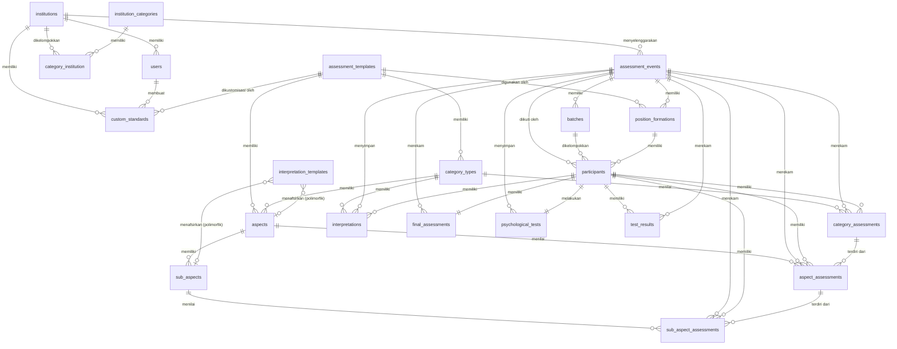

# Dokumentasi Struktur Database & ERD - SPSP Assessment System

> **Versi**: 2.0 (Terbaru)  
> **Terakhir Diperbarui**: 2026-07-01  
> **Tujuan**: Referensi lengkap untuk skema database, hubungan antar tabel, representasi ERD, dan aliran data sistem SPSP.

---

## Daftar Isi

1. [Gambaran Umum](#gambaran-umum)
2. [Diagram Hubungan Entitas (ERD)](#diagram-hubungan-entitas-erd)
3. [Tabel Master Data (Struktur & Template)](#1-tabel-master-data-struktur--template)
4. [Tabel Manajemen Event & Peserta](#2-tabel-manajemen-event--peserta)
5. [Tabel Hasil & Agregasi Penilaian (BI Workloads)](#3-tabel-hasil--agregasi-penilaian-bi-workloads)
6. [Tabel Konfigurasi Kustom, Tes Fisik, & Interpretasi AI](#4-tabel-konfigurasi-kustom-tes-fisik--interpretasi-ai)
7. [Tabel Pengguna & Multi-Tenancy](#5-tabel-pengguna--multi-tenancy)
8. [Panduan Relasi & Aliran Kalkulasi](#panduan-relasi--aliran-kalkulasi)

---

## Gambaran Umum

Sistem SPSP (Sistem Pemetaan & Statistik Psikologi) menggunakan **arsitektur data berorientasi BI (Business Intelligence)**. Database dirancang untuk mendukung kueri analitik cepat pada data historis statis yang di-import dari sistem Quantum. 

Sistem ini memiliki karakteristik utama sebagai berikut:
- **Template-Based**: Struktur penilaian didasarkan pada template standar (misalnya: Staff, Supervisor, Manager).
- **Dual Category**: Setiap template terbagi menjadi dua kategori utama: **Potensi** (Psikometrik) dan **Kompetensi** (Behavioral).
- **Hierarki 3 Tingkat**: Template → Kategori → Aspek → Sub-Aspek.
  - *Aspek Potensi* memiliki sub-aspek (nilai aspek dihitung dari rata-rata sub-aspek).
  - *Aspek Kompetensi* tidak memiliki sub-aspek (nilai aspek diinput secara langsung).
- **Imutabilitas Data**: Nilai mentah dari asesmen peserta bersifat permanen (immutable), sedangkan bobot, standar kelulusan, dan status aktif aspek dapat diubah dinamis via standard overlay (Layered Priority System).

---

## Diagram Hubungan Entitas (ERD)

Berikut adalah visualisasi hubungan antar tabel (Entity Relationship Diagram) di SPSP menggunakan Mermaid:



---

## 1. Tabel Master Data (Struktur & Template)

### `assessment_templates`
Mendefinisikan tipe standar jabatan/template dasar asesmen.

| Kolom | Tipe | Nullable | Deskripsi |
| :--- | :--- | :--- | :--- |
| `id` | bigint | No | Primary Key |
| `code` | varchar(255) | No | Kode unik template (e.g., `staff_standard_v1`) |
| `name` | varchar(255) | No | Nama tampilan template |
| `description` | text | Yes | Deskripsi atau penjelasan mengenai target jabatan |
| `created_at` / `updated_at` | timestamp | Yes | Audit timestamps |

*Contoh Data*:
```json
{
  "id": 1,
  "code": "staff_standard_v1",
  "name": "Standar Asesmen Staff",
  "description": "Template untuk posisi staff/staf (entry level). Fokus balanced antara potensi dan kompetensi dasar. Potensi 50%, Kompetensi 50%."
}
```

---

### `category_types`
Menyimpan kategori utama di dalam template. Secara default bernilai `potensi` (psikometrik) dan `kompetensi` (behavioral).

| Kolom | Tipe | Nullable | Deskripsi |
| :--- | :--- | :--- | :--- |
| `id` | bigint | No | Primary Key |
| `template_id` | bigint | No | Foreign Key ke `assessment_templates.id` |
| `code` | varchar(255) | No | Kode kategori (`potensi` atau `kompetensi`) |
| `name` | varchar(255) | No | Nama kategori untuk UI |
| `weight_percentage` | int | No | Bobot default kategori dalam presentase (e.g. 50, 60, dll) |
| `order` | int | No | Urutan tampilan di UI |

*Contoh Data*:
```json
{
  "id": 1,
  "template_id": 1,
  "code": "potensi",
  "name": "Potensi",
  "weight_percentage": 50,
  "order": 1
}
```

---

### `aspects`
Menyimpan aspek-aspek penilaian di bawah setiap kategori.

| Kolom | Tipe | Nullable | Deskripsi |
| :--- | :--- | :--- | :--- |
| `id` | bigint | No | Primary Key |
| `template_id` | bigint | No | Foreign Key ke `assessment_templates.id` |
| `category_type_id` | bigint | No | Foreign Key ke `category_types.id` |
| `code` | varchar(255) | No | Kode unik aspek (e.g., `intelektual`) |
| `name` | varchar(255) | No | Nama aspek |
| `description` | text | Yes | Deskripsi aspek |
| `weight_percentage` | int | Yes | Bobot aspek dalam kategorinya |
| `standard_rating` | decimal(5,2) | Yes | Nilai standar kelulusan default (1.00 - 5.00) |
| `order` | int | No | Urutan tampilan |

*Contoh Data*:
```json
{
  "id": 1,
  "template_id": 1,
  "category_type_id": 1,
  "code": "intelektual",
  "name": "Intelektual",
  "description": "Mengukur kemampuan berpikir, analisa, logika, dan kreativitas dalam penyelesaian masalah.",
  "weight_percentage": 25,
  "standard_rating": "3.00",
  "order": 1
}
```

---

### `sub_aspects`
Menyimpan sub-aspek penunjang aspek utama (Hanya untuk aspek dari kategori `potensi`).

| Kolom | Tipe | Nullable | Deskripsi |
| :--- | :--- | :--- | :--- |
| `id` | bigint | No | Primary Key |
| `aspect_id` | bigint | No | Foreign Key ke `aspects.id` |
| `code` | varchar(255) | No | Kode unik sub-aspek (e.g., `kecerdasan_umum`) |
| `name` | varchar(255) | No | Nama sub-aspek |
| `description` | text | Yes | Penjelasan detail sub-aspek |
| `standard_rating` | int | Yes | Nilai standar default (integer 1 - 5) |
| `order` | int | No | Urutan tampilan |

*Contoh Data*:
```json
{
  "id": 1,
  "aspect_id": 1,
  "code": "kecerdasan_umum",
  "name": "Kecerdasan Umum",
  "description": "Kemampuan intelektual secara umum",
  "standard_rating": 3,
  "order": 1
}
```

---

## 2. Tabel Manajemen Event & Peserta

### `assessment_events`
Mendefinisikan event/proyek asesmen yang diadakan oleh suatu instansi.

| Kolom | Tipe | Nullable | Deskripsi |
| :--- | :--- | :--- | :--- |
| `id` | bigint | No | Primary Key |
| `institution_id` | bigint | No | Foreign Key ke `institutions.id` |
| `code` | varchar(255) | No | Kode event unik (e.g., `P3K-KEJAKSAAN-2025`) |
| `name` | varchar(255) | No | Nama kegiatan |
| `description` | text | Yes | Keterangan tambahan event |
| `year` | int | No | Tahun penyelenggaraan |
| `start_date` | date | No | Tanggal mulai event |
| `end_date` | date | No | Tanggal selesai event |
| `status` | enum | No | Status event (`draft`, `ongoing`, `completed`) |
| `last_synced_at` | timestamp | Yes | Waktu sinkronisasi data terakhir dari API Quantum |

*Contoh Data*:
```json
{
  "id": 1,
  "institution_id": 1,
  "code": "P3K-KEJAKSAAN-2025",
  "name": "Seleksi P3K Kejaksaan 2025",
  "description": "Assessment P3K untuk Kejaksaan RI tahun 2025",
  "year": 2025,
  "start_date": "2025-09-01",
  "end_date": "2025-12-31",
  "status": "completed"
}
```

---

### `batches`
Gelombang/kelompok jadwal tes peserta dalam satu event.

| Kolom | Tipe | Nullable | Deskripsi |
| :--- | :--- | :--- | :--- |
| `id` | bigint | No | Primary Key |
| `event_id` | bigint | No | Foreign Key ke `assessment_events.id` |
| `code` | varchar(255) | No | Kode gelombang |
| `name` | varchar(255) | No | Nama gelombang |
| `location` | varchar(255) | No | Lokasi penyelenggaraan tes |
| `batch_number` | int | No | Urutan gelombang |
| `start_date` | date | No | Tanggal tes dimulai |
| `end_date` | date | No | Tanggal tes berakhir |

*Contoh Data*:
```json
{
  "id": 1,
  "event_id": 1,
  "code": "BATCH-1-MOJOKERTO",
  "name": "Gelombang 1 - Mojokerto",
  "location": "Mojokerto",
  "batch_number": 1,
  "start_date": "2025-09-27",
  "end_date": "2025-09-28"
}
```

---

### `position_formations`
Daftar jabatan/formasi lowongan yang dibuka dalam suatu event. Relasi krusial yang mengikat formasi dengan `assessment_templates` dasar.

| Kolom | Tipe | Nullable | Deskripsi |
| :--- | :--- | :--- | :--- |
| `id` | bigint | No | Primary Key |
| `event_id` | bigint | No | Foreign Key ke `assessment_events.id` |
| `template_id` | bigint | No | Foreign Key ke `assessment_templates.id` |
| `code` | varchar(255) | No | Kode formasi jabatan |
| `name` | varchar(255) | No | Nama formasi jabatan |
| `quota` | int | Yes | Kuota formasi yang tersedia |

*Contoh Data*:
```json
{
  "id": 1,
  "event_id": 1,
  "template_id": 4,
  "code": "fisikawan_medis",
  "name": "Fisikawan Medis",
  "quota": 20
}
```

---

### `participants`
Data diri lengkap peserta ujian yang mengikuti event tertentu.

| Kolom | Tipe | Nullable | Deskripsi |
| :--- | :--- | :--- | :--- |
| `id` | bigint | No | Primary Key |
| `event_id` | bigint | No | Foreign Key ke `assessment_events.id` |
| `batch_id` | bigint | Yes | Foreign Key ke `batches.id` (nullable) |
| `position_formation_id` | bigint | No | Foreign Key ke `position_formations.id` |
| `username` | varchar(255) | No | Username unik peserta |
| `test_number` | varchar(255) | No | Nomor ujian peserta (unik) |
| `skb_number` | varchar(255) | No | Nomor SKB peserta |
| `name` | varchar(255) | No | Nama lengkap peserta |
| `email` | varchar(255) | Yes | Alamat email peserta |
| `phone` | varchar(255) | Yes | Nomor telepon |
| `gender` | varchar(255) | Yes | Jenis kelamin (`L` / `P`) |
| `photo_path` | varchar(255) | Yes | Path foto peserta |
| `assessment_date` | date | No | Tanggal pelaksanaan asesmen |

*Contoh Data*:
```json
{
  "id": 1,
  "event_id": 1,
  "batch_id": 1,
  "position_formation_id": 1,
  "username": "SRV01-000",
  "test_number": "68-7-2-34-00001",
  "skb_number": "24400240120000001",
  "name": "MARIADI ASTUTI, S.Kom",
  "email": "participant1@hotmail.com",
  "phone": "080459449674",
  "gender": "L",
  "photo_path": null,
  "assessment_date": "2026-06-15"
}
```

---

## 3. Tabel Hasil & Agregasi Penilaian (BI Workloads)

Tabel-tabel di bawah ini menyimpan data nilai individu peserta. Kolom standar (`standard_*`) di dalam tabel-tabel ini adalah **snapshot awal saat import**. Aplikasi SPSP membaca standar dinamis dari `DynamicStandardService` saat kalkulasi on-the-fly.

### `sub_aspect_assessments`
Menyimpan nilai mentah sub-aspek potensi peserta.

| Kolom | Tipe | Nullable | Deskripsi |
| :--- | :--- | :--- | :--- |
| `id` | bigint | No | Primary Key |
| `aspect_assessment_id` | bigint | No | Foreign Key ke `aspect_assessments.id` |
| `participant_id` | bigint | No | Foreign Key ke `participants.id` |
| `event_id` | bigint | No | Foreign Key ke `assessment_events.id` |
| `sub_aspect_id` | bigint | No | Foreign Key ke `sub_aspects.id` |
| `standard_rating` | int | No | Standar nilai default (dari snapshot) |
| `individual_rating` | int | No | Nilai yang dicapai peserta (1 - 5) |
| `rating_label` | varchar(255) | No | Label teks nilai (e.g. `Cukup`, `Kurang`, `Baik`) |

*Contoh Data*:
```json
{
  "id": 1,
  "aspect_assessment_id": 1,
  "participant_id": 1,
  "event_id": 1,
  "sub_aspect_id": 131,
  "standard_rating": 3,
  "individual_rating": 3,
  "rating_label": "Cukup"
}
```

---

### `aspect_assessments`
Menyimpan nilai aspek peserta (baik Potensi yang dirata-ratakan dari sub-aspek, maupun Kompetensi yang langsung dinilai).

| Kolom | Tipe | Nullable | Deskripsi |
| :--- | :--- | :--- | :--- |
| `id` | bigint | No | Primary Key |
| `category_assessment_id` | bigint | No | Foreign Key ke `category_assessments.id` |
| `participant_id` | bigint | No | Foreign Key ke `participants.id` |
| `event_id` | bigint | No | Foreign Key ke `assessment_events.id` |
| `batch_id` | bigint | Yes | Foreign Key ke `batches.id` |
| `position_formation_id` | bigint | Yes | Foreign Key ke `position_formations.id` |
| `aspect_id` | bigint | No | Foreign Key ke `aspects.id` |
| `standard_rating` | decimal(5,2) | No | Rating standar snapshot |
| `standard_score` | decimal(8,2) | No | Skor standar (standard_rating * bobot aspek) |
| `individual_rating` | decimal(5,2) | No | Rating aktual peserta |
| `individual_score` | decimal(8,2) | No | Skor aktual peserta (individual_rating * bobot aspek) |
| `gap_rating` | decimal(8,2) | No | Selisih rating (`individual_rating` - `standard_rating`) |
| `gap_score` | decimal(8,2) | No | Selisih skor (`individual_score` - `standard_score`) |
| `percentage_score` | int | Yes | Persentase pencapaian standar (e.g. 68) |
| `conclusion_code` | varchar(255) | Yes | Kode kesimpulan aspek (`meets_standard` / `below_standard` / `above_standard`) |
| `conclusion_text` | varchar(255) | Yes | Deskripsi kesimpulan aspek |

*Contoh Data*:
```json
{
  "id": 1,
  "category_assessment_id": 1,
  "participant_id": 1,
  "event_id": 1,
  "batch_id": 1,
  "position_formation_id": 1,
  "aspect_id": 43,
  "standard_rating": "3.00",
  "standard_score": "45.00",
  "individual_rating": "3.40",
  "individual_score": "51.00",
  "gap_rating": "0.40",
  "gap_score": "6.00",
  "percentage_score": 68,
  "conclusion_code": "meets_standard",
  "conclusion_text": "Memenuhi Standard"
}
```

---

### `category_assessments`
Agregasi skor pada tingkat Kategori (Potensi / Kompetensi).

| Kolom | Tipe | Nullable | Deskripsi |
| :--- | :--- | :--- | :--- |
| `id` | bigint | No | Primary Key |
| `participant_id` | bigint | No | Foreign Key ke `participants.id` |
| `event_id` | bigint | No | Foreign Key ke `assessment_events.id` |
| `batch_id` | bigint | Yes | Foreign Key ke `batches.id` |
| `position_formation_id` | bigint | Yes | Foreign Key ke `position_formations.id` |
| `category_type_id` | bigint | No | Foreign Key ke `category_types.id` |
| `total_standard_rating` | decimal(8,2) | No | Total standar rating dari semua aspek aktif |
| `total_standard_score` | decimal(8,2) | No | Total standar skor dari semua aspek aktif |
| `total_individual_rating` | decimal(8,2) | No | Total rating aktual peserta |
| `total_individual_score` | decimal(8,2) | No | Total skor aktual peserta |
| `gap_rating` | decimal(8,2) | No | Selisih total rating |
| `gap_score` | decimal(8,2) | No | Selisih total skor |
| `conclusion_code` | varchar(255) | No | Kode kelulusan kategori (e.g. `SK` = Sangat Kompeten, `K` = Kompeten) |
| `conclusion_text` | varchar(255) | No | Deskripsi teks kelulusan |

*Contoh Data*:
```json
{
  "id": 1,
  "participant_id": 1,
  "event_id": 1,
  "batch_id": 1,
  "position_formation_id": 1,
  "category_type_id": 7,
  "total_standard_rating": "27.00",
  "total_standard_score": "340.00",
  "total_individual_rating": "31.68",
  "total_individual_score": "398.48",
  "gap_rating": "4.68",
  "gap_score": "58.48",
  "conclusion_code": "SK",
  "conclusion_text": "SANGAT KOMPETEN"
}
```

---

### `final_assessments`
Hasil akhir penilaian gabungan (Potensi + Kompetensi) untuk setiap peserta. Hanya ada satu record final per peserta.

| Kolom | Tipe | Nullable | Deskripsi |
| :--- | :--- | :--- | :--- |
| `id` | bigint | No | Primary Key |
| `participant_id` | bigint | No | Foreign Key unik ke `participants.id` |
| `event_id` | bigint | No | Foreign Key ke `assessment_events.id` |
| `batch_id` | bigint | Yes | Foreign Key ke `batches.id` |
| `position_formation_id` | bigint | Yes | Foreign Key ke `position_formations.id` |
| `potensi_weight` | int | No | Bobot kategori Potensi saat itu (%) |
| `potensi_standard_score` | decimal(8,2) | No | Skor standar kategori Potensi |
| `potensi_individual_score` | decimal(8,2) | No | Skor aktual Potensi peserta |
| `kompetensi_weight` | int | No | Bobot kategori Kompetensi (%) |
| `kompetensi_standard_score` | decimal(8,2) | No | Skor standar kategori Kompetensi |
| `kompetensi_individual_score` | decimal(8,2) | No | Skor aktual Kompetensi peserta |
| `total_standard_score` | decimal(8,2) | No | Akumulasi total skor standar |
| `total_individual_score` | decimal(8,2) | No | Akumulasi total skor aktual peserta |
| `achievement_percentage` | decimal(5,2) | No | Persentase kecocokan final (`individual_score` / `standard_score` * 100) |
| `conclusion_code` | varchar(255) | No | Kode rekomendasi akhir (e.g. `K` = Kompeten, `C` = Cukup, `TK` = Tidak Kompeten) |
| `conclusion_text` | varchar(255) | No | Deskripsi rekomendasi akhir |

*Contoh Data*:
```json
{
  "id": 1,
  "participant_id": 1,
  "event_id": 1,
  "batch_id": 1,
  "position_formation_id": 1,
  "potensi_weight": 45,
  "potensi_standard_score": "340.00",
  "potensi_individual_score": "398.48",
  "kompetensi_weight": 55,
  "kompetensi_standard_score": "400.00",
  "kompetensi_individual_score": "475.00",
  "total_standard_score": "740.00",
  "total_individual_score": "873.48",
  "achievement_percentage": "118.04",
  "conclusion_code": "K",
  "conclusion_text": "KOMPETEN"
}
```

---

### `test_results`
Menyimpan respons data mentah (raw data) ujian online dari API Quantum HRMI per alat tes per peserta. Berfungsi sebagai Single Source of Truth sebelum data dikonversi ke rating 1-5 SPSP.

| Kolom | Tipe | Nullable | Deskripsi |
| :--- | :--- | :--- | :--- |
| `id` | bigint | No | Primary Key |
| `participant_id` | bigint | No | Foreign Key ke `participants.id` |
| `event_id` | bigint | No | Foreign Key ke `assessment_events.id` |
| `test_code` | varchar(50) | No | Kode alat tes (e.g. `A.1`, `B.2`, `D.2`) |
| `test_name` | varchar(255) | No | Nama alat tes dari API (e.g. "Typical CFIT3A") |
| `test_category` | varchar(100) | No | Kategori/tipe tes (e.g. "Kecerdasan / IQ") |
| `status` | varchar(20) | No | Status tes (`completed` / `incomplete`) |
| `test_started_at` | timestamp | Yes | Waktu mulai tes |
| `summary_data` | json | No | Skor akhir kuantitatif/numerik hasil parser |
| `interpretation_data` | json | Yes | Teks interpretasi deskriptif & saran pengembangan |
| `raw_response` | json | No | Backup respons asli API (minus detail Kraeplin) |
| `conversion_status` | enum | No | Status konversi rating (`pending`, `converted`, `skipped`, `not_applicable`) |
| `converted_at` | timestamp | Yes | Waktu ketika data dikonversi ke rating SPSP |

*Contoh Data*:
```json
{
  "id": 1,
  "participant_id": 15436,
  "event_id": 1,
  "test_code": "A.1",
  "test_name": "Typical CFIT3A",
  "test_category": "Kecerdasan / IQ",
  "status": "completed",
  "test_started_at": "2025-11-28 08:23:27",
  "summary_data": {
    "iq": 70,
    "total": 12,
    "kategori": "Borderline",
    "hasil_sub": {
      "sub1": {"nilai": 4, "rating": 2, "deskripsi": "Kurang", "persentase": 30.76, "total_soal": 13}
    }
  },
  "interpretation_data": {
    "interpretasi_hasil": {
      "Kecerdasan Umum": "Kategori ini berada di ambang batas antara fungsi intelektual rendah..."
    }
  },
  "raw_response": {
    "iq": 70,
    "total": 12,
    "kategori": "Borderline"
  },
  "conversion_status": "pending",
  "converted_at": null
}
```

---

## 4. Tabel Konfigurasi Kustom, Tes Fisik, & Interpretasi AI

### `custom_standards`
Menyimpan modifikasi (overlay) bobot dan nilai standar yang disesuaikan oleh instansi (client) secara permanen.

| Kolom | Tipe | Nullable | Deskripsi |
| :--- | :--- | :--- | :--- |
| `id` | bigint | No | Primary Key |
| `institution_id` | bigint | No | Foreign Key ke `institutions.id` |
| `template_id` | bigint | No | Foreign Key ke `assessment_templates.id` |
| `code` | varchar(255) | No | Kode kustom standar unik untuk instansi |
| `name` | varchar(255) | No | Nama kustom standar (e.g. "Standar Kejaksaan Agung Khusus") |
| `description` | text | Yes | Keterangan standar kustom |
| `category_weights` | json | No | Kustomisasi bobot kategori Potensi & Kompetensi |
| `aspect_configs` | json | No | Kustomisasi bobot, standar rating, dan status aktif aspek |
| `sub_aspect_configs` | json | No | Kustomisasi standar rating dan status aktif sub-aspek |
| `is_active` | tinyint | No | Menyatakan apakah standar aktif (1/0) |
| `created_by` | bigint | Yes | ID user pembuat standar (`users.id`) |

*Contoh Data*:
```json
{
  "id": 1,
  "institution_id": 1,
  "template_id": 1,
  "code": "std_kustom_kejaksaan_2026",
  "name": "Standard Kustom Kejaksaan 2026",
  "description": "Standar penyesuaian khusus formasi analis hukum",
  "category_weights": {
    "potensi": 60,
    "kompetensi": 40
  },
  "aspect_configs": {
    "intelektual": {
      "weight": 30,
      "active": true
    },
    "komunikasi": {
      "weight": 10,
      "rating": 4.0,
      "active": true
    }
  },
  "sub_aspect_configs": {
    "kecerdasan_umum": {
      "rating": 4,
      "active": true
    },
    "daya_analisa": {
      "rating": 3,
      "active": false
    }
  },
  "is_active": 1,
  "created_by": 2
}
```

---

### `psychological_tests`
Menyimpan data mentah tes psikologi tambahan, seperti hasil tes klinis, tingkat stres, dan detail psikogram.

| Kolom | Tipe | Nullable | Deskripsi |
| :--- | :--- | :--- | :--- |
| `id` | bigint | No | Primary Key |
| `event_id` | bigint | No | Foreign Key ke `assessment_events.id` |
| `participant_id` | bigint | No | Foreign Key ke `participants.id` |
| `no_test` | varchar(30) | Yes | Nomor tes |
| `username` | varchar(100) | Yes | Username peserta |
| `validitas` | text | Yes | Hasil validitas tes |
| `internal` | text | Yes | Hasil deskripsi profil internal peserta |
| `interpersonal` | text | Yes | Keterangan kecakapan interpersonal |
| `kap_kerja` | text | Yes | Kapasitas kerja peserta |
| `klinik` | text | Yes | Catatan klinis |
| `kesimpulan` | text | Yes | Kesimpulan psikologis |
| `psikogram` | text | Yes | JSON array berisi poin-poin psikogram |
| `nilai_pq` | decimal(10,2) | Yes | Nilai Psychological Quotient (PQ) |
| `tingkat_stres` | varchar(20) | Yes | Tingkat stres (`Rendah`, `Sedang`, `Tinggi`) |

*Contoh Data*:
```json
{
  "id": 1,
  "event_id": 1,
  "participant_id": 1,
  "no_test": "68-7-2-34-00001",
  "username": "SRV01-000",
  "validitas": "Valid - Hasil tes dapat dipercaya dan akurat",
  "internal": "Memiliki kemampuan internal yang sangat baik dengan potensi tinggi...",
  "interpersonal": "Keterampilan interpersonal yang sangat baik...",
  "kap_kerja": "Kapasitas kerja tinggi dengan kemampuan menyelesaikan tugas kompleks secara efisien",
  "klinik": "Tidak ada indikasi klinis yang signifikan, kondisi psikologis stabil",
  "kesimpulan": "Kandidat dengan performa tinggi, memiliki potensi untuk posisi leadership",
  "psikogram": {
    "Leadership": "Sangat Baik",
    "Problem Solving": "Sangat Baik",
    "Adaptability": "Baik"
  },
  "nilai_pq": "90.51",
  "tingkat_stres": "Rendah"
}
```

---

### `interpretations`
Menyimpan narasi laporan interpretasi hasil asesmen per kategori untuk peserta.

| Kolom | Tipe | Nullable | Deskripsi |
| :--- | :--- | :--- | :--- |
| `id` | bigint | No | Primary Key |
| `participant_id` | bigint | No | Foreign Key ke `participants.id` |
| `event_id` | bigint | No | Foreign Key ke `assessment_events.id` |
| `category_type_id` | bigint | Yes | Foreign Key ke `category_types.id` (nullable) |
| `interpretation_text` | text | No | Teks narasi interpretasi |

*Contoh Data*:
```json
{
  "id": 1,
  "participant_id": 1,
  "event_id": 1,
  "category_type_id": 7,
  "interpretation_text": "Memiliki potensi yang sangat baik dengan kemampuan di atas rata-rata dalam berbagai aspek. Kandidat menunjukkan kecenderungan untuk berkembang pesat dan mampu mengatasi tantangan kompleks."
}
```

---

### `interpretation_templates`
Menyimpan template narasi interpretasi dinamis berdasarkan pencapaian skor/rating. Menggunakan relasi **polimorfik** ke `aspects` atau `sub_aspects`.

| Kolom | Tipe | Nullable | Deskripsi |
| :--- | :--- | :--- | :--- |
| `id` | bigint | No | Primary Key |
| `interpretable_type` | enum | No | Jenis target penafsiran (`sub_aspect` atau `aspect`) |
| `interpretable_id` | bigint | Yes | ID target (`aspects.id` atau `sub_aspects.id`) |
| `interpretable_name` | varchar(255) | Yes | Nama aspek/sub-aspek (opsi pencocokan fleksibel) |
| `rating_value` | tinyint | No | Rating pencapaian (1 - 5) yang memicu template ini |
| `template_text` | text | No | Narasi penjelasan hasil template |
| `tone` | enum | No | Nada narasi (`positive`, `neutral`, `negative`) |
| `category` | enum | No | Klasifikasi narasi (`strength`, `development_area`, `neutral`) |
| `version` | varchar(10) | No | Versi template |
| `is_active` | tinyint | No | Status aktif template (1/0) |

*Contoh Data*:
```json
{
  "id": 1,
  "interpretable_type": "sub_aspect",
  "interpretable_id": null,
  "interpretable_name": "Kepekaan Interpersonal",
  "rating_value": 2,
  "template_text": "Kepekaan interpersonal yang dimiliki individu masih perlu ditingkatkan. Individu terkadang kesulitan dalam memahami kebutuhan orang-orang yang ada di sekitarnya sehingga responnya kurang sesuai dengan harapan.",
  "tone": "neutral",
  "category": "development_area",
  "version": "v2.0",
  "is_active": 1
}
```

---

## 5. Tabel Pengguna & Multi-Tenancy

Sistem SPSP mengisolasi data antar instansi (client) menggunakan mekanisme **Multi-Tenancy berbasis kolom** (`institution_id`).

### `users`
Tabel pengguna pengelola sistem.

| Kolom | Tipe | Nullable | Deskripsi |
| :--- | :--- | :--- | :--- |
| `id` | bigint | No | Primary Key |
| `institution_id` | bigint | Yes | Foreign Key ke `institutions.id`. Jika `NULL`, maka pengguna adalah **Quantum Admin (Superadmin)**. |
| `name` | varchar(255) | No | Nama lengkap pengguna |
| `email` | varchar(255) | No | Email pengguna (Unique) |
| `email_verified_at` | timestamp | Yes | Waktu verifikasi email |
| `password` | varchar(255) | No | Hash password |
| `is_active` | tinyint | No | Status aktif pengguna (1/0) |
| `last_login_at` | timestamp | Yes | Waktu login terakhir |
| `remember_token` | varchar(100) | Yes | Token autentikasi Laravel |

*Contoh Data*:
```json
{
  "id": 1,
  "institution_id": null,
  "name": "Admin User",
  "email": "admin@example.com",
  "is_active": 1,
  "last_login_at": "2026-06-30 08:09:07"
}
```

---

### `institutions`
Instansi client penyewa SaaS SPSP.

| Kolom | Tipe | Nullable | Deskripsi |
| :--- | :--- | :--- | :--- |
| `id` | bigint | No | Primary Key |
| `code` | varchar(255) | No | Kode unik instansi (e.g. `kejaksaan`, `kemenkes`) |
| `name` | varchar(255) | No | Nama lengkap instansi |
| `logo_path` | varchar(255) | Yes | Path file logo instansi |
| `api_key` | varchar(255) | No | API Key untuk autentikasi integrasi data |

*Contoh Data*:
```json
{
  "id": 1,
  "code": "kejaksaan",
  "name": "Kejaksaan Agung RI",
  "logo_path": "logos/kejaksaan.png",
  "api_key": "4x470qTGHZoJe92TuY0cEAl0bv6UWJ5W"
}
```

---

### `institution_categories`
Daftar pengelompokan instansi (e.g. Kementerian, BUMN, Pemda).

| Kolom | Tipe | Nullable | Deskripsi |
| :--- | :--- | :--- | :--- |
| `id` | bigint | No | Primary Key |
| `code` | varchar(255) | No | Kode kelompok instansi |
| `name` | varchar(255) | No | Nama kelompok instansi |
| `description` | text | Yes | Keterangan kelompok |
| `icon` | varchar(255) | Yes | Icon representasi |
| `color` | varchar(255) | Yes | Kode warna hex tampilan |
| `order` | int | No | Urutan tampilan |
| `is_active` | tinyint | No | Status keaktifan kelompok |

*Contoh Data*:
```json
{
  "id": 1,
  "code": "kementerian",
  "name": "Kementerian",
  "description": "Kementerian dan Lembaga Pemerintah",
  "icon": "fa-building-flag",
  "color": "#3B82F6",
  "order": 1,
  "is_active": 1
}
```

---

### `category_institution` (Pivot)
Tabel relasi many-to-many antara `institutions` and `institution_categories`.

| Kolom | Tipe | Nullable | Deskripsi |
| :--- | :--- | :--- | :--- |
| `id` | bigint | No | Primary Key |
| `institution_id` | bigint | No | Foreign Key ke `institutions.id` |
| `institution_category_id` | bigint | No | Foreign Key ke `institution_categories.id` |
| `is_primary` | tinyint | No | Menyatakan kategori utama instansi tersebut (1/0) |

*Contoh Data*:
```json
{
  "id": 1,
  "institution_id": 1,
  "institution_category_id": 1,
  "is_primary": 1
}
```

---

## Panduan Relasi & Aliran Kalkulasi

### 1. Hubungan Template terhadap Pengguna (Multi-Tenancy)
1. Setiap data instansi diisolasi via `institution_id` di `assessment_events` dan `custom_standards`.
2. Saat pengguna instansi mengakses sistem, `User::institution_id` membatasi scope event yang dapat dibaca.
3. Kustomisasi standar disimpan pada `custom_standards` dengan foreign key `institution_id`. Ini memastikan instansi lain tidak melihat atau menggunakan standar kustom instansi lain.

### 2. Hubungan Tingkat Prioritas Nilai Standar (3-Layer Priority)
Saat sistem menghitung skor peserta, nilai standar kelulusan dan bobot aspek diselesaikan secara dinamis melalui `DynamicStandardService` dengan urutan prioritas:
1. **Layer 1: Session Adjustment (Highest)** - Penyesuaian sementara oleh pengguna saat eksplorasi (disimpan di session, hilang saat logout).
2. **Layer 2: Custom Standard (Medium)** - Standar kustom instansi yang tersimpan pada `custom_standards` di database.
3. **Layer 3: Quantum Default (Lowest)** - Nilai standar dasar yang tersimpan di kolom `standard_rating` pada tabel `aspects` dan `sub_aspects` (snapshot awal).

### 3. Rumus Kalkulasi Skor (BI Engine Logic)
Data individual (`individual_rating`) yang di-input peserta bersifat statis. Seluruh skor dihitung dinamis di sisi memori server saat laporan dimuat:

- **Aspek Potensi (Kalkulasi Rata-Rata Sub-Aspek)**:
  $$Rating Aktual Aspek = \frac{\sum{Sub-Aspect Individual Rating}}{Jumlah Sub-Aspect Aktif}$$
  *Catatan*: Jika sub-aspek dinonaktifkan dalam konfigurasi standar, maka nilainya dikeluarkan dari kalkulasi rata-rata.

- **Skor Aspek**:
  $$Score = Rating \times Bobot Aspek$$

- **Total Skor Kategori (Potensi/Kompetensi)**:
  $$Total Score = \sum{Individual Score Aspek-Aspek Aktif}$$

- **Akumulasi Skor Final**:
  $$Total Final Score = (Skor Potensi \times Bobot Potensi) + (Skor Kompetensi \times Bobot Kompetensi)$$

- **Persentase Kecocokan (Achievement %)**:
  $$Achievement \% = \left(\frac{Total Individual Score Final}{Total Standard Score Final}\right) \times 100\%$$

---

## Contoh Data Lengkap Aliran Penilaian (1 Peserta)

Berikut contoh alur nilai aktual untuk satu peserta fiktif bernama **MARIADI ASTUTI, S.Kom**:

### A. Sub-Aspek Potensi (Tabel `sub_aspect_assessments`)
Di bawah aspek **Intelektual**:
- **Kecerdasan Umum**: Standard = 3, Aktual = 4 (Rating Label: Baik)
- **Daya Tangkap**: Standard = 3, Aktual = 3 (Rating Label: Cukup)
- **Daya Analisa**: Standard = 3, Aktual = 4 (Rating Label: Baik)
- **Kemampuan Logika**: Standard = 3, Aktual = 3 (Rating Label: Cukup)

### B. Aspek Penilaian (Tabel `aspect_assessments`)
1. **Aspek Potensi (Intelektual)** (Bobot = 25%):
   - **Standard Rating** = Rata-rata standard sub-aspek = (3+3+3+3) / 4 = **3.00**
   - **Individual Rating** = Rata-rata aktual sub-aspek = (4+3+4+3) / 4 = **3.50**
   - **Standard Score** = 3.00 * 25 = **75.00**
   - **Individual Score** = 3.50 * 25 = **87.50**
   - **Gap Rating** = +0.50, **Gap Score** = +12.50
   - **Percentage Score** = (3.50 / 3.00) * 100 = **116.6%**

2. **Aspek Kompetensi (Integritas)** (Bobot = 15%):
   - **Standard Rating** = **3.00** (Langsung dari aspek)
   - **Individual Rating** = **3.00** (Langsung diinput)
   - **Standard Score** = 3.00 * 15 = **45.00**
   - **Individual Score** = 3.00 * 15 = **45.00**
   - **Gap Rating** = **0.00**, **Gap Score** = **0.00**

### C. Kategori Penilaian (Tabel `category_assessments`)
Kategori **Potensi** (Total akumulasi dari semua aspek potensi aktif):
- **Total Standard Score** = **340.00**
- **Total Individual Score** = **398.48**
- **Conclusion Code** = `SK` (Sangat Kompeten)

### D. Hasil Akhir (Tabel `final_assessments`)
Gabungan Potensi (Bobot 45%) & Kompetensi (Bobot 55%):
- **Potensi Individual Score** = **398.48** (Bobot 45%)
- **Kompetensi Individual Score** = **475.00** (Bobot 55%)
- **Total Standard Score** = **740.00**
- **Total Individual Score** = **873.48**
- **Achievement Percentage** = (873.48 / 740.00) * 100 = **118.04%**
- **Conclusion Code** = `K` (Kompeten)
