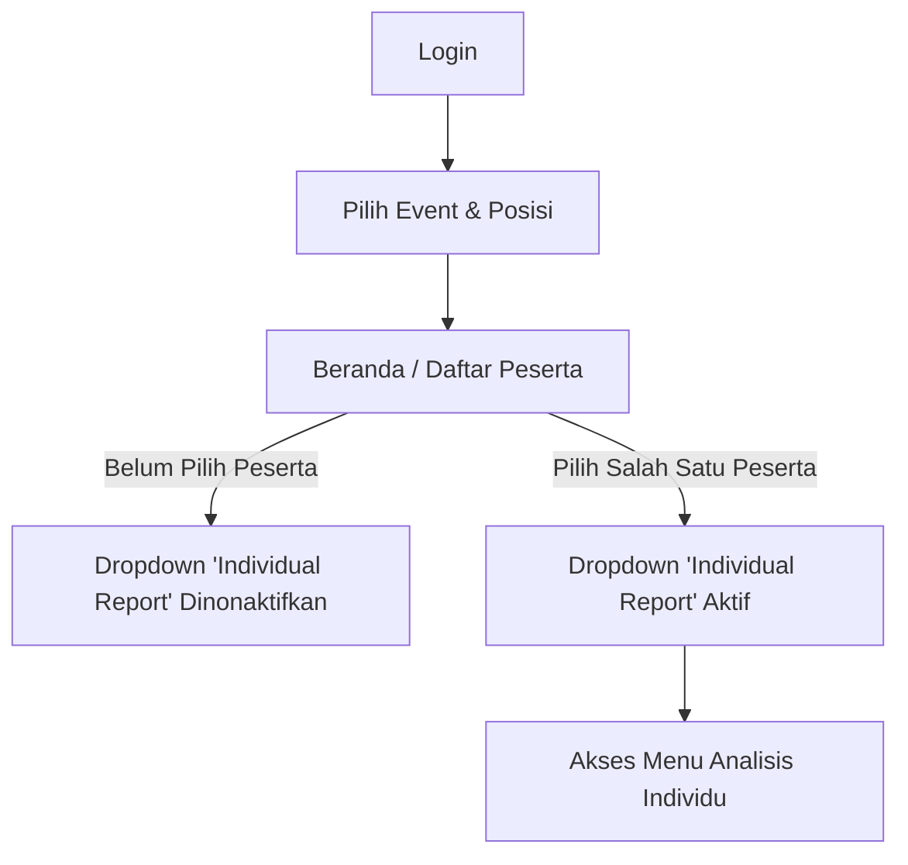

# User Flow & Menu Documentation - SPSP System

Dokumen ini menjelaskan alur pengguna (User Flow) dalam sistem SPSP, implementasi dan cara mengoperasikan konsep **3-Layer Priority System**, serta penjelasan singkat untuk setiap menu yang tersedia di dalam aplikasi.

---

## 🔄 Alur Pengguna (User Flow) Utama

Alur navigasi utama pengguna setelah masuk ke sistem dirancang untuk membatasi akses ke menu analisis individu sampai data yang diperlukan tersedia:



### 1. Tahap Inisialisasi & Pembatasan Menu
1. **Login**: Pengguna masuk ke sistem menggunakan akun instansi masing-masing.
2. **Pilih Event & Posisi**: Di bagian atas halaman (Header/Event Selector), pengguna harus memilih Event Asesmen (misalnya: *Seleksi P3K Kejaksaan 2025*) dan Formasi Posisi (misalnya: *Jaksa Penuntut Umum*) untuk membatasi cakupan data.
3. **Kondisi 'Individual Report'**:
   - Secara default, setelah pertama kali masuk, menu dropdown **Individual Report** akan berada dalam kondisi **dinonaktifkan (disabled)**.
   - Hal ini dikarenakan menu laporan individual memerlukan parameter `participant_id` (ID Peserta) yang spesifik untuk menarik data asesmen.
   - Pengguna **wajib** pergi ke menu **Beranda** (Dashboard) atau **Daftar Peserta** (Shortlist) terlebih dahulu, lalu memilih/mengklik nama salah satu peserta untuk mengaktifkan menu **Individual Report** untuk peserta tersebut.

---

## 🏗️ Implementasi & Operasional 3-Layer Priority System

Sebagai sistem *Business Intelligence*, SPSP memungkinkan pengguna melakukan simulasi analisis *What-If* secara dinamis tanpa merusak data asli hasil tes peserta. Ini dicapai dengan menerapkan **3-Layer Priority System**.

### Cara Kerja 3-Layer di UI:

```
[Layer 1: Session Adjustment] (Prioritas Tertinggi)
  └── Diatur secara interaktif lewat slider/input di halaman 'Standar' (bersifat sementara).
[Layer 2: Custom Standard] (Prioritas Menengah)
  └── Diambil dari database jika instansi memilih baseline kustom yang telah dibuat sebelumnya.
[Layer 3: Quantum Default] (Prioritas Terendah / Fallback)
  └── Standar bawaan sistem dari tabel aspects/sub_aspects jika tidak ada kustomisasi.
```

### Bagaimana Pengguna Mengoperasikannya?

1. **Menggunakan Standar Bawaan (Quantum Default - Layer 3)**:
   - Saat pertama kali memuat halaman laporan atau ranking, sistem secara otomatis menggunakan **Quantum Default** sebagai baseline standar kelulusan dan bobot aspek.

2. **Memilih & Mengaktifkan Standar Instansi (Custom Standard - Layer 2)**:
   - Pengguna pergi ke menu **Tambah Standar** untuk mendefinisikan standar khusus institusi (mengubah bobot aspek, nilai minimal kelulusan, atau menonaktifkan aspek tertentu).
   - Setelah standar disimpan, pengguna dapat masuk ke menu **Standar MC Mapping** atau **Standar Potential Mapping**, lalu memilih standar kustom tersebut dari opsi pilihan baseline. Pilihan ini akan disimpan di database relasional `custom_standards` dan terikat ke institusi.

3. **Melakukan Simulasi Sementara (Session Adjustment - Layer 1)**:
   - Pada halaman **Standar MC Mapping** atau **Standar Potential Mapping**, pengguna dapat langsung menggeser slider bobot aspek atau mengganti nilai standar kelulusan secara interaktif.
   - Perubahan instan ini **tidak langsung disimpan ke database**, melainkan disimpan dalam **Session** browser pengguna.
   - Begitu data session berubah, seluruh kalkulasi skor, spider plot, gap analysis, dan ranking di seluruh menu (baik *Individual* maupun *General*) akan **berubah secara real-time** mengikuti perubahan tersebut.
   - Pengguna dapat memilih untuk menyimpan penyesuaian session ini menjadi *Custom Standard* baru (masuk ke Layer 2) or melakukan **Reset** untuk kembali ke baseline awal.

---

## 📁 Panduan Deskripsi Menu SPSP

Berikut adalah fungsi dan peran dari setiap menu yang dikonfigurasi di sistem:

### 1. Menu Navigasi Utama & Konfigurasi
*   **Beranda (Dashboard)**: Halaman utama yang menyajikan ringkasan visual berupa statistik agregat event, spider plot kelompok, status pemenuhan standar secara keseluruhan, serta daftar peserta cepat untuk dipilih.
*   **Daftar Peserta (Shortlist)**: Halaman tabel berisi data seluruh peserta pada event dan formasi yang dipilih. Di sini pengguna dapat mencari peserta, melihat status kelulusan ringkas, dan mengklik nama peserta untuk memilihnya (mengaktifkan menu Individual Report).
*   **Tambah Standar**: Modul konfigurasi untuk membuat, mengedit, dan menyimpan struktur pembobotan dan nilai kelulusan baru secara permanen sebagai **Custom Standard (Layer 2)**.

### 2. Dropdown: Individual Report (Aktif setelah peserta dipilih)
*   **General Matching**: Menampilkan tabel pencocokan langsung antara skor aktual (individual rating) peserta dengan standar kelulusan untuk seluruh aspek (Potensi dan Kompetensi).
*   **General Mapping**: Pemetaan komprehensif aspek Potensi dan Kompetensi yang menampilkan rincian bobot, skor standar, skor individu, nilai gap (+/-), serta persentase kecocokan.
*   **General Psy Mapping**: Pemetaan khusus yang hanya menampilkan detail aspek-aspek **Potensi** (Psikometrik) seperti Daya Pikir, Sikap Kerja, dll.
*   **General MC Mapping**: Pemetaan khusus yang hanya menampilkan detail aspek-aspek **Kompetensi** (Behavioral/Management Competency) seperti Kepemimpinan, Integritas, dll.
*   **Spider Plot**: Grafik radar interaktif yang membandingkan garis skor individu peserta terhadap garis standar kelulusan. Visualisasinya identik dengan yang ada di dashboard utama namun berfokus pada data satu orang.
*   **Ringkasan MC Mapping**: Halaman ringkas yang menyajikan interpretasi kompetensi secara cepat beserta rekomendasi dasar berdasarkan gap kompetensi.
*   **Ringkasan Asesmen**: Laporan naratif ringkas yang merangkum hasil asesmen keseluruhan dari sudut pandang psikologis peserta.
*   **Laporan Individu**: Menu induk yang memanggil dan menggabungkan semua visualisasi dan data dari modul-modul di atas (*General Matching*, *General Mapping*, *Spider Plot*, dll) ke dalam satu halaman utuh yang siap cetak (PDF/Print).

### 3. Dropdown: General Report (Analisis Kelompok)
Halaman-halaman laporan analitik yang menyajikan visualisasi dan data untuk seluruh kelompok peserta dalam satu formasi/event:
*   **Ranking Psy Mapping**: Menampilkan daftar urutan (ranking) seluruh peserta berdasarkan akumulasi skor aspek **Potensi** saja.
*   **Ranking MC Mapping**: Menampilkan daftar urutan (ranking) seluruh peserta berdasarkan akumulasi skor aspek **Kompetensi** saja.
*   **Ranking Ringkasan Asesmen**: Laporan ranking utama (*Overall Ranking*) yang menggabungkan nilai Potensi dan Kompetensi berdasarkan pembobotan kategori aktif (misal Potensi 40% dan Kompetensi 60%).
*   **Statistik**: Menyajikan data statistik deskriptif dari kelompok peserta, seperti nilai tertinggi, nilai terendah, nilai rata-rata, dan grafik distribusi frekuensi skor.
*   **Training Recommendation**: Modul analitik cerdas yang mengidentifikasi gap kompetensi kelompok peserta di bawah standar, lalu merekomendasikan jenis pelatihan (*training*) yang sesuai secara otomatis.
*   **MMPI (Minnesota Multiphasic Personality Inventory)**: Menu non-analitik yang digunakan khusus untuk menampilkan data mentah hasil tes kepribadian klinis MMPI peserta (tidak dipengaruhi oleh simulasi standard priority).

### 4. Halaman Penyesuaian Standar & Simulasi (Layer 1 - Session Adjustment)
*(Secara struktur menu diletakkan di bawah dropdown General Report, namun fungsinya adalah sebagai panel kontrol simulasi / What-If Analysis)*:
*   **Standar MC Mapping**: Antarmuka interaktif untuk melihat standar kompetensi yang aktif, memilih baseline (Quantum/Custom), dan menyesuaikan bobot/rating kompetensi secara dinamis di session (**Layer 1**).
*   **Standar Potential Mapping**: Antarmuka interaktif untuk melihat standar potensi yang aktif, memilih baseline (Quantum/Custom), dan menyesuaikan bobot/rating potensi secara dinamis di session (**Layer 1**).

### 5. Talent Pool Management (Analisis Potensi Talenta)
*   **Talent Pool Management**: Merupakan menu analitik untuk memetakan dan menganalisis kandidat-kandidat berkinerja terbaik (*top talent*). Menu ini menyajikan data analitik kelompok talenta (bukan sekadar manajemen/CRUD data) untuk mempermudah identifikasi suksesi jabatan, pemetaan kompetensi jangka panjang, serta penempatan strategis karyawan.

