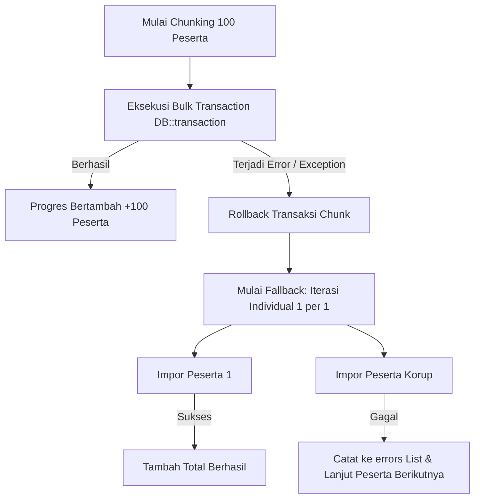

# 🛡️ Mekanisme Fallback & Isolasi Error Integrasi LSP

[← Kembali ke Indeks Dokumentasi Integrasi LSP](./README.md)

- **Modul**: Integrasi Database LSP (Quantum HRMI) $\rightarrow$ Native SPSP System
- **Status**: 🟢 **Robust & Fault-Tolerant**
- **File Terkait**: [LspNormEngineService.php](file:///c:/laragon/www/spsp_new/app/Services/Lsp/LspNormEngineService.php), [LspDataTransformerService.php](file:///c:/laragon/www/spsp_new/app/Services/Lsp/LspDataTransformerService.php), [LspDataImporterService.php](file:///c:/laragon/www/spsp_new/app/Services/Lsp/LspDataImporterService.php)
- **Tanggal Pembaruan**: 29 Juli 2026

---

> [!NOTE]
> **Ikhtisar Ketahanan Sistem (System Resilience)**:
> Data historis pada database LSP (CodeIgniter 3 legacy) memiliki variasi kelengkapan data yang tinggi. Sebagian peserta mungkin belum menyelesaikan wawancara, tidak mengikuti tes kejiwaan MMPI, atau memiliki nilai `NULL` pada atribut tertentu. Modul integrasi LSP dilengkapi dengan **sistem *fallback* bertingkat dan *error isolation*** agar proses sinkronisasi massal 100% tahan error (*crash-proof*).

---

## 📋 1. Matriks Rinci Mekanisme Fallback

### A. Identitas Peserta, Tanggal Lahir & Usia
| Field / Variabel | Kondisi Data Mentah LSP | Nilai Fallback / Aturan Penanganan | Status Safety |
| :--- | :--- | :--- | :-: |
| **Lookup Peserta** | `kode_pelaksanaan` tidak cocok persis | Mencari berdasarkan `username` saja pada tabel `peserta_produksi`. | 🟢 **Safe Lookup** |
| **Tanggal Lahir** | `tanggal_lahir` di `peserta_produksi` kosong | Mengambil `tanggal_lahir` dari tabel `users`. Jika masih kosong, default `'1990-01-01'`. | 🟡 **Fallback Date** |
| **Perhitungan Usia** | `tanggal_lahir` invalid / tanggal di masa depan | Method `hitungUmurDalamTahun` mengembalikan nilai default **25 Tahun** (atau `0` jika tanggal lahir di masa depan). | 🟡 **Fallback Age** |
| **Nama Lengkap & Gelar** | Gelar depan/belakang bernilai `NULL` | String dibersihkan via `trim(($gelarDepan . ' ' . $nama . ', ' . $gelarBelakang), ' ,')`. | 🟢 **Safe Format** |
| **Jenis Kelamin** | `jenis_kelamin` kosong / `NULL` | Default `'L'` (Laki-laki). | 🟡 **Fallback Gender** |
| **Tingkat Pendidikan** | `pendidikan` kosong / `NULL` | Default `'S1'`. | 🟡 **Fallback Edu** |

---

### B. Formasi Jabatan, Template, & Gelombang (Batch)
| Field / Variabel | Kondisi Data Mentah LSP | Nilai Fallback / Aturan Penanganan | Status Safety |
| :--- | :--- | :--- | :-: |
| **Standar Form Penilaian** | `standar_form_penilaian` di LSP kosong | Default `'p3k_kjg_2025'`. | 🟡 **Fallback Form** |
| **Level Jabatan** | `jabatan_pelaksana` di LSP kosong | Default `'STAFF'`. | 🟡 **Fallback Level** |
| **Pemetaan Standar Penilaian** | `standar_form_penilaian` = `'p3k_kjg_2025'` | Jika `levelJabatan` = `'TERAMPIL'` $\rightarrow$ `'p3k_kjg_-_jf_terampil_2025'`. Selainnya $\rightarrow$ `'p3k_kjg_-_jf_muda_&_pertama_2025'`. | 🟢 **Auto Scoping** |
| **Nama Gelombang / Batch** | Kolom `batch` di LSP kosong / `NULL` | Default `'1'` (Gelombang 1). | 🟡 **Fallback Batch** |
| **Nama Formasi (PositionFormation)**| `minat_penempatan` di LSP kosong | Menggunakan nilai `levelJabatan` (misal `'STAFF'`). | 🟡 **Fallback Formation** |

---

### C. Skor Mentah Psikometri (IST, PAPI Kostik, 16PF)
| Instrument | Kondisi Data Mentah LSP | Nilai Fallback / Aturan Penanganan | Status Safety |
| :--- | :--- | :--- | :-: |
| **IST (Intelligenz Struktur Test)** | Skor mentah IST kosong / tidak lengkap (< 9 subtest) | IQ default **100** (Kategori `'Rata-rata'`), Skor Subtest SS default **10**. | 🟡 **Fallback IQ** |
| **Norma IST JSON Missing** | File `ist.json` tidak ditemukan di server | Formula estimasi: $IQ = 90 + \min(40, \text{total\_skor} / 3)$. | 🔴 **Formula Fallback** |
| **PAPI Kostik** | Skor mentah Kostik kosong / `NULL` | Seluruh 20 faktor kepribadian di-set default **1**. | 🟡 **Fallback Kostik** |
| **16PF (Personality Factor)** | Skor mentah 16PF kosong / `NULL` | Seluruh 16 faktor sten score di-set default **5**. | 🟡 **Fallback 16PF** |
| **Koreksi MD 16PF** | Nilai MD = 10, 8-9, atau 7 | Penyesuaian Sten score $+2$, $+1$, $-1$, $-2$ pada faktor tertentu. Hasil akhir di-*clamp* antara `1` dan `10`. | 🟢 **Bounded Clamp** |
| **Divided by Zero Guard** | Standard Rating Toleransi = 0 | `max(1, $standardRatingToleransi)`. | 🟢 **Zero Guard** |

---

### D. Wawancara Asesor & Data Kualitatif
| Data Wawancara | Kondisi Data Mentah LSP | Nilai Fallback / Aturan Penanganan | Status Safety |
| :--- | :--- | :--- | :-: |
| **Rating Kompetensi Inti** | Record di `hasil_aspek_yang_digali` tidak ada | Menggunakan nilai **Standard Rating Target**. | 🟡 **Fallback Target** |
| **Asesor Penanggung Jawab** | Data asesor di `users_personil` tidak ada | Nama: `'Asesor Penanggung Jawab'`, Jabatan: `'Technical Advisor'`. | 🟡 **Fallback TA** |
| **Keunggulan & Kelemahan** | Record di `hasil_aspek_kelebihan` kosong | `'kekuatan' => '-'`, `'kelemahan' => '-'`. | 🟡 **Fallback Text** |
| **Rekomendasi Wawancara** | Record di `hasil_rekomendasi` kosong | Rekomendasi default `'MS'` (Memenuhi Syarat), Catatan = `'-'`. | 🟡 **Fallback Rec** |
| **Aspek Tambahan** | Rating aspek tambahan di `hasil_aspek_tambahan` kosong | Nilai default = **Standard Rating Target**, Keterangan = `'-'`. | 🟡 **Fallback Add** |

---

### E. Tes Kejiwaan (MMPI)
| Data MMPI | Kondisi Data Mentah LSP | Nilai Fallback / Aturan Penanganan | Status Safety |
| :--- | :--- | :--- | :-: |
| **Record MMPI Missing** | Peserta/proyek tidak punya data di `rekapmmpi_p3kkjg` | `validitas` => `'-'`, `nilai_pq` => `0.00`, `tingkat_stres` => `'-'`, `kesimpulan_mmpi` => `'BELUM ADA REKOMENDASI'`. | 🟢 **Non-MMPI Safe** |
| **Parsing Teks Kesimpulan** | Teks `kesimpulan` tidak cocok dengan kata kunci | `nilai_kejiwaan` => `0`, `kesimpulan_mmpi` => `'BELUM ADA REKOMENDASI'`. | 🟢 **Zero Match Safe** |

---

## ⚡ 2. Mekanisme Isolasi Error Impor (Chunk Transaction Fallback)

Proses impor massal pada [LspDataImporterService.php](file:///c:/laragon/www/spsp_new/app/Services/Lsp/LspDataImporterService.php) memproses peserta dalam kelompok (*chunk*) sebanyak **100 peserta per transaksi**.

> [!IMPORTANT]
> **Keunggulan Transaksi Chunking & Isolation**:
> 1. **Performa Maksimal**: Dalam kondisi normal, 100 peserta diimpor secara instan dalam 1 transaksi DB.
> 2. **Auto-Recovery**: Jika terdapat 1 peserta dengan data korup yang memicu exception SQL, transaksi *chunk* 100 peserta tersebut di-rollback tanpa mempengaruhi *chunk* lainnya.
> 3. **Error Isolation**: Engine otomatis mengalihkan *chunk* yang gagal tersebut ke mode **sinkronisasi individual**. 99 peserta yang sehat akan **tetap berhasil diimpor**, dan hanya 1 peserta yang korup yang dicatat pada tabel kesalahan `errors[]`.
