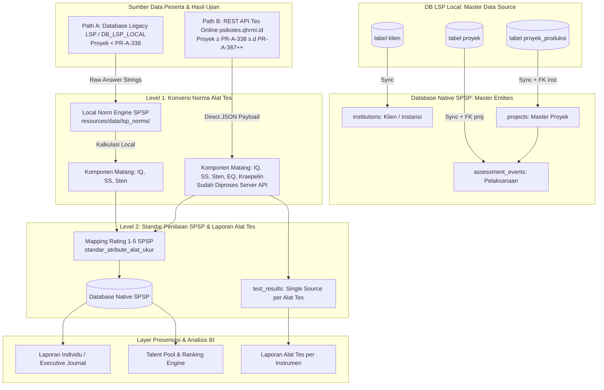

# 🏛️ Arsitektur Fondasi & Dual-Path Data Ingestion SPSP

- **Sistem**: Sistem Pemetaan & Statistik Psikologi (SPSP)
- **Tipe Sistem**: Business Intelligence (BI) & Analytical System
- **Terakhir Diperbarui**: 13 Agustus 2026

---

> [!IMPORTANT]
> **Prinsip Dasar SPSP**:
> SPSP **bukanlah sistem OLTP/CRUD** tempat pengguna meng-input jawaban tes satu per satu. SPSP adalah **sistem Business Intelligence (BI) & Analitik** yang mengagregasi, menganalisis, dan memvisualisasikan data hasil asesmen psikometri dari sumber data eksternal untuk kebutuhan pemetaan talenta, pemeringkatan (*ranking*), dan analisis *what-if*.

---

## 🌐 1. Arsitektur Dual-Path Data Ingestion & Master Data Syncing

SPSP menerima data hasil ujian dan wawancara dari **dua pintu masuk (Dual-Path Data Ingestion)** utama yang terpisah berdasarkan era pelaksanaan proyek:



> [!NOTE]
> **Kebijakan Master Data (Proyek, Pelaksanaan, & Instansi)**:
> Walaupun data peserta dan komponen tes Jalur B diambil dari REST API (`psikotes.qhrmi.id`), **data Klien/Instansi (`institutions`), Master Proyek (`projects`), dan Pelaksanaan (`assessment_events`) SELALU disinkronkan dari DB LSP (`DB_LSP_LOCAL`)** karena tersimpan secara pasti dan lengkap pada hirarki tabel `klien` $\rightarrow$ `proyek_produksi` $\rightarrow$ `proyek`.

---

## 🔀 2. Spesifikasi Rinci Jalur Ingestion & Master Data

### A. Hirarki 3 Level Master Data & Profil SPSP
1. **Klien / Instansi (`institutions`)**:
   - Disinkronkan dari tabel `klien` pada DB LSP (`kode_klien` $\rightarrow$ `code`, `nama_klien` $\rightarrow$ `name`, `logo` $\rightarrow$ `logo_path`, `address`, `phone`, `pic_name`, `pic_phone`).
2. **Master Proyek (`projects`)**:
   - Disinkronkan dari tabel `proyek_produksi` pada DB LSP (`kode` $\rightarrow$ `code` misal `'AP-085'`, `'AP-100'`, `'AP-554'`, `nama` $\rightarrow$ `name`, `tahun` $\rightarrow$ `year`, `contract_number`, `pic_name`, `pic_phone`, `project_type`, `institution_id`).
3. **Pelaksanaan / Execution (`assessment_events`)**:
   - Disinkronkan dari tabel `proyek` pada DB LSP (`kode_proyek` $\rightarrow$ `code` misal `'PR-A-313'`, `'PR-A-338'`, `nama_pelaksanaan` $\rightarrow$ `name`, `location`, `target_participants`, `assessment_type`, `project_id`, `institution_id`).
4. **Data Peserta (`participants`)**:
   - Disinkronkan dari tabel `peserta_produksi` pada DB LSP dengan bulk upsert 18 kolom profil lengkap (`tempat_lahir`, `tanggal_lahir`, `gelar_depan`, `gelar_belakang`, `pendidikan`, `agama`, `status_perkawinan`, `nik`, `no_kjg`, `jabatan_pelaksana`, `jbt_fungsional`, `jbt_struktural`, `pangkat`, `golongan`, `status_kepegawaian`, `unit_kerja`, `minat_penempatan`, `pengalaman_kerja`).

---

### B. Ingestion Data Peserta & Komponen Tes

#### Jalur A: Legacy Database LSP (`DB_LSP_LOCAL`)
* **Cakupan Proyek**: Seluruh proyek asesmen historis lama sebelum gelombang API baru (**Kode Proyek `< PR-A-338`**).
* **Sumber Data**: Tabel MySQL database LSP (`peserta_produksi`, `ujian_peserta_produksi`, `rekapmmpi_p3kkjg`, `hasil_aspek_yang_digali`, `hasil_rekomendasi`).
* **Karakteristik Data Mentah**: Tabel `ujian_peserta_produksi` menyimpan string jawaban/skor mentah (misal IST: `"9,12,7,7,5,4,8,3,16"`).
* **Local Norm Engine SPSP**: [`LspNormEngineService.php`](file:///c:/laragon/www/spsp_new/app/Services/Lsp/LspNormEngineService.php) memuat 5 file norma resmi (`ist.json`, `kostik.json`, `personality.json`, `cfit3a.json`, `cfit3b.json`).

#### Jalur B: REST API Tes Online Baru (`psikotes.qhrmi.id`)
* **Cakupan Proyek**: Seluruh proyek asesmen baru (**Kode Proyek `≥ PR-A-338`**, misal `PR-A-338` s.d `PR-A-387` dan seterusnya).
* **Sumber Data**: Endpoint REST API HTTP Client (`/api/ambil_semua`) via [`QuantumApiClient.php`](file:///c:/laragon/www/spsp_new/app/Services/Api/QuantumApiClient.php).
* **Penyimpanan Komponen Alat Tes**: Seluruh instrumen hasil tes (IST `A.1`/`A.2`/`A.5`, PAPI Kostik/Karakter `B.1`/`D.1`, 16PF `B.2`, Kraepelin `D.2`, EQ `F.1`, DISC `G.1`, MMPI `E.1`/`E.2`) disimpan ke tabel `test_results` dan disajikan pada UI **Laporan Alat Tes** ([`LaporanAlatTes`](file:///c:/laragon/www/spsp_new/app/Livewire/Pages/LaporanAlatTes/LaporanAlatTes.php) & [`DetailLaporanTes`](file:///c:/laragon/www/spsp_new/app/Livewire/Pages/LaporanAlatTes/DetailLaporanTes.php)).

---

## ⚙️ 3. Pemisahan 2 Level Konversi Data

```
[ LEVEL 1: Konversi Norma Alat Tes ]
Jawaban Mentah Peserta ────────(Diproses via Norm Engine / API)──────► Komponen Tes Matang (IQ, SS, Sten, EQ, DISC)
                                                                                  │
                                                                                  ├─► Disimpan ke test_results (Laporan Alat Tes)
                                                                                  │
                                                                                  ▼
[ LEVEL 2: Standar Penilaian SPSP ]
Komponen Tes Matang ───────────(Diproses via DynamicStandardService)──► Rating Aspek Potensi & Kompetensi (Skala 1–5)
```

1. **Level 1 (Konversi Norma Alat Tes)**:
   * Mengubah respons/jawaban mentah peserta menjadi nilai standar instrumen psikometri.
   * Ditangani oleh backend `psikotes.qhrmi.id` (Jalur B) atau oleh `LspNormEngineService` lokal (Jalur A).
2. **Level 2 (Standar Penilaian SPSP)**:
   * Mengubah komponen tes matang dari Level 1 menjadi **Rating Aspek Potensi & Kompetensi (Skala 1–5)** berdasarkan aturan *cut-off* pada tabel mapping `standar_atribute_alat_ukur` dan `standard_aspek_yang_digali` sesuai level jabatan/formasi target.

---

## 🎯 4. Muara & Struktur Data Utama SPSP

```
Institution (Klien)  ──►  Project (Master Proyek)  ──►  AssessmentEvent (Pelaksanaan)  ──►  Participant  ──►  TestResult (Laporan Alat Tes)
                                                                                                    └──  AspectAssessments (Rating 1–5 SPSP)
```

### Tabel Native Utama SPSP:
1. **`institutions`**: Identitas klien / instansi penyelenggara.
2. **`projects`**: Master proyek asesmen (Kode misal `AP-085`, `AP-100`, `AP-554`).
3. **`assessment_events`**: Pelaksanaan proyek asesmen (Kode misal `PR-A-313`, `PR-A-338`).
4. **`participants`**: Identitas peserta asesmen.
5. **`batches`**: Gelombang/Batch pelaksanaan.
6. **`position_formations`**: Formasi jabatan target.
7. **`test_results`**: Tabel *Single Source of Truth* penampung data rincian komponen instrumen hasil tes per alat tes (`source`: `'api'` / `'lsp_db'`).
8. **`sub_aspect_assessments` & `aspect_assessments`**: Rating atribut & aspek potensi/kompetensi (1–5) beserta GAP rating.
9. **`category_assessments` & `final_assessments`**: Total skor agregat, persentase pencapaian, dan rekomendasi akhir (MS / MMS / TMS).
10. **`mmpi`**: Hasil tes kejiwaan MMPI.

---

## 🛠️ 5. Panduan Operasional Ingestion & Testing

```bash
# 1. Test Ingestion Jalur A (Proyek Legacy DB < PR-A-338) - Dry Run
php artisan lsp:test-report <username> PR-A-313

# 2. Synchronize Proyek (Jalur A atau Jalur B) ke Native SPSP
php artisan project:import PR-A-338

# 3. Automated Test Suite Verification
php artisan test --compact --filter=Lsp
```
