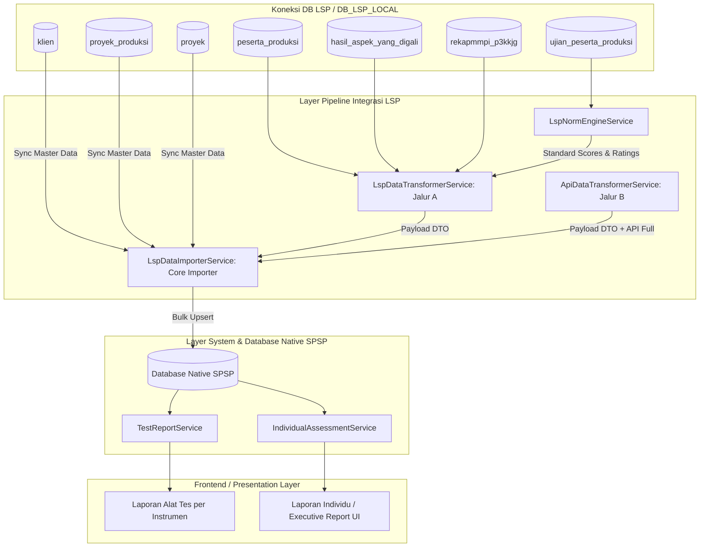

# 🏗️ Arsitektur & Spesifikasi Service Integrasi LSP

[← Kembali ke Indeks Dokumentasi Integrasi LSP](./README.md)

- **Modul**: Integrasi Database LSP (Quantum HRMI) $\rightarrow$ Native SPSP System
- **File Dokumentasi**: [docs/data_ntegration/SERVICES_ARCHITECTURE.md](./SERVICES_ARCHITECTURE.md)
- **Tanggal Pembaruan**: 13 Agustus 2026

---

> [!NOTE]
> **Ikhtisar Arsitektur Multi-Service**:
> Modul integrasi LSP menerapkan prinsip **Single Responsibility Principle (SRP)** dengan memisahkan tugas pipeline data ke dalam service-service modular. Setiap service bertanggung jawab atas 1 tahap spesifik (Norm Calculation, Data Transformation, Importer, Master Data Syncing, dan Presentation).

---

## 🏛️ 1. Diagram Alur Service Architecture

---

## 🧩 2. Rincian & Peran Masing-Masing Service

### 1. `LspNormEngineService`
- **Lokasi File**: [LspNormEngineService.php](file:///c:/laragon/www/spsp_new/app/Services/Lsp/LspNormEngineService.php)
- **Tanggung Jawab Utama**: Murni mengolah konversi norma psikometri dari skor mentah (*raw score*) ke *standard score*, IQ, Sten score, dan rating aspek/atribut (skala 1–5).
- **Independensi**: Tidak tergantung pada database SPSP, sehingga *reusable* untuk berbagai kebutuhan pengolahan norma.
- **Method Utama**:
  - `loadNormData()`: Pemuatan in-memory caching untuk `ist.json`, `kostik.json`, `personality.json`.
  - `processIstNorms($rawIst, $pendidikan, $usia)`: Mengonversi 9 subtest IST ke SW (Standard Score) & IQ.
  - `processKostikNorms($rawKostik)`: Mengolah 20 faktor kepribadian PAPI Kostik.
  - `process16pfNorms($rawPersonality, $usia)`: Mengonversi 16PF ke Sten Score (1–10) + koreksi MD.
  - `calculateProfilPotensiCached(...)`: Menghitung rating aspek potensi (skala 1–5) dari tabel `standar_atribute_alat_ukur`.

---

### 2. `LspDataTransformerService` (Jalur A - Legacy DB)
- **Lokasi File**: [LspDataTransformerService.php](file:///c:/laragon/www/spsp_new/app/Services/Lsp/LspDataTransformerService.php)
- **Tanggung Jawab Utama**: Pipeline ekstraksi dan transformasi data mentah dari koneksi DB LSP (`DB_LSP_LOCAL`) untuk proyek legacy (`< PR-A-338`) menjadi struktur DTO terstandar.
- **Fitur Profil Lengkap**: Membaca dan mengekstrak 18 atribut profil peserta dari `peserta_produksi` (`tempat_lahir`, `tanggal_lahir`, `gelar_depan`, `gelar_belakang`, `pendidikan`, `agama`, `status_perkawinan`, `nik`, `no_kjg`, `jabatan_pelaksana`, `jbt_fungsional`, `jbt_struktural`, `pangkat`, `golongan`, `status_kepegawaian`, `unit_kerja`, `minat_penempatan`, `pengalaman_kerja`).
- **Method Utama**:
  - `getIndividualReport($username, $kodeProyek)`: Membaca & mentransformasi 1 peserta.
  - `getBatchIndividualReports(array $usernames, string $kodeProyek)`: Mengolah sekelompok (*batch/chunk*) peserta sekaligus dengan optimasi query N+1 hingga 95%.

---

### 3. `ApiDataTransformerService` (Jalur B - REST API Online)
- **Lokasi File**: [ApiDataTransformerService.php](file:///c:/laragon/www/spsp_new/app/Services/Api/ApiDataTransformerService.php)
- **Tanggung Jawab Utama**: Transformer data khusus proyek baru (`≥ PR-A-338`) yang membaca payload JSON dari REST API `psikotes.qhrmi.id` via `QuantumApiClient`.
- **Fitur Utama**: Mengekstrak komponen matang (IQ, SS IST, Sten 16PF terkoreksi MD, MMPI 9 domain, EQ, Kraepelin, DISC) dan seluruh atribut profil peserta secara langsung dan menyimpannya ke DTO SPSP.

---

### 4. `LspDataImporterService`
- **Lokasi File**: [LspDataImporterService.php](file:///c:/laragon/www/spsp_new/app/Services/Lsp/LspDataImporterService.php)
- **Tanggung Jawab Utama**: Core Importer & Router Dual-Path Ingestion yang menyinkronkan master data dan menulis payload DTO ke tabel-tabel native SPSP.
- **Fitur Utama**:
  - `isLegacyProject($kodeProyek)`: Deteksi alur Ingest (Jalur A `< PR-A-338` vs Jalur B `≥ PR-A-338`).
  - **Sinkronisasi Master Data & Profil**: 
    - `klien` $\rightarrow$ `institutions` (termasuk `address`, `phone`, `pic_name`, `pic_phone`).
    - `proyek_produksi` $\rightarrow$ `projects` (termasuk `pic_name`, `pic_phone`, `project_type`).
    - `proyek` $\rightarrow$ `assessment_events` (termasuk `location`, `target_participants`, `assessment_type`).
    - `peserta_produksi` $\rightarrow$ `participants` (bulk upsert 18 kolom profil peserta).
    - Formasi Jabatan $\rightarrow$ `position_formations` (termasuk `level_jabatan` & `description`).
  - **Single Source TestResults**: Memproses seluruh komponen alat tes ke tabel `test_results`.
  - *Idempotent bulk upserts*, isolasi transaksi 100-chunk per peserta, dan *in-memory registry*.

---

### 5. `TestReportService`
- **Lokasi File**: [TestReportService.php](file:///c:/laragon/www/spsp_new/app/Services/TestReportService.php)
- **Tanggung Jawab Utama**: Service penyedia data **Laporan Alat Tes per Instrumen** untuk disajikan di UI SPSP.
- **Method Utama**:
  - `getParticipantAllTestReports($participantId, $eventId)`: Mengambil seluruh rincian hasil ujian alat tes peserta.
  - `formatTestDataForDisplay($testResult)`: Memformat payload JSON `summary_data` per alat tes (IST, PAPI Kostik, 16PF, Kraepelin, EQ, DISC) menjadi struktur siap render UI.

---

### 6. Livewire Pages `LaporanAlatTes` & `DetailLaporanTes`
- **Lokasi File**:
  - [LaporanAlatTes.php](file:///c:/laragon/www/spsp_new/app/Livewire/Pages/LaporanAlatTes/LaporanAlatTes.php) & [`index.blade.php`](file:///c:/laragon/www/spsp_new/resources/views/livewire/pages/laporan-alat-tes/index.blade.php)
  - [DetailLaporanTes.php](file:///c:/laragon/www/spsp_new/app/Livewire/Pages/LaporanAlatTes/DetailLaporanTes.php) & [`detail-laporan-tes.blade.php`](file:///c:/laragon/www/spsp_new/resources/views/livewire/pages/laporan-alat-tes/detail-laporan-tes.blade.php)
- **Tanggung Jawab Utama**: Menampilkan daftar peserta per Pelaksanaan/Event & Formasi dengan badge jumlah alat tes, serta menyajikan **Card Dinamis Hasil Ujian per Alat Tes**.

---

## 📊 3. Matriks Perbandingan & Alur Penggunaan

| Pertanyaan / Pertimbangan | Service yang Bertanggung Jawab | Status Service |
| :--- | :--- | :-: |
| *Di mana rumus konversi IST / IQ / PAPI Kostik dihitung (Jalur A)?* | `LspNormEngineService` | 🟢 **Active Calculation** |
| *Service apa yang membaca DB LSP lama saat impor (< PR-A-338)?* | `LspDataTransformerService` | 🟢 **Active Transformer (Jalur A)** |
| *Service apa yang membaca REST API psikotes.qhrmi.id (≥ PR-A-338)?* | `ApiDataTransformerService` & `QuantumApiClient` | 🟢 **Active Transformer (Jalur B)** |
| *Dari mana data Instansi, Master Proyek, & Pelaksanaan disinkronkan?* | Always fetched from DB LSP (`DB_LSP_LOCAL`) via `LspDataImporterService` | 🟢 **Active Master Sync** |
| *Service apa yang memandu alur dan menulis data ke tabel native SPSP?* | `LspDataImporterService` | 🟢 **Active Core Importer** |
| *Service apa yang menyajikan Laporan Alat Tes di UI SPSP?* | `TestReportService` & `DetailLaporanTes` Livewire | 🟢 **Active Native UI** |
| *Service apa yang menyajikan Laporan Individu di UI SPSP?* | `IndividualAssessmentService` | 🟢 **Active Executive UI** |

---

## 🛠️ 4. Panduan Ekstensi (Extensibility Guide)

> [!TIP]
> **Menambahkan Alat Tes atau Norma Baru**:
> 1. Tambahkan file norma JSON baru di `resources/data/lsp_norms/` (jika berupa file norma Jalur A).
> 2. Tambahkan method konversi baru pada [LspNormEngineService.php](file:///c:/laragon/www/spsp_new/app/Services/Lsp/LspNormEngineService.php).
> 3. Daftarkan kode tes baru di `TestResult::TEST_CATEGORIES` pada [TestResult.php](file:///c:/laragon/www/spsp_new/app/Models/TestResult.php) dan tambahkan aturan format di `TestReportService::formatTestDataForDisplay()`.
