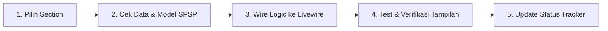

# 📊 HCA Report — Dynamic Integration Tracker

Dokumen tracker ini digunakan untuk memantau status integrasi data dinamis dari database SPSP ke setiap halaman/section pada **Human Capital Assessment (HCA) Report**. 

Setiap section diuji dan di-update secara bertahap sesuai keputusan dan verifikasi pengguna (*user-guided page-by-page migration*).

---

## 🚀 Ringkasan Kemajuan (Progress Overview)

| Indicator | Total Section | Selesai (Dynamic) | Menunggu Pengecekan | Belum Dikerjakan |
| :--- | :---: | :---: | :---: | :---: |
| **Jumlah** | **23 Sections + Nav** | **3** | **0** | **21** |
| **Persentase** | **100%** | **12.5%** | **0%** | **87.5%** |

> [!NOTE]
> **Metode Pengerjaan**: Integrasi dilakukan 1 per 1 section. Setiap section yang akan diintegrasikan direview sumber datanya di database SPSP sebelum di-wiring secara permanen.

---

## 📋 Table Tracker Integrasi per Section

| No | Section / Halaman | Kategori Data SPSP | Status Dynamic | Komponen File | Catatan & Sumber Data DB |
| :-: | :--- | :-: | :-: | :--- | :--- |
| **00** | **Active Talent Selector & Sidebar** | 🟢 Reuse | ✅ **DONE** | [HcaReportPage.php](file:///c:/laragon/www/spsp_new/app/Livewire/Pages/HCA/HcaReportPage.php) | Cascading 3-select filter (Event &rarr; Position &rarr; Participant), session sync, dan modal animatif. |
| **01** | **Cover Page** | 🟢 Reuse | ✅ **DONE** | [cover.blade.php](file:///c:/laragon/www/spsp_new/resources/views/livewire/pages/h-c-a/sections/cover.blade.php) | Mengambil nama, foto/inisial, no. tes, formasi posisi, tanggal asesmen, & instansi dari model `Participant`. |
| **02** | **Ringkasan Eksekutif** | 🟡 Partial | ✅ **DONE** | [executive-summary.blade.php](file:///c:/laragon/www/spsp_new/resources/views/livewire/pages/h-c-a/sections/executive-summary.blade.php) | Dynamically computed 5 pillars, Talent Index, & status kesiapan bawaan SPSP (`final_assessments.conclusion_text`). |
| **03** | **Identitas Peserta** | 🟢 Reuse | 📋 **PLANNED** | [participant-profile.blade.php](file:///c:/laragon/www/spsp_new/resources/views/livewire/pages/h-c-a/sections/participant-profile.blade.php) | Biodata lengkap peserta (`$participant`). |
| **04** | **Human Capital Index (HCI)** | 🟡 Partial | 📋 **PLANNED** | [index-radar-section.blade.php](file:///c:/laragon/www/spsp_new/resources/views/livewire/pages/h-c-a/sections/index-radar-section.blade.php) | Radar chart skoring 5 pilar HCI. |
| **05** | **Layer 1: Kompetensi** | 🟢 Reuse | 📋 **PLANNED** | [score-list-section.blade.php](file:///c:/laragon/www/spsp_new/resources/views/livewire/pages/h-c-a/sections/score-list-section.blade.php) | Reuse data `general-mc-mapping` (rating vs standard). |
| **06** | **Riwayat Karier** | 🔴 New | 📋 **PLANNED** | [timeline-section.blade.php](file:///c:/laragon/www/spsp_new/resources/views/livewire/pages/h-c-a/sections/timeline-section.blade.php) | Data histori karier / input manual / HRIS. |
| **07** | **Layer 2: Potensi** | 🟢 Reuse | 📋 **PLANNED** | [index-radar-section.blade.php](file:///c:/laragon/www/spsp_new/resources/views/livewire/pages/h-c-a/sections/index-radar-section.blade.php) | Reuse data `general-psy-mapping`. |
| **08** | **IQ & Profil Kognitif** | 🟢 Reuse | 📋 **PLANNED** | [score-list-section.blade.php](file:///c:/laragon/www/spsp_new/resources/views/livewire/pages/h-c-a/sections/score-list-section.blade.php) | Breakdown sub-aspek kognitif di bawah aspek Daya Pikir. |
| **09** | **Big Five Personality** | 🔴 New | 📋 **PLANNED** | [score-list-section.blade.php](file:///c:/laragon/www/spsp_new/resources/views/livewire/pages/h-c-a/sections/score-list-section.blade.php) | Model OCEAN kepribadian (butuh instrumen/mapping). |
| **10** | **DISC Profile** | 🔴 New | 📋 **PLANNED** | [disc-profile.blade.php](file:///c:/laragon/www/spsp_new/resources/views/livewire/pages/h-c-a/sections/disc-profile.blade.php) | Grafik profil D/I/S/C kepribadian. |
| **11** | **Learning Agility** | 🟡 Partial | 📋 **PLANNED** | [score-list-section.blade.php](file:///c:/laragon/www/spsp_new/resources/views/livewire/pages/h-c-a/sections/score-list-section.blade.php) | Aspek Learning Agility + 4 dimensi agility. |
| **12** | **Leadership Potential** | 🟡 Partial | 📋 **PLANNED** | [score-list-section.blade.php](file:///c:/laragon/www/spsp_new/resources/views/livewire/pages/h-c-a/sections/score-list-section.blade.php) | Breakdown 6 dimensi potensi kepemimpinan. |
| **13** | **Emotional Intelligence (EQ)** | 🟡 Partial | 📋 **PLANNED** | [index-radar-section.blade.php](file:///c:/laragon/www/spsp_new/resources/views/livewire/pages/h-c-a/sections/index-radar-section.blade.php) | Radar/Skor 5 dimensi EQ (Self awareness, Empathy, dst). |
| **14** | **Values & Integrity** | 🟡 Partial | 📋 **PLANNED** | [score-list-section.blade.php](file:///c:/laragon/www/spsp_new/resources/views/livewire/pages/h-c-a/sections/score-list-section.blade.php) | Aspek Integritas + 5 dimensi nilai kerja. |
| **15** | **Performance Dashboard** | 🔴 New | 📋 **PLANNED** | [performance-dashboard.blade.php](file:///c:/laragon/www/spsp_new/resources/views/livewire/pages/h-c-a/sections/performance-dashboard.blade.php) | Data kinerja KPI / revenue growth aktual. |
| **16** | **Talent 9-Box Matrix** | 🔴 New | 📋 **PLANNED** | [nine-box-matrix.blade.php](file:///c:/laragon/www/spsp_new/resources/views/livewire/pages/h-c-a/sections/nine-box-matrix.blade.php) | Matriks Potensi (Potensi Psikologis) &times; Kinerja. |
| **17** | **Succession Readiness** | 🔴 New | 📋 **PLANNED** | [succession-readiness.blade.php](file:///c:/laragon/www/spsp_new/resources/views/livewire/pages/h-c-a/sections/succession-readiness.blade.php) | Indikator kesiapan suksesi kepemimpinan. |
| **18** | **Profil Personal (Pelengkap)** | 🔴 New | 📋 **PLANNED** | [qualitative-list-section.blade.php](file:///c:/laragon/www/spsp_new/resources/views/livewire/pages/h-c-a/sections/qualitative-list-section.blade.php) | Profil personal hobi/karakter pelengkap. |
| **19** | **Kesehatan Jiwa** | 🟡 Partial | 📋 **PLANNED** | [mental-health-section.blade.php](file:///c:/laragon/www/spsp_new/resources/views/livewire/pages/h-c-a/sections/mental-health-section.blade.php) | Teks naratif / gauge dari `psychological_tests`. |
| **20** | **Kekuatan Psikologis** | 🟡 Partial | 📋 **PLANNED** | [qualitative-list-section.blade.php](file:///c:/laragon/www/spsp_new/resources/views/livewire/pages/h-c-a/sections/qualitative-list-section.blade.php) | Poin kekuatan & area pengembangan utama. |
| **21** | **Indikator Risiko** | 🔴 New | 📋 **PLANNED** | [risk-indicators.blade.php](file:///c:/laragon/www/spsp_new/resources/views/livewire/pages/h-c-a/sections/risk-indicators.blade.php) | Indikator risiko burnout/stres/klinis. |
| **22** | **Rekomendasi Pengembangan** | 🟡 Partial | 📋 **PLANNED** | [development-recommendation.blade.php](file:///c:/laragon/www/spsp_new/resources/views/livewire/pages/h-c-a/sections/development-recommendation.blade.php) | Adaptasi dari rekomendasi training SPSP. |
| **23** | **Rekomendasi Peran Berikutnya** | 🔴 New | 📋 **PLANNED** | [next-role-recommendation.blade.php](file:///c:/laragon/www/spsp_new/resources/views/livewire/pages/h-c-a/sections/next-role-recommendation.blade.php) | Career pathing & action plan peran masa depan. |

---

## 💡 Alur Pengerjaan per Halaman (Page-by-Page Workflow)

