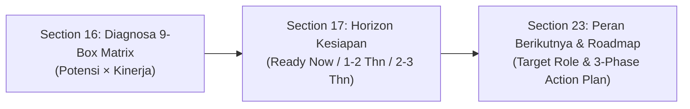

# HCA Report — Data & Component Mapping Specification

> Dokumen ini adalah referensi internal tim Backend & AI Agent untuk pemetaan sumber data dari database SPSP ke setiap section HCA Report.

## Legenda Status Data

- 🟢 **Dynamic DB Sync (Tersinkronisasi)** — Komponen dan sumber data telah terhubung penuh secara dinamis ke database SPSP (`participants`, `aspect_assessments`, `sub_aspect_assessments`, `final_assessments`, `mmpi`, `test_results`, `participant_career_histories`, `participant_performance_records`, dan `participant_personal_profiles`).
- 🟡 **Synthesized Meta-Constructs (Agregasi Terbobot)** — Indeks tematik modern yang dibentuk dari formula agregasi sub-aspek kompetensi/potensi SPSP tanpa membutuhkan alat tes baru.
- 📋 **Planned Appendix (Roadmap)** — Modul lampiran teknis psikogram yang disiapkan untuk menghubungkan skor mentah instrumen dari `test_results` via `TestReportService`.

---

## 🟢 Pemetaan Data & Model Komponen HCA

| Section | Model & Sumber Data DB SPSP | Komponen Livewire | Catatan Implementasi Teknis |
| :--- | :--- | :--- | :--- |
| **00 — Active Talent Selector** | `Participant`, `AssessmentEvent`, `PositionFormation` | [HcaReportPage.php](file:///c:/laragon/www/spsp_new/app/Livewire/Pages/HCA/HcaReportPage.php) | Cascading 3-select filter (Event &rarr; Formasi &rarr; Peserta), sinkronisasi sesi pengguna (`session(['filter.participant_id' => ...])`). |
| **01 — Cover Page** | `Participant` | [Cover.php](file:///c:/laragon/www/spsp_new/app/Livewire/Pages/HCA/Sections/Cover.php) | Identitas resmi asesmen, nomor SKB/tes, tanggal asesmen, nama formasi target, avatar/inisial, dan instansi klien. |
| **02 — Ringkasan Eksekutif** | `IndividualAssessmentService`, `FinalAssessment`, `ParticipantPerformanceRecord` | [ExecutiveSummary.php](file:///c:/laragon/www/spsp_new/app/Livewire/Pages/HCA/Sections/ExecutiveSummary.php) | Agregasi 5 pilar (Kompetensi, Potensi, Kinerja, Kepemimpinan, Integritas) &rarr; skor Talent Index (1.00–5.00) & predikat kesiapan penugasan definitif. |
| **03 — Identitas Peserta** | `Participant` | [ParticipantProfile.php](file:///c:/laragon/www/spsp_new/app/Livewire/Pages/HCA/Sections/ParticipantProfile.php) | Profil demografis, NIK, tanggal lahir, penghitungan usia dinamis, pangkat/golongan, unit kerja, jabatan, dan formasi target. |
| **04 — Human Capital Index (HCI)** | `IndividualAssessmentService`, `AspectAssessment` | [IndexRadarSection.php](file:///c:/laragon/www/spsp_new/app/Livewire/Pages/HCA/Sections/IndexRadarSection.php) | Visualisasi radar pentagon 5 pilar HCI dengan 3 lapis poligon: Skor Aktual vs Standar Formasi vs Batas Toleransi (90%). |
| **05 — Layer 1: Kompetensi** | `AspectAssessment` (kategori `kompetensi`) via `IndividualAssessmentService` | [ScoreListSection.php](file:///c:/laragon/www/spsp_new/app/Livewire/Pages/HCA/Sections/ScoreListSection.php) | Evaluasi perilaku teramati standar PermenPANRB/BKN, progres horizontal bar, standar formasi (▲), gap delta, dan kesimpulan evaluasi. |
| **06 — Riwayat Karier** | `ParticipantCareerHistory` (tabel `participant_career_histories`) | [TimelineSection.php](file:///c:/laragon/www/spsp_new/app/Livewire/Pages/HCA/Sections/TimelineSection.php) | Timeline kronologis vertikal 4 tahap jabatan, masa kerja efektif total, penanda posisi aktif, dan pencapaian milestone realistis. |
| **07 — Layer 2: Potensi** | `AspectAssessment` (kategori `potensi`) via `IndividualAssessmentService` | [IndexRadarSection.php](file:///c:/laragon/www/spsp_new/app/Livewire/Pages/HCA/Sections/IndexRadarSection.php) | Radar chart 5 domain psikologis klasik (Intelektual, Sikap Kerja, Potensi Kerja, Sosiabilitas, Kepribadian) dan tabel komparasi standar. |
| **08 — IQ & Profil Kognitif** | `TestResult` (CFIT/IST) & `SubAspectAssessment` (aspek Daya Pikir) | [ScoreListSection.php](file:///c:/laragon/www/spsp_new/app/Livewire/Pages/HCA/Sections/ScoreListSection.php) | Ekstraksi skor IQ komposit & breakdown 5 sub-dimensi bernalar (Analytical, Numerical, Verbal, Abstract, Spatial). |
| **09 — Big Five Personality** | `TestResult` (`test_code: B.2` 16PF) | [ScoreListSection.php](file:///c:/laragon/www/spsp_new/app/Livewire/Pages/HCA/Sections/ScoreListSection.php) | Konversi matematis 16 faktor Cattell (Sten score) ke 5 dimensi model OCEAN (Openness, Conscientiousness, Extraversion, Agreeableness, Emotional Stability). |
| **10 — DISC Profile** | `TestResult` (`test_code: D.1` PAPI Kostik) | [DiscProfile.php](file:///c:/laragon/www/spsp_new/app/Livewire/Pages/HCA/Sections/DiscProfile.php) | Pemetaan 20 skala PAPI Kostik ke 4 kuadran gaya perilaku kerja (D/I/S/C) dan deteksi otomatis gaya komunikasi dominan. |
| **11 — Learning Agility** | `SubAspectAssessment` (Sintesis Tematik 4 Pilar) | [ScoreListSection.php](file:///c:/laragon/www/spsp_new/app/Livewire/Pages/HCA/Sections/ScoreListSection.php) | Agregasi terbobot 4 pilar VUCA agility (*Mental, People, Change, Result Agility*) dari sub-aspek relevan SPSP. |
| **12 — Leadership Potential** | `SubAspectAssessment` (Sintesis Tematik 6 Pilar) | [ScoreListSection.php](file:///c:/laragon/www/spsp_new/app/Livewire/Pages/HCA/Sections/ScoreListSection.php) | Agregasi 6 dimensi kepemimpinan strategis (*Visioning, Decision Making, Strategic Influence, Execution Control, Coaching, Strategic Thinking*). |
| **13 — Emotional Intelligence (EQ)** | `AspectAssessment`, `SubAspectAssessment`, `TestResult` (`test_code: F.1`) | [IndexRadarSection.php](file:///c:/laragon/www/spsp_new/app/Livewire/Pages/HCA/Sections/IndexRadarSection.php) | Radar chart & indeks kematangan emosi 5 domain Goleman (*Self Awareness, Self Regulation, Motivation, Empathy, Social Skills*). |
| **14 — Values & Integrity** | `SubAspectAssessment` (Sintesis Tematik 4 Pilar) | [ScoreListSection.php](file:///c:/laragon/www/spsp_new/app/Livewire/Pages/HCA/Sections/ScoreListSection.php) | Agregasi 4 pilar tata kelola moral (*Honesty & Transparency, Ethical Compliance, Accountability, Consistency & Loyalty*). |
| **15 — Performance Dashboard** | `ParticipantPerformanceRecord` (tabel `participant_performance_records`) | [PerformanceDashboard.php](file:///c:/laragon/www/spsp_new/app/Livewire/Pages/HCA/Sections/PerformanceDashboard.php) | Line chart time-series 5 tahun tren KPI aktual vs target benchmark institusi dengan auto-scaling buffer dinamis & rincian metrik tahun aktif. |
| **16 — Talent 9-Box Matrix** | `FinalAssessment` (Potensi) $\times$ `ParticipantPerformanceRecord` (Kinerja) | [NineBoxMatrix.php](file:///c:/laragon/www/spsp_new/app/Livewire/Pages/HCA/Sections/NineBoxMatrix.php) | Grid 3x3 model McKinsey/GE (*Criterion-Referenced*), penanda kuadran aktif peserta, dan narasi interpretasi penempatan talenta. |
| **17 — Succession Readiness** | `PositionFormation`, `FinalAssessment`, `ParticipantPerformanceRecord` | [SuccessionReadiness.php](file:///c:/laragon/www/spsp_new/app/Livewire/Pages/HCA/Sections/SuccessionReadiness.php) | Horizon suksesi bertingkat (*Horizon 1: Ready Now, Horizon 2: 1–2 Tahun, Horizon 3: 2–3 Tahun*) dengan tingkat keyakinan kesiapan. |
| **18 — Profil Personal (Pelengkap)** | `ParticipantPersonalProfile` (tabel `participant_personal_profiles`) | [QualitativeListSection.php](file:///c:/laragon/www/spsp_new/app/Livewire/Pages/HCA/Sections/QualitativeListSection.php) | Kartu modular informasi personal (hobi, olahraga, golongan darah, zodiak, shio, weton Jawa deterministik, dan moto hidup). |
| **19 — Kesehatan Jiwa** | `Mmpi` (tabel `mmpi`, skala L/F/K, distres, kelaikan) | [MentalHealthSection.php](file:///c:/laragon/www/spsp_new/app/Livewire/Pages/HCA/Sections/MentalHealthSection.php) | Skrining klinis kelaikan mental (*Hygiene Gatekeeper*, tidak dirata-ratakan ke Talent Index) dan catatan resmi psikolog klinis SPSP. |
| **20 — Kekuatan Psikologis** | `AspectAssessment`, `SubAspectAssessment`, `Mmpi` | [QualitativeListSection.php](file:///c:/laragon/www/spsp_new/app/Livewire/Pages/HCA/Sections/QualitativeListSection.php) | 5 klaster kekuatan eksekutif terpersonalisasi (*Mental Toughness, Leadership, Cognitive Agility, Interpersonal, Core Values*) berbasis rating tertinggi. |
| **21 — Indikator Risiko** | `Mmpi` (tingkat stres & catatan risiko) | [RiskIndicators.php](file:///c:/laragon/www/spsp_new/app/Livewire/Pages/HCA/Sections/RiskIndicators.php) | Sistem peringatan dini (*Early Warning System*) risiko burnout, kerentanan stres, dan friksi interpersonal. |
| **22 — Rekomendasi Pengembangan** | `AspectAssessment` (analisis gap) & Kerangka CCL 70-20-10 | [DevelopmentRecommendation.php](file:///c:/laragon/www/spsp_new/app/Livewire/Pages/HCA/Sections/DevelopmentRecommendation.php) | Rencana Pengembangan Individu (IDP) 2 kolom: 3 pilar kekuatan untuk dimaksimalkan & 3 kesenjangan kritis dengan matriks aksi 70-20-10. |
| **23 — Rekomendasi Peran Berikutnya** | `PositionFormation`, `FinalAssessment`, `ParticipantPerformanceRecord` | [NextRoleRecommendation.php](file:///c:/laragon/www/spsp_new/app/Livewire/Pages/HCA/Sections/NextRoleRecommendation.php) | Proyeksi peran target setingkat lebih tinggi & roadmap transisi karir 3 fase (*Fase 1: Onboarding, Fase 2: Cross-Functional, Fase 3: Autonomy*). |
| **24 — Laporan Alat Tes (Appendix)** | `TestResult` (tabel `test_results`) via `TestReportService` | [TestInstrumentsAppendix.php](file:///c:/laragon/www/spsp_new/app/Livewire/Pages/HCA/Sections/TestInstrumentsAppendix.php) | *Level 1 Evidence Layer* yang menyajikan rincian skor matang per subtes instrumen (CFIT/IST, PAPI, 16PF, Kraepelin, MMPI, RMIB). |

---

## 🧬 Prinsip Metodologi & Penyelarasan Keilmuan

### 1. Indeks Sintesis Tematik (*Synthesized Meta-Constructs*) — Klaster 3
Section 11 (*Learning Agility*), Section 12 (*Leadership Potential*), dan Section 14 (*Values & Integrity*) **bukanlah alat tes baru yang berdiri sendiri**, melainkan agregasi terbobot dari sub-aspek kompetensi/potensi pada database SPSP (`sub_aspect_assessments`). 
- **Tujuan**: Menyediakan analisis tematik modern bagi eksekutif tanpa memerlukan baterai tes tambahan yang membebani kandidat.

### 2. Rantai Keputusan Talenta (*Talent Progression Chain*)
Section 16, 17, dan 23 membentuk rangkaian kausal berurutan:

### 3. Triangulasi 3 Lensa Kualitatif MMPI (Section 19, 20, 21)
Satu instrumen evaluasi klinis/psikologis (`mmpi`) dipisahkan secara ketat menjadi 3 lensa analisis:
- **Lensa 1: Skrining Klinis & Validitas (Section 19)** &rarr; *Hygiene gatekeeper* (skala L, F, K, distres). **Tidak dirata-ratakan ke Talent Index**.
- **Lensa 2: Kekuatan Perilaku Dominan (Section 20)** &rarr; Ekstraksi keunggulan personal (*Key Strengths*).
- **Lensa 3: Sistem Peringatan Dini Risiko (Section 21)** &rarr; Deteksi dini kejenuhan (*Burnout Risk*) dan kerentanan stres kerja.

### 4. Dualitas Metodologi 9-Box Matrix: HCA vs General Report
Kedua model 9-box di SPSP memiliki landasan ilmiah resmi yang diakui, namun diterapkan pada use-case bisnis yang berbeda:
1. **Model General Report (Talent Pool — Norm-Referenced $\mu \pm \sigma$)**:
   - **Sumbu**: Potensi Psikologis (X) $\times$ Kompetensi Perilaku (Y).
   - **Tujuan**: Penilaian berbasis kohort/batch (*Assessment Center Method*) saat data KPI belum ada/tidak seragam (misal: seleksi terbuka JPT / rekrutmen).
2. **Model HCA Report (Section 16 — Criterion-Referenced / Ambang Mutlak)**:
   - **Sumbu**: Kinerja Aktual KPI (X) $\times$ Potensi Masa Depan (Y).
   - **Tujuan**: Standar global McKinsey/GE untuk *Executive Talent Review* & suksesi kepemimpinan internal korporasi/instansi.
