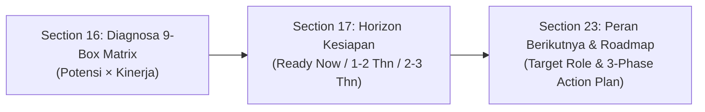

# HCA Report — Data & Component Mapping Specification

> Dokumen ini adalah referensi internal tim Backend & AI Agent untuk pemetaan sumber data dari database SPSP ke setiap section HCA Report.

## Legenda Status Data

- 🟢 **Reuse** — Komponen/data sudah ada di database SPSP, tinggal dipanggil (restyle tampilan saja jika perlu).
- 🟡 **Partial** — Data induk/aspek sudah ada, tapi agregasi/breakdown spesifik yang dibutuhkan HCA belum ada.
- 🔴 **New** — Sumber data belum ada sama sekali di DB SPSP, membutuhkan instrumen/tabel/integrasi baru.

---

## 🟢 Reuse Data Sources

| Section              | Sumber Data SPSP Existing                                                     | Catatan Technical                                                                                                                                                                             |
| -------------------- | ----------------------------------------------------------------------------- | -------------------------------------------------------------------------------------------------------------------------------------------------------------------------------------------- |
| Identitas Peserta    | Biodata peserta pada model `Participant` (`$participant`)                     | Field sudah lengkap: nomor tes, SKB, nama, email, telepon, gender, formasi jabatan, tanggal asesmen, foto                                                                                    |
| Layer 1 — Kompetensi | `general-mc-mapping` / `general-matching` (`showKompetensi=true`)             | Reuse komponen `IndividualAssessmentService::getAspectAssessments` dengan props `kompetensi`                                                                                                 |
| Layer 2 — Potensi    | `general-psy-mapping` (`showPotensi=true`)                                    | Reuse `IndividualAssessmentService::getAspectAssessments` dengan props `potensi`                                                                                                             |
| IQ & Profil Kognitif | Sub-aspect dari `general-psy-mapping`, di bawah aspek "Daya Pikir"            | Extract sub-aspek kognitif (Analytical, Numerical, Verbal, Abstract, Spatial) dari `sub_aspect_assessments`                                                                                 |
| Laporan Hasil Alat Tes (Appendix) | Model `TestResult` (tabel `test_results`) via `TestReportService`             | Single Source of Truth skor matang & interpretasi instrumen psikometri (IST, CFIT, PAPI, 16PF, Kraepelin, MMPI, EQ, DISC, RMIB) dari Jalur A & Jalur B.                                    |

---

## 🟡 Partial Data Sources

| Section                        | Data Induk Existing                                                                                                                       | Pekerjaan Agregasi Backend yang Dibutuhkan                                                                                                                                                                                      |
| ------------------------------ | ----------------------------------------------------------------------------------------------------------------------------------------- | ------------------------------------------------------------------------------------------------------------------------------------------------------------------------------------------------------------------------------- |
| Ringkasan Eksekutif            | Skor per-aspek dari `aspect_assessments` & `final_assessments`                                                                            | Formula agregasi 5 pilar (Kompetensi/Potensi/Kinerja/Kepemimpinan/Integritas) -> 1 Talent Index (skala 5.00), + status kesiapan bawaan SPSP (`final_assessments.conclusion_text`)                                               |
| Human Capital Index (HCI)      | Sama seperti di atas                                                                                                                      | Menggunakan service kalkulasi 5 pilar yang sama dengan Ringkasan Eksekutif agar konsisten                                                                                                                                       |
| Learning Agility               | Aspek "Learning Agility" (kategori Potensi)                                                                                               | Breakdown 4 sub-aspek (Mental, People, Change, Result Agility) di bawah aspek existing                                                                                                                                          |
| Leadership Potential           | Aspek "Leadership Potential"                                                                                                              | Breakdown 6 sub-aspek (Visioning, Decision Making, Influence, Execution, Coaching, Strategic Thinking)                                                                                                                         |
| Emotional Intelligence (EQ)    | Aspek "Emotional Intelligence"                                                                                                            | Breakdown 5 sub-aspek (Self Awareness, Self Regulation, Social Skills, Empathy, Motivation)                                                                                                                                     |
| Values & Integrity             | Aspek "Integritas"                                                                                                                        | Breakdown 5 sub-aspek (Honesty, Ethics, Accountability, Compliance, Consistency)                                                                                                                                                |
| Kesehatan Jiwa (Mental Health) | `$mmpi` (tabel `mmpi`, field `validitas`, `internal`, `interpersonal`, `kap_kerja`, `klinik`, `kesimpulan`, `nilai_pq`, `tingkat_stres`) | Field-field ini berupa **teks kualitatif**, HCA butuh representasi visual numerik/gauge atau penataan teks naratif berstruktur                                                                                                  |
| Kekuatan Psikologis            | Field `internal`/`interpersonal` pada `$mmpi` (tabel `mmpi`)                                                                              | Ekstraksi paragraf bebas menjadi 4-6 poin kekuatan & area pengembangan ringkas                                                                                                                                                  |
| Rekomendasi Pengembangan       | "Training Recommendation" pada `general_report`                                                                                           | Adaptasi output `TrainingRecommendationService` ke format visual HCA                                                                                                                                                            |

---

## 🔴 New Data Sources

| Section                                    | Catatan Integration & Scope                                                                                                                                                   |
| ------------------------------------------ | ----------------------------------------------------------------------------------------------------------------------------------------------------------------------------- |
| Riwayat Karier                             | Data histori jabatan/karir — butuh integrasi ke sistem HRIS eksternal atau modul input manual riwayat kerja                                                                   |
| Big Five Personality                       | Instrumen psikometri terpisah (model OCEAN) — butuh skema instrumen/tabel baru                                                                                                |
| DISC Profile                               | Instrumen terpisah (4 dimensi D/I/S/C) — butuh skema instrumen/tabel baru                                                                                                     |
| Layer 3 — Performance Dashboard            | Data kinerja kerja aktual (KPI, revenue growth) — butuh integrasi ke HRIS performance management                                                                             |
| Talent 9-Box Matrix                        | Gabungan Potensi Psikologis (sudah ada) × Kinerja Kerja (butuh data kinerja di atas)                                                                                           |
| Succession Readiness                       | Model skoring kesiapan suksesi kepemimpinan baru                                                                                                                              |
| Profil Personal (Pelengkap)                | Field hobi/karakter pelengkap non-formal                                                                                                                                      |
| Indikator Risiko (Burnout, Stres)          | Instrumen klinis numerik tambahan                                                                                                                                             |
| Rekomendasi Peran Berikutnya + Action Plan | Career pathing & action plan masa depan per jabatan                                                                                                                           |

---

## 🛠️ Rekomendasi Urutan Integrasi & Prinsip Keilmuan

1. **Tahap 1 (Cepat / Reuse)**: Identitas Peserta, Layer 1 Kompetensi, Layer 2 Potensi, IQ/Kognitif, Laporan Hasil Alat Tes (Appendix).
2. **Tahap 2 (Sedang / Partial & Synthesized)**: Ringkasan Eksekutif, HCI, Learning Agility, Leadership Potential, EQ, Values & Integrity, Kesehatan Jiwa, Kekuatan Psikologis, Rekomendasi Pengembangan.
3. **Tahap 3 (Keputusan Produk / Dynamic DB Active)**: Riwayat Karier, Big Five, DISC, Performance Dashboard, 9-Box, Succession Readiness, Profil Personal, Indikator Risiko, Rekomendasi Peran Berikutnya.

---

## 🧬 Prinsip Metodologi & Penyelarasan Keilmuan

### 1. Indeks Sintesis Tematik (*Synthesized Meta-Constructs*) — Klaster 3
Section 11 (*Learning Agility*), Section 12 (*Leadership Potential*), dan Section 14 (*Values & Integrity*) **bukanlah alat tes baru yang berdiri sendiri**, melainkan agregasi terbobot dari sub-aspek kompetensi/potensi pada database SPSP (`sub_aspect_assessments`). 
- **Tujuan**: Menyediakan analisis tematik modern bagi eksekutif tanpa memerlukan baterai tes tambahan yang membebani kandidat.

### 2. Rantai Keputusan Talenta (*Talent Progression Chain*)
Section 16, 17, dan 23 membentuk rangkaian kausal berurutan:

### 3. Triangulasi 3 Lensa Kualitatif MMPI (Section 19, 20, 21)
Satu instrumen evaluasi klinis/psikologis (`mmpi`) dipisahkan secara ketat menjadi 3 lensa analisis:
- **Lensa 1: Skrining Klinis & Validitas (Section 19)** &rarr; *Hygiene gatekeeper* (skala L, F, K, distres). **Tidak dirata-ratakan ke Talent Index**.
- **Lensa 2: Kekuatan Perilaku Dominan (Section 20)** &rarr; Ekstraksi keunggulan personal (*Key Strengths*).
- **Lensa 3: Sistem Peringatan Dini Risiko (Section 21)** &rarr; Deteksi dini kejenuhan (*Burnout Risk*) dan kerentanan stres kerja.

### 4. Dualitas Metodologi 9-Box Matrix: HCA vs General Report
Kedua model 9-box di SPSP memiliki landasan ilmiah resmi yang diakui, namun diterapkan pada use-case bisnis yang berbeda:
1. **Model General Report (Talent Pool — Norm-Referenced $\mu \pm \sigma$)**:
   - **Sumbu**: Potensi Psikologis (X) $\times$ Kompetensi Perilaku (Y).
   - **Tujuan**: Penilaian berbasis kohort/batch (*Assessment Center Method*) saat data KPI belum ada/tidak seragam (misal: seleksi terbuka JPT / rekrutmen).
2. **Model HCA Report (Section 16 — Criterion-Referenced / Ambang Mutlak)**:
   - **Sumbu**: Kinerja Aktual KPI (X) $\times$ Potensi Masa Depan (Y).
   - **Tujuan**: Standar global McKinsey/GE untuk *Executive Talent Review* & suksesi kepemimpinan internal korporasi/instansi.

