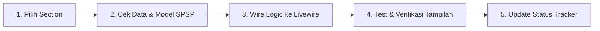

# 📊 HCA Report — Dynamic Integration Tracker

Dokumen tracker ini digunakan untuk memantau status integrasi data dinamis dari database SPSP ke setiap halaman/section pada **Human Capital Assessment (HCA) Report**. 

Setiap section diuji dan di-update secara bertahap sesuai keputusan dan verifikasi pengguna (*user-guided page-by-page migration*).

---

## 🚀 Ringkasan Kemajuan (Progress Overview)

| Indicator | Total Section | Selesai (Dynamic) | Menunggu Pengecekan | Belum Dikerjakan |
| :--- | :---: | :---: | :---: | :---: |
| **Jumlah** | **23 Sections + Nav** | **3** | **0** | **21** |
| **Persentase** | **100%** | **12.5%** | **0%** | **87.5%** |

> [!NOTE]
> **Metode Pengerjaan**: Integrasi dilakukan 1 per 1 section. Setiap section yang akan diintegrasikan direview sumber datanya di database SPSP sebelum di-wiring secara permanen.

---

## 📋 Table Tracker Integrasi per Section & Links Dokumentasi

| No | Section / Halaman | Kategori Data SPSP | Status Dynamic | Dokumentasi Per Section | Catatan & Sumber Data DB |
| :-: | :--- | :-: | :-: | :--- | :--- |
| **00** | **Active Talent Selector & Sidebar** | 🟢 Reuse | ✅ **DONE** | [00_talent_selector.md](./sections/00_talent_selector.md) | Cascading 3-select filter (Event &rarr; Position &rarr; Participant), session sync, dan modal animatif. |
| **01** | **Cover Page** | 🟢 Reuse | ✅ **DONE** | [01_cover_page.md](./sections/01_cover_page.md) | Mengambil nama, foto/inisial, no. tes, formasi posisi, tanggal asesmen, & instansi dari model `Participant`. |
| **02** | **Ringkasan Eksekutif** | 🟡 Partial | ✅ **DONE** | [02_executive_summary.md](./sections/02_executive_summary.md) | Dynamically computed 5 pillars, Talent Index, & status kesiapan bawaan SPSP (`final_assessments.conclusion_text`). |
| **03** | **Identitas Peserta** | 🟢 Reuse | 📋 **PLANNED** | [03_participant_profile.md](./sections/03_participant_profile.md) | Biodata lengkap peserta (`$participant`). |
| **04** | **Human Capital Index (HCI)** | 🟡 Partial | 📋 **PLANNED** | [04_human_capital_index.md](./sections/04_human_capital_index.md) | Radar chart skoring 5 pilar HCI. |
| **05** | **Layer 1: Kompetensi** | 🟢 Reuse | 📋 **PLANNED** | [05_layer1_kompetensi.md](./sections/05_layer1_kompetensi.md) | Reuse data `general-mc-mapping` (rating vs standard). |
| **06** | **Riwayat Karier** | 🔴 New | 📋 **PLANNED** | [06_riwayat_karier.md](./sections/06_riwayat_karier.md) | Data histori karier / input manual / HRIS. |
| **07** | **Layer 2: Potensi** | 🟢 Reuse | 📋 **PLANNED** | [07_layer2_potensi.md](./sections/07_layer2_potensi.md) | Reuse data `general-psy-mapping`. |
| **08** | **IQ & Profil Kognitif** | 🟢 Reuse | 📋 **PLANNED** | [08_iq_kognitif.md](./sections/08_iq_kognitif.md) | Breakdown sub-aspek kognitif di bawah aspek Daya Pikir. |
| **09** | **Big Five Personality** | 🔴 New | 📋 **PLANNED** | [09_big_five_personality.md](./sections/09_big_five_personality.md) | Model OCEAN kepribadian (butuh instrumen/mapping). |
| **10** | **DISC Profile** | 🔴 New | 📋 **PLANNED** | [10_disc_profile.md](./sections/10_disc_profile.md) | Grafik profil D/I/S/C kepribadian. |
| **11** | **Learning Agility** | 🟡 Partial | 📋 **PLANNED** | [11_learning_agility.md](./sections/11_learning_agility.md) | Aspek Learning Agility + 4 dimensi agility. |
| **12** | **Leadership Potential** | 🟡 Partial | 📋 **PLANNED** | [12_leadership_potential.md](./sections/12_leadership_potential.md) | Breakdown 6 dimensi potensi kepemimpinan. |
| **13** | **Emotional Intelligence (EQ)** | 🟡 Partial | 📋 **PLANNED** | [13_emotional_intelligence.md](./sections/13_emotional_intelligence.md) | Radar/Skor 5 dimensi EQ (Self awareness, Empathy, dst). |
| **14** | **Values & Integrity** | 🟡 Partial | 📋 **PLANNED** | [14_values_integrity.md](./sections/14_values_integrity.md) | Aspek Integritas + 5 dimensi nilai kerja. |
| **15** | **Performance Dashboard** | 🔴 New | 📋 **PLANNED** | [15_performance_dashboard.md](./sections/15_performance_dashboard.md) | Data kinerja KPI / revenue growth aktual. |
| **16** | **Talent 9-Box Matrix** | 🔴 New | 📋 **PLANNED** | [16_talent_9box_matrix.md](./sections/16_talent_9box_matrix.md) | Matriks Potensi (Potensi Psikologis) &times; Kinerja. |
| **17** | **Succession Readiness** | 🔴 New | 📋 **PLANNED** | [17_succession_readiness.md](./sections/17_succession_readiness.md) | Indikator kesiapan suksesi kepemimpinan. |
| **18** | **Profil Personal (Pelengkap)** | 🔴 New | 📋 **PLANNED** | [18_profil_personal.md](./sections/18_profil_personal.md) | Profil personal hobi/karakter pelengkap. |
| **19** | **Kesehatan Jiwa** | 🟡 Partial | 📋 **PLANNED** | [19_kesehatan_jiwa.md](./sections/19_kesehatan_jiwa.md) | Teks naratif / gauge dari `psychological_tests`. |
| **20** | **Kekuatan Psikologis** | 🟡 Partial | 📋 **PLANNED** | [20_kekuatan_psikologis.md](./sections/20_kekuatan_psikologis.md) | Poin kekuatan & area pengembangan utama. |
| **21** | **Indikator Risiko** | 🔴 New | 📋 **PLANNED** | [21_indikator_risiko.md](./sections/21_indikator_risiko.md) | Indikator risiko burnout/stres/klinis. |
| **22** | **Rekomendasi Pengembangan** | 🟡 Partial | 📋 **PLANNED** | [22_rekomendasi_pengembangan.md](./sections/22_rekomendasi_pengembangan.md) | Adaptasi dari rekomendasi training SPSP. |
| **23** | **Rekomendasi Peran Berikutnya** | 🔴 New | 📋 **PLANNED** | [23_rekomendasi_peran_berikutnya.md](./sections/23_rekomendasi_peran_berikutnya.md) | Career pathing & action plan peran masa depan. |

---

## 💡 Alur Pengerjaan per Halaman (Page-by-Page Workflow)

