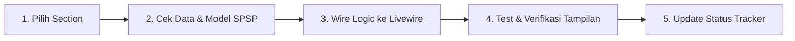

# 📊 HCA Report — Dynamic Integration Tracker

Dokumen tracker ini digunakan untuk memantau status integrasi data dinamis dari database SPSP ke setiap halaman/section pada **Human Capital Assessment (HCA) Report**. 

Setiap section diuji dan di-update secara bertahap sesuai keputusan dan verifikasi pengguna (*user-guided page-by-page migration*).

---

## 🚀 Ringkasan Kemajuan (Progress Overview)

| Indicator | Total Section | Dynamic DB Sync (Selesai) | Component Active (Ready UI) | Belum Dikerjakan (Planned) |
| :--- | :---: | :---: | :---: | :---: |
| **Jumlah** | **24 Sections + Nav** | **10** | **13** | **1** |
| **Persentase** | **100%** | **41.7%** | **54.2%** | **4.2%** |

> [!NOTE]
> **Metode Pengerjaan & Kedinamisan Section**:
> 1. **Seluruh 24 Section + Navigasi** telah terdata spesifikasinya dalam arsitektur HCA Report.
> 2. **Dynamic DB Integration**: Section 00-07, 13, dan 19 sudah terhubung penuh dengan kalkulasi dinamis database SPSP (`IndividualAssessmentService`, model `Participant`, `ParticipantCareerHistory`, dan `Mmpi`).
> 3. **Component Active (UI Ready)**: Section 08-12, 14-18, dan 20-23 telah aktif dengan komponen UI mandiri dan dataset terstruktur siap integrasi data eksternal/HRIS.
> 4. **Planned Appendix**: Section 24 (Laporan Hasil Alat Tes / Technical Appendix) disiapkan sebagai pembuktian Level 1 (*evidence layer*) menggunakan tabel `test_results` dan `TestReportService`.

---

## 📋 Table Tracker Integrasi per Section & Links Dokumentasi

| No | Section / Halaman | Kategori Data SPSP | Status UI / Dynamic | Dokumentasi Per Section | Catatan & Sumber Data DB |
| :-: | :--- | :-: | :-: | :--- | :--- |
| **00** | **Active Talent Selector & Sidebar** | 🟢 Reuse | ✅ **DONE (Dynamic)** | [00_talent_selector.md](./sections/00_talent_selector.md) | Cascading 3-select filter (Event &rarr; Position &rarr; Participant), session sync, dan modal animatif. |
| **01** | **Cover Page** | 🟢 Reuse | ✅ **DONE (Dynamic)** | [01_cover_page.md](./sections/01_cover_page.md) | Mengambil nama, foto/inisial, no. tes, formasi posisi, tanggal asesmen, & instansi dari model `Participant`. |
| **02** | **Ringkasan Eksekutif** | 🟡 Partial | ✅ **DONE (Dynamic)** | [02_executive_summary.md](./sections/02_executive_summary.md) | Dynamically computed 5 pillars, Talent Index, & status kesiapan bawaan SPSP (`final_assessments.conclusion_text`). |
| **03** | **Identitas Peserta** | 🟢 Reuse | ✅ **DONE (Dynamic)** | [03_participant_profile.md](./sections/03_participant_profile.md) | Biodata lengkap peserta (`$participant`). |
| **04** | **Human Capital Index (HCI)** | 🟡 Partial | ✅ **DONE (Dynamic)** | [04_human_capital_index.md](./sections/04_human_capital_index.md) | Radar chart skoring 5 pilar HCI via `IndividualAssessmentService`. |
| **05** | **Layer 1: Kompetensi** | 🟢 Reuse | ✅ **DONE (Dynamic)** | [05_layer1_kompetensi.md](./sections/05_layer1_kompetensi.md) | Component active & wired `ScoreListSection` (rating vs standard kompetensi). |
| **06** | **Riwayat Karier** | 🟢 Dynamic DB | ✅ **DONE (Dynamic)** | [06_riwayat_karier.md](./sections/06_riwayat_karier.md) | Tabel `participant_career_histories`, model `ParticipantCareerHistory`, seeder generator, dan relasi `Participant::careerHistories()`. |
| **07** | **Layer 2: Potensi** | 🟢 Reuse | ✅ **DONE (Dynamic)** | [07_layer2_potensi.md](./sections/07_layer2_potensi.md) | Component active `IndexRadarSection` + `IndividualAssessmentService` potensi. |
| **08** | **IQ & Profil Kognitif** | 🟢 Reuse | 🟨 **ACTIVE (UI Ready)** | [08_iq_kognitif.md](./sections/08_iq_kognitif.md) | Component active `ScoreListSection` (breakdown sub-aspek kognitif). |
| **09** | **Big Five Personality** | 🔴 New | 🟨 **ACTIVE (UI Ready)** | [09_big_five_personality.md](./sections/09_big_five_personality.md) | Component active `ScoreListSection` (model OCEAN kepribadian). |
| **10** | **DISC Profile** | 🔴 New | 🟨 **ACTIVE (UI Ready)** | [10_disc_profile.md](./sections/10_disc_profile.md) | Component active `DiscProfile` (grafik profil D/I/S/C kepribadian). |
| **11** | **Learning Agility** | 🟡 Partial | 🟨 **ACTIVE (UI Ready)** | [11_learning_agility.md](./sections/11_learning_agility.md) | Component active `ScoreListSection` (aspek Learning Agility + 4 dimensi). |
| **12** | **Leadership Potential** | 🟡 Partial | 🟨 **ACTIVE (UI Ready)** | [12_leadership_potential.md](./sections/12_leadership_potential.md) | Component active `ScoreListSection` (breakdown 6 dimensi potensi kepemimpinan). |
| **13** | **Emotional Intelligence (EQ)** | 🟡 Partial | ✅ **DONE (Dynamic)** | [13_emotional_intelligence.md](./sections/13_emotional_intelligence.md) | Component active `IndexRadarSection` (radar/skor 5 dimensi EQ). |
| **14** | **Values & Integrity** | 🟡 Partial | 🟨 **ACTIVE (UI Ready)** | [14_values_integrity.md](./sections/14_values_integrity.md) | Component active `ScoreListSection` (aspek Integritas + 5 dimensi nilai kerja). |
| **15** | **Performance Dashboard** | 🔴 New | 🟨 **ACTIVE (UI Ready)** | [15_performance_dashboard.md](./sections/15_performance_dashboard.md) | Component active `PerformanceDashboard` (data kinerja KPI / revenue growth). |
| **16** | **Talent 9-Box Matrix** | 🔴 New | 🟨 **ACTIVE (UI Ready)** | [16_talent_9box_matrix.md](./sections/16_talent_9box_matrix.md) | Component active `NineBoxMatrix` (matriks Potensi &times; Kinerja). |
| **17** | **Succession Readiness** | 🔴 New | 🟨 **ACTIVE (UI Ready)** | [17_succession_readiness.md](./sections/17_succession_readiness.md) | Component active `SuccessionReadiness` (indikator kesiapan suksesi kepemimpinan). |
| **18** | **Profil Personal (Pelengkap)** | 🔴 New | 🟨 **ACTIVE (UI Ready)** | [18_profil_personal.md](./sections/18_profil_personal.md) | Component active `QualitativeListSection` (profil personal hobi/karakter). |
| **19** | **Kesehatan Jiwa** | 🟡 Partial | ✅ **DONE (Dynamic)** | [19_kesehatan_jiwa.md](./sections/19_kesehatan_jiwa.md) | Component active `MentalHealthSection` + terhubung model `Mmpi` (`psychologicalTest`). |
| **20** | **Kekuatan Psikologis** | 🟡 Partial | 🟨 **ACTIVE (UI Ready)** | [20_kekuatan_psikologis.md](./sections/20_kekuatan_psikologis.md) | Component active `QualitativeListSection` (poin kekuatan & area pengembangan). |
| **21** | **Indikator Risiko** | 🔴 New | 🟨 **ACTIVE (UI Ready)** | [21_indikator_risiko.md](./sections/21_indikator_risiko.md) | Component active `RiskIndicators` (indikator risiko burnout/stres/klinis). |
| **22** | **Rekomendasi Pengembangan** | 🟡 Partial | 🟨 **ACTIVE (UI Ready)** | [22_rekomendasi_pengembangan.md](./sections/22_rekomendasi_pengembangan.md) | Component active `DevelopmentRecommendation` (rekomendasi training SPSP). |
| **23** | **Rekomendasi Peran Berikutnya** | 🔴 New | 🟨 **ACTIVE (UI Ready)** | [23_rekomendasi_peran_berikutnya.md](./sections/23_rekomendasi_peran_berikutnya.md) | Component active `NextRoleRecommendation` (career pathing & action plan). |
| **24** | **Laporan Hasil Alat Tes (Technical Appendix)** | 🟢 Reuse | 📋 **PLANNED** | [24_laporan_alat_tes.md](./sections/24_laporan_alat_tes.md) | Rincian skor matang per instrumen psikometri (`test_results` via `TestReportService`). |

---

## 💡 Alur Pengerjaan per Halaman (Page-by-Page Workflow)

