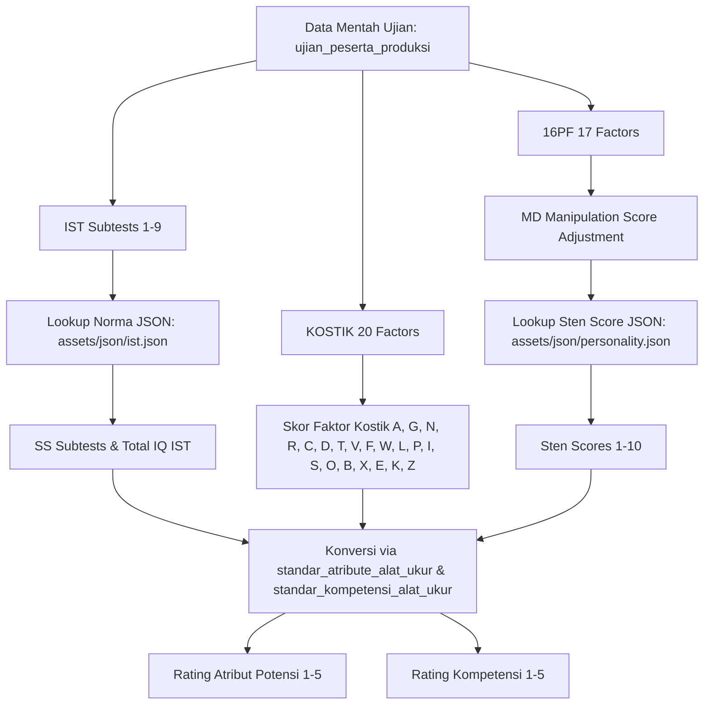

# Analisis Legacy View Report Individu P3K Kejaksaan Agung 2025

- **File Sumber**: `D:\bima\RND\SPSP\legacy\report_individu_p3k_kjg_2025.php`
- **Aplikasi Asal**: CodeIgniter 3 (LSP)
- **Koneksi Database**: `DB_LSP_LOCAL` / `lspLocalConfig`
- **Tanggal Analisis**: 22 Juli 2026

---

## 1. Ikhtisar & Ringkasan Fitur
View `report_individu_p3k_kjg_2025.php` merupakan tampilan laporan individu hasil asesmen peserta **P3K Kejaksaan Agung RI 2025**. File ini bertindak sebagai gabungan *controller-view logic* yang mengambil data mentah peserta dari database LSP, mengolah norma alat tes psikometri (IST, Kostik, 16PF), mengonversi skor ke rating 1–5, menghitung nilai berbobot Potensi (40%) dan Kompetensi (60%), memproses tes kejiwaan (MMPI), menarik interpretasi narasi otomatis, hingga menentukan kesimpulan akhir kelulusan (MS / MMS / TMS).

---

## 2. Pemetaan Tabel Database LSP

Berikut adalah 20 tabel database LSP yang diakses oleh view legacy ini:

| No | Nama Tabel | Fungsi & Kolom Utama yang Dipakai |
|---:|:---|:---|
| 1 | `peserta_produksi` / `$peserta` | Identitas peserta (`no_test`, `no_kjg`, `username`, `nama_lengkap`, `gelar_depan`, `gelar_belakang`, `tanggal_lahir`, `pendidikan`, `jenis_kelamin`, `jabatan_pelaksana`, `minat_penempatan`, `batch`, `kode_pelaksanaan`, `pasfoto`, `angka`). |
| 2 | `ujian_peserta_produksi` | Skor mentah alat tes (`typesoal` IN (`ist`, `kostik`, `personality`), `nilai`). |
| 3 | `rekapmmpi_p3kkjg` | Evaluasi tes kejiwaan/MMPI (`validitas`, `internal_pribadi`, `interpersonal`, `kapasitas_kerja`, `klinis`, `kesimpulan`, `psikogram`, `nilai_pq`, `tingkat_stres`). |
| 4 | `proyek` | Metadata pelaksanaan (`tanggal_pelaksanaan`, `sampai_tanggal`, `nama_proyek`, `lokasi`). |
| 5 | `proyek_produksi` | Data instansi proyek (`instansi`). |
| 6 | `klien` | Data nama instansi/klien (`nama_klien`, `kode_instansi`). |
| 7 | `validasi_ttd_report` | Penomoran dokumen resmi (`no_dokumen`), kode validasi TTD digital (`kode_validasi`), dan file QR code. |
| 8 | `standard` | Penentuan jenis standar penilaian (`p3k_kjg_-_jf_terampil_2025` atau `p3k_kjg_-_jf_muda_&_pertama_2025`). |
| 9 | `aspek_yang_digali` | Daftar kompetensi inti wawancara (`kode_kompetensi`, `nama_kompetensi`, `interview`). |
| 10 | `standard_aspek_yang_digali` | Mapping standar rating target (1–5) dan bobot (`bobot`, `standar_rating`, `jenis_standar`, `kompetensi`). |
| 11 | `hasil_aspek_yang_digali` | Hasil penilaian wawancara dari asesor (`nilai_rating`, `bukti_perilaku`, `kuk`, `kode_ta`). |
| 12 | `aspek_tambahan` | Aspek tambahan wawancara (`kode_aspek_tambahan`, `nama_aspek_tambahan`, `definisi`). |
| 13 | `hasil_aspek_tambahan` | Nilai dan keterangan aspek tambahan dari asesor (`nilai`, `keterangan`). |
| 14 | `standar_potensi` | Definisi aspek potensi, atribut target, standar rating (1–5), bobot (`bobot`), dan urutan display. |
| 15 | `standar_aspek` | Master nama aspek potensi (`kode_aspek`, `aspek_penilaian`). |
| 16 | `standar_atribute` | Master nama atribut potensi (`kode_atribute`, `nama_atribute`). |
| 17 | `standar_atribute_alat_ukur` | **Tabel Utama Konversi Potensi**: Mapping komponen alat tes ke atribut beserta rentang skala norma (`skala_1` s.d. `skala_5`) & arah korelasi (`tingkat` `+`/`-`). |
| 18 | `standar_kompetensi_alat_ukur` | **Tabel Utama Konversi Kompetensi**: Mapping komponen alat tes ke kompetensi inti beserta rentang skala norma. |
| 19 | `kamus_potensi` | Narasi interpretasi potensi berdasarkan (`standard`, `versi`, `kode_atribute`, `rating`, `interpretasi`). |
| 20 | `kamus_kompetensi` | Narasi interpretasi kompetensi berdasarkan (`standard`, `versi`, `kode_kompetensi`, `rating`, `interpretasi`). |
| 21 | `hasil_aspek_kelebihan` | Catatan kualitatif kekuatan (`aspek_kelebihan`) & kelemahan (`aspek_kelemahan`) dari asesor. |
| 22 | `hasil_rekomendasi` | Rekomendasi akhir wawancara asesor (`catatan_wajib`, `saran_pengembangan`, `rekomendasi` MS/MMS/TMS). |
| 23 | `users_personil` & `penugasan` | Data Asesor / Technical Advisor (TA): gelar, nama lengkap, jabatan. |

---

## 3. Logika & Pipeline Kalkulasi Alat Tes Psikometri

View ini memproses 3 instrumen psikometri utama:

### A. IST (Intelligenz Struktur Test)
- **Subtest**: `SE`, `WA`, `AN`, `GE`, `RA`, `ZR`, `FA`, `WU`, `ME` (di-explode dari CSV).
- **Norma Pendidikan/Usia**: Look up ke `assets/json/ist.json` sesuai tingkat pendidikan peserta (`SMA/SMK` vs `S1/D3` vs Norma Usia).
- **Output**: Standard Score (SS) per subtest dan IQ IST.
- **Kategori IQ**:
  - $\le 89 \rightarrow$ Kategori 5 (Sangat Rendah / Rendah)
  - $90 - 109 \rightarrow$ Kategori 4 (Rata-rata)
  - $110 - 119 \rightarrow$ Kategori 3 (Rata-rata Tinggi)
  - $120 - 129 \rightarrow$ Kategori 2 (Tinggi)
  - $\ge 130 \rightarrow$ Kategori 1 (Sangat Tinggi)

### B. PAPI KOSTIK
- **Faktor**: 20 faktor kepribadian kerja (`A`, `G`, `N`, `R`, `C`, `D`, `T`, `V`, `F`, `W`, `L`, `P`, `I`, `S`, `O`, `B`, `X`, `E`, `K`, `Z`).

### C. 16PF (Personality Factor)
- **Faktor**: 17 faktor (`MD`, `A`, `B`, `C`, `E`, `F`, `G`, `H`, `I`, `L`, `M`, `N`, `O`, `Q1`, `Q2`, `Q3`, `Q4`).
- **Koreksi MD (Motivasi Manipulasi)**:
  - Jika $MD = 10$: Penyesuaian $+2$ / $-2$ / $+1$ / $-1$ pada faktor tertentu.
  - Jika $MD = 8$ atau $9$: Penyesuaian $+1$ / $-1$ pada faktor tertentu.
  - Jika $MD = 7$: Penyesuaian $+1$ / $-1$ pada faktor $O, Q4, C, Q3$.
- **Look Up Norma Sten**: Mengambil dari `assets/json/personality.json` berdasarkan kelompok usia ($\le 19$, $20-29$, $\ge 30$) untuk menghasilkan **Sten Score (1–10)**.

---

## 4. Konversi Komponen Alat Tes ke Rating 1–5

Proses konversi komponen tes ke skala rating 1–5 dilakukan dengan membaca aturan pada tabel `standar_atribute_alat_ukur` (untuk Potensi) dan `standar_kompetensi_alat_ukur` (untuk Kompetensi):

### Aturan Skala & Korelasi (`tingkat`)
Setiap baris mapping berisi batas cut-off: `skala_1`, `skala_2`, `skala_3`, `skala_4`, `skala_5`.

1. **Korelasi Positif (`tingkat = '+'`)**:
   - Jika Skor $\le$ `skala_1` $\rightarrow$ **Rating 1**
   - Jika Skor $\le$ `skala_2` $\rightarrow$ **Rating 2**
   - Jika Skor $\le$ `skala_3` $\rightarrow$ **Rating 3**
   - Jika Skor $\le$ `skala_4` $\rightarrow$ **Rating 4**
   - Jika Skor $\ge$ `skala_5` $\rightarrow$ **Rating 5**

2. **Korelasi Negatif / Inverted (`tingkat = '-'`)**:
   - Jika Skor $\ge$ `skala_1` $\rightarrow$ **Rating 1**
   - Jika Skor $\ge$ `skala_2` $\rightarrow$ **Rating 2**
   - Jika Skor $\ge$ `skala_3` $\rightarrow$ **Rating 3**
   - Jika Skor $\ge$ `skala_4` $\rightarrow$ **Rating 4**
   - Jika Skor $\le$ `skala_5` $\rightarrow$ **Rating 5**

Jika satu atribut/kompetensi dipengaruhi oleh lebih dari 1 faktor alat tes, maka rating dari tiap-tiap faktor dihitung **rata-ratanya** (`round()`) untuk menjadi **Rating Akhir Atribut/Kompetensi (1–5)**.

---

## 5. Kerangka Kalkulasi Potensi & Kompetensi

### A. Toleransi Default (10%)
Secara default pada view ini: `$toleransi = "10"` (10%).
- $\text{Standar Toleransi} = \text{Standar Rating} - (\text{Standar Rating} \times 10\%)$.

### B. Formula Profil Potensi
- **Rata-rata Rating Potensi**: Rata-rata dari rating atribut dalam aspek tersebut.
- **Skor Potensi**: $\text{Rating} \times \text{Bobot Aspek}$.
- **Bobot Potensi**: Potensi menyumbang **40%** dari total skor akhir psikotes.
- **GAP Rating**: $\text{Rating Individu} - \text{Standar Rating Toleransi}$.
- **GAP Score**: $\text{Skor Individu} - \text{Standar Skor Toleransi}$.

### C. Formula Profil Kompetensi
- Mengambil nilai dari hasil wawancara asesor (`hasil_aspek_yang_digali`) ATAU hasil kalkulasi alat tes (`standar_kompetensi_alat_ukur`).
- **Skor Kompetensi**: $\text{Rating Kompetensi} \times \text{Bobot Kompetensi}$.
- **Bobot Kompetensi**: Kompetensi menyumbang **60%** dari total skor akhir psikotes.

---

## 6. Pengolahan Tes Kejiwaan (MMPI)

Data dari `rekapmmpi_p3kkjg` dievaluasi pada 9 domain:
1. Validitas
2. Internal Pribadi
3. Interpersonal
4. Kapasitas Kerja
5. Klinis
6. Kesimpulan
7. Psikogram
8. Nilai PQ
9. Tingkat Stres

**Logika Konversi Kejiwaan ke Skor & Status**:
View mencari frasa kunci pada kolom `kesimpulan`:
- *"tidak mengalami stres"* $\rightarrow$ **Nilai 90** | Status: **MEMENUHI SYARAT (MS)** (Hijau)
- *"stres ringan"* atau *"stres sedang"* $\rightarrow$ **Nilai 77.5 / 65** | Status: **MASIH MEMENUHI SYARAT (MMS)** (Kuning)
- *"stres berat"* atau *"gejala kejiwaan"* $\rightarrow$ **Nilai 52.5 / 40** | Status: **TIDAK MEMENUHI SYARAT (TMS)** (Merah)

---

## 7. Sistem Interpretasi Narasi Otomatis

- Peserta mendapatkan versi narasi acak (1–5) yang tersimpan di `peserta_produksi.angka`.
- Kunci pencarian narasi pada `kamus_potensi` & `kamus_kompetensi`:
  - Potensi: `[kode_atribute]_[rating_1-5]` pada versi `angka`.
  - Kompetensi: `[kode_kompetensi]_[rating_1-5]` pada versi `angka`.
- Narasi yang didapatkan kemudian digabungkan (*implode*) untuk ditampilkan pada tabel laporan individu.

---

## 8. Logika Rekomendasi & Kesimpulan Akhir (MS / MMS / TMS)

1. **Total Skor Akhir Psikotes**:
   $$\text{Total Skor Akhir} = (\text{Skor Potensi} \times 40\%) + (\text{Skor Kompetensi} \times 60\%)$$

2. **Syarat Kelulusan Psikotes**:
   - **Prasyarat IQ**: $IQ \ge 90$. Jika $IQ < 90$, maka Kesimpulan Psikotes otomatis **TIDAK MEMENUHI SYARAT (TMS)** (Merah).
   - **Kriteria Total Skor**:
     - $\text{Total Skor Akhir} \ge \text{Total Skor Standar}$ $\rightarrow$ **MEMENUHI SYARAT (MS)** (Hijau)
     - $\text{Total Skor Akhir} \ge \text{Total Skor Standar Toleransi}$ $\rightarrow$ **MASIH MEMENUHI SYARAT (MMS)** (Kuning)
     - Di bawah toleransi $\rightarrow$ **TIDAK MEMENUHI SYARAT (TMS)** (Merah)

3. **Matriks Kesimpulan Final (Psikotes + Wawancara Asesor)**:
   - Psikotes (MS) + Wawancara (MS) $\rightarrow$ **MS** (Hijau)
   - Psikotes (TMS) + Wawancara (MS) $\rightarrow$ **MMS** (Kuning)
   - Psikotes (MS) + Wawancara (TMS) $\rightarrow$ **MMS** (Kuning)
   - Psikotes (MMS) + Wawancara (MMS) $\rightarrow$ **MMS** (Kuning)
   - Psikotes (TMS) + Wawancara (TMS) $\rightarrow$ **TMS** (Merah)

---

## 9. TTD Elektronik & QR Code
- Menghasilkan nomor dokumen resmi berformat: `001-[batch]/LI-QHRM-[kode_instansi]-[kode_nama]/[bulan_romawi]/[tahun]`.
- Mengirim AJAX request ke `qr_code/create_qr_lapin/` untuk merekam log validasi dan generate URL QR Code TTD digital yang mengarah ke link verifikasi LSP.
