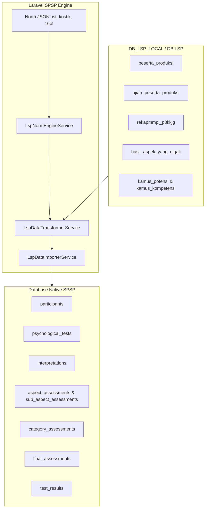

# Panduan Integrasi & Sinkronisasi Data LSP ke SPSP

- **Modul**: Integrasi LSP (Quantum HRMI) $\rightarrow$ SPSP System
- **File Service**:
  - `app/Services/Lsp/LspNormEngineService.php` (Engine Perhitungan Norma Psikometri)
  - `app/Services/Lsp/LspDataTransformerService.php` (Transformer Data Impor LSP, menggantikan `LspIndividualReportService`)
  - `app/Services/Lsp/LspDataImporterService.php` (Importer Data ke DB Native SPSP)
  - `app/Services/TestReportService.php` (Fondasi Laporan Alat Tes SPSP Native)
- **File Command**: `app/Console/Commands/TestLspIndividualReport.php` & `app/Console/Commands/ImportLspData.php`
- **File Test**: `tests/Feature/LspNormEngineServiceTest.php`, `tests/Feature/LspIndividualReportServiceTest.php` & `tests/Feature/LspDataImporterServiceTest.php`
- **Lokasi Norma**: `resources/data/lsp_norms/` (`ist.json`, `kostik.json`, `personality.json`)
- **Dokumentasi Kedinamisan Multi-Proyek**: `docs/lsp_integration/04_DYNAMIC_MULTI_PROJECT_SUPPORT.md`
- **Dokumentasi Fallback & Ketahanan Sistem**: `docs/lsp_integration/05_FALLBACK_AND_SAFETY_MECHANISMS.md`

---

## 1. Ikhtisar Arsitektur Integrasi

Integrasi LSP bertugas mengambil data mentah hasil ujian dari clone database LSP (`DB_LSP_LOCAL` / koneksi `lsp`), mengolah norma psikometri presisi via `LspNormEngineService`, dan mentransformasi data via `LspDataTransformerService` untuk disinkronkan ke tabel-tabel native SPSP (`participants`, `psychological_tests`, `interpretations`, `aspect_assessments`, `sub_aspect_assessments`, `category_assessments`, `final_assessments`).


```mermaid
flowchart TD
    subgraph LSP_DATABASE [DB_LSP_LOCAL / DB LSP]
        A1[peserta_produksi]
        A2[ujian_peserta_produksi]
        A3[rekapmmpi_p3kkjg]
        A4[hasil_aspek_yang_digali]
        A5[kamus_potensi & kamus_kompetensi]
    end

    subgraph SPSP_ENGINE [Laravel SPSP Engine]
        B1[LspNormEngineService]
        B2[LspDataTransformerService]
        B3[LspDataImporterService]
        B4[Norm JSON: ist, kostik, 16pf]
    end

    subgraph SPSP_DATABASE [Database Native SPSP]
        C1[participants]
        C2[psychological_tests]
        C3[interpretations]
        C4[aspect_assessments & sub_aspect_assessments]
        C5[category_assessments]
        C6[final_assessments]
        C7[test_results]
    end

    LSP_DATABASE --> B2
    B4 --> B1
    B1 --> B2
    B2 --> B3
    B3 --> SPSP_DATABASE
```

---

## 2. Penggunaan Command Artisan CLI

### A. Uji Coba Transformer & Laporan Individu (Tanpa Menyimpan ke DB SPSP)
Menguji kalkulasi norma & transformasi data peserta secara instan dan menampilkan DTO/tabel pada terminal:
```bash
php artisan lsp:test-report <username_peserta> <kode_proyek>
```
*Contoh*:
```bash
php artisan lsp:test-report bntn01-001 PR-A-313
```

### B. Impor / Sinkronisasi Data LSP ke Database SPSP
Mengimpor data peserta dari database LSP dan menyimpan/menyinkronkannya ke tabel-tabel SPSP:
```bash
# Impor seluruh peserta dalam 1 proyek LSP
php artisan lsp:import <kode_proyek>

# Impor spesifik 1 username peserta saja
php artisan lsp:import <kode_proyek> --username=<username_peserta>

# Impor dengan menentukan ID Instansi SPSP spesifik
php artisan lsp:import <kode_proyek> --institution=<institution_id>
```

---

## 3. Eksekusi Automated Tests

Untuk memastikan seluruh pengujian integrasi LSP berjalan tanpa error:
```bash
# Menjalankan seluruh test suite integrasi LSP
php artisan test --compact --filter=Lsp

# Menjalankan unit test LspNormEngineService
php artisan test --compact --filter=LspNormEngineServiceTest

# Menjalankan unit test LspDataTransformerService
php artisan test --compact --filter=LspIndividualReportServiceTest

# Menjalankan unit test LspDataImporterService
php artisan test --compact --filter=LspDataImporterServiceTest
```

---

## 4. Struktur File Norma JSON

File norma psikometri disimpan pada direktori:
`resources/data/lsp_norms/`
- `ist.json`: Norma konversi subtest & total IQ IST.
- `kostik.json`: Norma konversi 20 faktor PAPI Kostik.
- `personality.json`: Norma konversi Sten Score (1–10) 16PF dengan koreksi MD.
