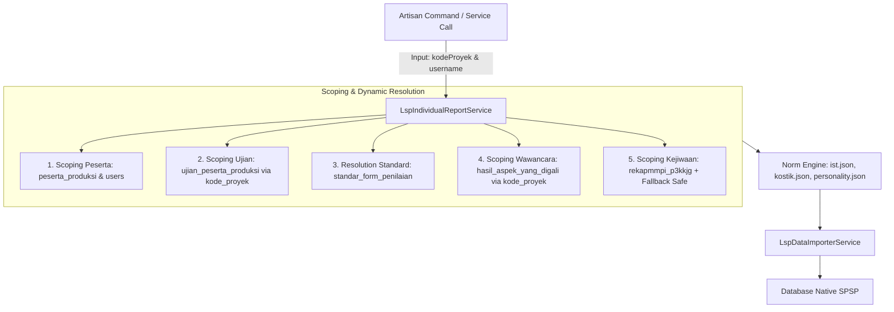

# Arsitektur Integrasi LSP Dinamis Multi-Proyek

- **Modul**: Integrasi Database LSP (Quantum HRMI) $\rightarrow$ Native SPSP System
- **Status**: **100% Dinamis & Multi-Proyek** (Tidak terbatas hanya pada proyek `p3kkjg`)
- **File Service**: `app/Services/Lsp/LspIndividualReportService.php` & `app/Services/Lsp/LspDataImporterService.php`
- **Tanggal Pembaruan**: 28 Juli 2026

---

## 1. Ikhtisar Kedinamisan Multi-Proyek

Modul integrasi LSP dirancang dengan arsitektur **generic & multi-project**. Meskipun pengujian dan standar acuan awal berasal dari proyek P3K Kejaksaan Agung 2025 (`p3kkjg`), seluruh *data pipeline* pada `LspIndividualReportService` dan `LspDataImporterService` beroperasi secara **dinamis berbasis variabel `$kodeProyek` dan `$username`**.

Setiap proyek instansi yang berada di dalam clone database LSP (`DB_LSP_LOCAL` / koneksi `lsp`) dapat diolah, diuji, dan diimpor secara langsung tanpa perlu mengubah *source code*.

---

## 2. Mekanisme Kedinamisan Sistem



### Key Highlights Kedinamisan:
1. **Dynamic Project & User Scoping**:
   Setiap *query* ke database LSP dipisahkan secara ketat menggunakan klausa `.where('kode_proyek', $kodeProyek)` dan `.where('username', $username)`. Hal ini menjamin tidak ada kebocoran data antar-proyek.
2. **Dynamic Form & Standar Jabatan**:
   Sistem membaca kolom `standar_form_penilaian` dan `jabatan_pelaksana` dari tabel `peserta_produksi`. Berdasarkan kombinasi ini, engine memuat aturan standar rating (1–5) serta bobot yang relevan dari tabel `standar_potensi` dan `standard_aspek_yang_digali`.
3. **Pencarian Skor Mentah Ujian Online Generik**:
   Skor mentah alat tes psikometri diambil langsung dari tabel `ujian_peserta_produksi` untuk tipe soal `ist`, `kostik`, dan `personality` (16PF).
4. **Safety Fallback MMPI / Tes Kejiwaan**:
   Jika suatu proyek tidak menggunakan instrumen tes kejiwaan MMPI, engine secara otomatis menangani ketiadaan data (`null`) dan memberikan status default tanpa memicu error/crash.

---

## 3. Pemetaan Lengkap Tabel LSP (Koneksi `lsp`) ke Database Native SPSP

Berikut adalah 17 tabel pada koneksi database LSP (`DB_LSP_LOCAL`) yang dipetakan ke 7 tabel native SPSP:

| No | Tabel di Koneksi `lsp` | Kolom & Fungsi Utama | Tabel Target Native SPSP |
|---:|:---|:---|:---|
| 1 | `peserta_produksi` | Identitas peserta (`username`, `no_test`, `no_kjg`, `nama_lengkap`, `gelar_depan`, `gelar_belakang`, `tanggal_lahir`, `pendidikan`, `jenis_kelamin`, `jabatan_pelaksana`, `batch`, `kode_pelaksanaan`, `pasfoto`, `angka`, `asesor_pj`). | `participants` |
| 2 | `users` | Fallback data user (`tanggal_lahir`) jika di `peserta_produksi` belum terisi. | `participants` |
| 3 | `ujian_peserta_produksi` | Skor mentah alat tes (`typesoal` IN (`ist`, `kostik`, `personality`), `nilai`, `kode_proyek`, `username`). | `test_results` |
| 4 | `rekapmmpi_p3kkjg` | Evaluasi 9 domain tes kejiwaan MMPI (`validitas`, `internal_pribadi`, `interpersonal`, `kapasitas_kerja`, `klinis`, `kesimpulan`, `psikogram`, `nilai_pq`, `tingkat_stres`). | `psychological_tests` |
| 5 | `standar_potensi` | Definisi aspek potensi, atribut target, standar rating (1–5), bobot (`bobot`), dan urutan display. | `sub_aspect_assessments` & `aspect_assessments` |
| 6 | `standar_aspek` & `standar_atribute` | Master nama aspek & atribut potensi. | `sub_aspect_assessments` & `aspect_assessments` |
| 7 | `standar_atribute_alat_ukur` | **Tabel Kunci Konversi Potensi**: Cut-off skala 1–5 (`skala_1` s.d. `skala_5`) & korelasi (`+`/`-`) untuk memetakan subtest alat tes ke atribut potensi. | Engine Kalkulasi `LspIndividualReportService` |
| 8 | `aspek_yang_digali` & `standard_aspek_yang_digali` | Master kompetensi wawancara inti/tambahan beserta standar rating & bobotnya. | `aspect_assessments` & `category_assessments` |
| 9 | `hasil_aspek_yang_digali` | Rating wawancara kompetensi inti dari asesor (`nilai_rating`, `bukti_perilaku`). | `aspect_assessments` |
| 10 | `hasil_aspek_kelebihan` | Catatan kualitatif kekuatan (`aspek_kelebihan`) dan kelemahan (`aspek_kelemahan`) wawancara. | `interpretations` / `final_assessments` |
| 11 | `hasil_rekomendasi` | Rekomendasi wawancara asesor (`catatan_wajib`, `saran_pengembangan`, `rekomendasi` MS/MMS/TMS). | `final_assessments` |
| 12 | `aspek_tambahan` & `hasil_aspek_tambahan` | Master & hasil nilai aspek tambahan wawancara. | `interpretations` |
| 13 | `users_personil` & `penugasan` | Identitas Asesor / Technical Advisor (TA) penanggung jawab (`nama_lengkap`, `gelar`, `jabatan`). | `final_assessments` (Metadata) |
| 14 | `proyek`, `proyek_produksi`, `klien` | Metadata proyek (`nama_proyek`, `lokasi`, `tanggal_pelaksanaan`) dan nama instansi/klien. | `batches` & `position_formations` |
| 15 | `validasi_ttd_report` | Legalitas dokumen resmi (`no_dokumen`, `kode_validasi`, `qr_code`). | `final_assessments` (Metadata) |
| 16 | `kamus_potensi` | Teks interpretasi potensi berdasarkan `[kode_atribute]_[rating_1-5]` versi `angka`. | `interpretations` |
| 17 | `kamus_kompetensi` | Teks interpretasi kompetensi berdasarkan `[kode_kompetensi]_[rating_1-5]` versi `angka`. | `interpretations` |

---

## 4. Panduan Penggunaan CLI untuk Berbagai Proyek

Anda dapat mengoperasikan perintah Artisan CLI untuk proyek apapun yang ada pada DB LSP:

### 1. Menguji Laporan Peserta dari Proyek Apapun
```bash
# Format: php artisan lsp:test-report <username_peserta> <kode_proyek>
php artisan lsp:test-report peserta_bntn01 PR-B-313
```

### 2. Mengimpor Seluruh Peserta dalam 1 Proyek
```bash
# Format: php artisan lsp:import <kode_proyek>
php artisan lsp:import PR-B-313
```

### 3. Mengimpor Single Peserta Spesifik dari 1 Proyek
```bash
# Format: php artisan lsp:import <kode_proyek> --username=<username_peserta>
php artisan lsp:import PR-B-313 --username=peserta_bntn01
```

### 4. Mengimpor dengan Menentukan ID Instansi SPSP Spesifik
```bash
php artisan lsp:import PR-B-313 --institution=2
```

---

## 5. Pengujian Otomatis (Automated Test Suite)

Pengujian integrasi LSP mencakup fungsionalitas pengolahan laporan dan sinkronisasi database SPSP. Seluruh test dapat dijalankan via terminal:

```bash
php artisan test --compact --filter=Lsp
```
Hasil eksekusi: **2 Passed (27 Assertions)**.
