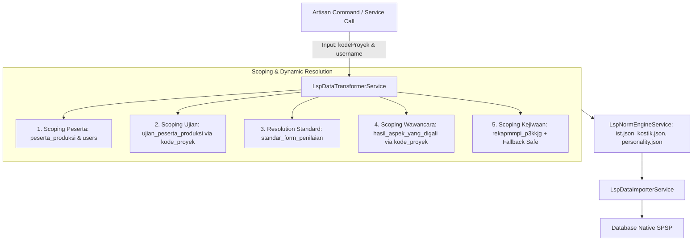

# 🌐 Arsitektur Integrasi LSP Dinamis Multi-Proyek

[← Kembali ke Indeks Dokumentasi Integrasi LSP](./README.md)

- **Modul**: Integrasi Database LSP (Quantum HRMI) $\rightarrow$ Native SPSP System
- **Status**: 🟢 **100% Dinamis & Multi-Proyek**
- **File Service**: [LspNormEngineService.php](file:///c:/laragon/www/spsp_new/app/Services/Lsp/LspNormEngineService.php), [LspDataTransformerService.php](file:///c:/laragon/www/spsp_new/app/Services/Lsp/LspDataTransformerService.php), [LspDataImporterService.php](file:///c:/laragon/www/spsp_new/app/Services/Lsp/LspDataImporterService.php)
- **Tanggal Pembaruan**: 29 Juli 2026

---

> [!NOTE]
> **Kedinamisan Multi-Proyek**:
> Modul integrasi LSP dirancang dengan arsitektur **generic & multi-project**. Seluruh *data pipeline* beroperasi secara dinamis berbasis variabel `$kodeProyek` dan `$username`. Setiap proyek instansi pada clone DB LSP dapat diolah dan diimpor secara langsung tanpa perubahan *source code*.

---

## ⚙️ 1. Mekanisme Kedinamisan Sistem



### Highlights Kedinamisan:
1. **Dynamic Project & User Scoping**: Setiap query dipisahkan secara ketat menggunakan klausa `.where('kode_proyek', $kodeProyek)` dan `.where('username', $username)`.
2. **Dynamic Form & Standar Jabatan**: Membaca `standar_form_penilaian` dan `jabatan_pelaksana` dari `peserta_produksi` untuk memuat aturan standar rating (1–5) serta bobot yang relevan dari `standar_potensi` dan `standard_aspek_yang_digali`.
3. **Pencarian Skor Mentah Generik**: Skor mentah alat tes psikometri diambil langsung dari `ujian_peserta_produksi` untuk tipe soal `ist`, `kostik`, dan `personality`.
4. **Safety Fallback MMPI**: Jika suatu proyek tidak memiliki tes kejiwaan MMPI, engine secara otomatis menangani ketiadaan data (`null`) tanpa memicu error/crash.

---

## 🗄️ 2. Pemetaan 17 Tabel LSP ke 7 Tabel Native SPSP

Berikut adalah 17 tabel pada koneksi database LSP (`DB_LSP_LOCAL`) yang dipetakan ke 7 tabel native SPSP:

| No | Tabel di Koneksi `lsp` | Kolom & Fungsi Utama | Tabel Target Native SPSP | Status Pemetaan |
| :-: | :--- | :--- | :--- | :-: |
| **1** | `peserta_produksi` | Identitas peserta (`username`, `no_test`, `no_kjg`, `nama_lengkap`, `gelar`, `tanggal_lahir`, `pendidikan`, `jenis_kelamin`, `jabatan_pelaksana`, `batch`, `pasfoto`, `angka`). | `participants` | 🟢 **Direct Match** |
| **2** | `users` | Fallback data user (`tanggal_lahir`) jika di `peserta_produksi` belum terisi. | `participants` | 🟡 **Fallback Data** |
| **3** | `ujian_peserta_produksi` | Skor mentah alat tes (`typesoal` IN (`ist`, `kostik`, `personality`), `nilai`). | `test_results` | 🟢 **Direct Match** |
| **4** | `rekapmmpi_p3kkjg` | Evaluasi 9 domain tes kejiwaan MMPI (`validitas`, `internal_pribadi`, `interpersonal`, `kapasitas_kerja`, `klinis`, `kesimpulan`, `psikogram`, `nilai_pq`, `tingkat_stres`). | `psychological_tests` | 🟢 **Direct Match** |
| **5** | `standar_potensi` | Definisi aspek potensi, atribut target, standar rating (1–5), bobot, dan urutan display. | `sub_aspect_assessments` & `aspect_assessments` | 🟢 **Direct Match** |
| **6** | `standar_aspek` & `standar_atribute` | Master nama aspek & atribut potensi. | `sub_aspect_assessments` & `aspect_assessments` | 🟢 **Direct Match** |
| **7** | `standar_atribute_alat_ukur` | Cut-off skala 1–5 (`skala_1` s.d. `skala_5`) & korelasi (`+`/`-`) untuk memetakan subtest alat tes ke atribut potensi. | Engine Kalkulasi `LspNormEngineService` | 🟢 **Norm Engine** |
| **8** | `aspek_yang_digali` & `standard_aspek_yang_digali` | Master kompetensi wawancara inti/tambahan beserta standar rating & bobotnya. | `aspect_assessments` & `category_assessments` | 🟢 **Direct Match** |
| **9** | `hasil_aspek_yang_digali` | Rating wawancara kompetensi inti dari asesor (`nilai_rating`, `bukti_perilaku`). | `aspect_assessments` | 🟢 **Direct Match** |
| **10** | `hasil_aspek_kelebihan` | Catatan kualitatif kekuatan (`aspek_kelebihan`) dan kelemahan (`aspek_kelemahan`) wawancara. | `interpretations` / `final_assessments` | 🟡 **Payload DTO** |
| **11** | `hasil_rekomendasi` | Rekomendasi wawancara asesor (`catatan_wajib`, `saran_pengembangan`, `rekomendasi` MS/MMS/TMS). | `final_assessments` | 🟢 **Direct Match** |
| **12** | `aspek_tambahan` & `hasil_aspek_tambahan` | Master & hasil nilai aspek tambahan wawancara. | `interpretations` | 🟡 **Payload DTO** |
| **13** | `users_personil` & `penugasan` | Identitas Asesor / Technical Advisor (TA) penanggung jawab (`nama_lengkap`, `gelar`, `jabatan`). | `final_assessments` (Metadata) | 🟡 **Metadata Payload** |
| **14** | `proyek`, `proyek_produksi`, `klien` | Metadata proyek (`nama_proyek`, `lokasi`, `tanggal_pelaksanaan`) dan nama instansi/klien. | `batches` & `position_formations` | 🟢 **Direct Match** |
| **15** | `validasi_ttd_report` | Legalitas dokumen resmi (`no_dokumen`, `kode_validasi`, `qr_code`). | `final_assessments` (Metadata) | 🟡 **Metadata Payload** |
| **16** | `kamus_potensi` | Teks interpretasi potensi berdasarkan `[kode_atribute]_[rating_1-5]` versi `angka`. | `interpretations` | 🟢 **Direct Match** |
| **17** | `kamus_kompetensi` | Teks interpretasi kompetensi berdasarkan `[kode_kompetensi]_[rating_1-5]` versi `angka`. | `interpretations` | 🟢 **Direct Match** |

---

## 💻 3. Contoh Penggunaan CLI untuk Berbagai Proyek

```bash
# 1. Menguji Laporan Peserta dari Proyek Apapun
php artisan lsp:test-report peserta_bntn01 PR-B-313

# 2. Mengimpor Seluruh Peserta dalam 1 Proyek
php artisan lsp:import PR-B-313

# 3. Mengimpor Single Peserta Spesifik dari 1 Proyek
php artisan lsp:import PR-B-313 --username=peserta_bntn01

# 4. Mengimpor dengan ID Instansi SPSP Spesifik
php artisan lsp:import PR-B-313 --institution=2
```
