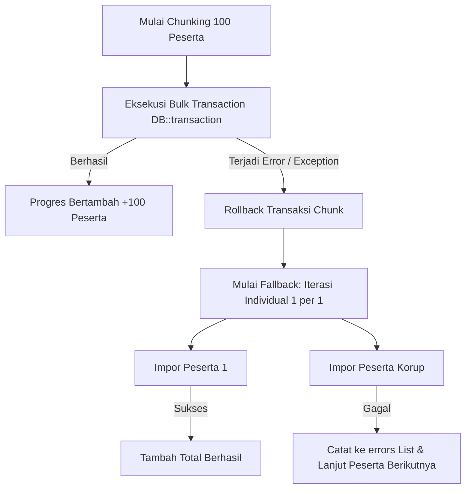

# Dokumentasi Mekanisme Fallback & Isolasi Error Integrasi LSP

- **Modul**: Integrasi Database LSP (Quantum HRMI) $\rightarrow$ Native SPSP System
- **Status**: **Robust & Fault-Tolerant** (Tahan terhadap data kosong / missing dari DB LSP)
- **File Terkait**: `app/Services/Lsp/LspIndividualReportService.php` & `app/Services/Lsp/LspDataImporterService.php`
- **Tanggal Pembaruan**: 28 Juli 2026

---

## 1. Ikhtisar Ketahanan Sistem (System Resilience)

Data historis pada database LSP (CodeIgniter 3 legacy) memiliki variasi kelengkapan data yang sangat tinggi. Sebagian peserta mungkin belum menyelesaikan tes wawancara, tidak mengikuti tes kejiwaan MMPI, atau memiliki nilai `NULL`/kosong pada atribut seperti `jabatan_pelaksana` dan `standar_form_penilaian`.

Modul integrasi LSP pada SPSP dilengkapi dengan **sistem *fallback* bertingkat dan *error isolation***. Mekanisme ini menjamin bahwa proses kalkulasi maupun sinkronisasi massal **100% tahan terhadap error (*crash-proof*)**, serta tidak akan menghentikan proses impor peserta lain saat ditemukan satu record data yang tidak valid.

---

## 2. Matriks Rinci Mekanisme Fallback

### A. Identitas Peserta, Tanggal Lahir & Usia
| Field / Variabel | Kondisi Data Mentah LSP | Nilai Fallback / Aturan Penanganan | Dampak Sistem |
|:---|:---|:---|:---|
| **Lookup Peserta** | `kode_pelaksanaan` tidak cocok persis | Mencari berdasarkan `username` saja pada tabel `peserta_produksi`. | Memastikan peserta tetap terimpor jika kode proyek di LSP memiliki penulisan bervariasi. |
| **Tanggal Lahir** | `tanggal_lahir` di `peserta_produksi` kosong | Mengambil `tanggal_lahir` dari tabel `users`. Jika masih kosong, default `'1990-01-01'`. | Dasar perhitungan usia peserta. |
| **Perhitungan Usia** | `tanggal_lahir` invalid / tanggal di masa depan | Method `hitungUmurDalamTahun` mengembalikan nilai default **25 Tahun** (atau `0` jika tanggal lahir di masa depan). | Menjamin kalkulasi norma IST & 16PF berbasis usia tidak memicu error. |
| **Nama Lengkap & Gelar** | Gelar depan/belakang bernilai `NULL` | String dibersihkan via `trim(($gelarDepan . ' ' . $nama . ', ' . $gelarBelakang), ' ,')`. | Menghindari tampilan koma atau spasi ganda. |
| **Jenis Kelamin** | `jenis_kelamin` kosong / `NULL` | Default `'L'` (Laki-laki). | Digunakan untuk norma yang membutuhkan variabel gender. |
| **Tingkat Pendidikan** | `pendidikan` kosong / `NULL` | Default `'S1'`. | Digunakan sebagai acuan norma IST (S1/D3 vs SMA/SMK). |

---

### B. Formasi Jabatan, Template, & Gelombang (Batch)
| Field / Variabel | Kondisi Data Mentah LSP | Nilai Fallback / Aturan Penanganan | Dampak Sistem |
|:---|:---|:---|:---|
| **Standar Form Penilaian** | `standar_form_penilaian` di LSP kosong / `""` | Default `'p3k_kjg_2025'`. | Memastikan engine memuat norma standar Kejaksaan 2025. |
| **Level Jabatan** | `jabatan_pelaksana` di LSP kosong / `""` | Default `'STAFF'`. | Menghindari nama formasi atau *slug* bernilai string kosong. |
| **Pemetaan Standar Penilaian** | `standar_form_penilaian` = `'p3k_kjg_2025'` | Jika `levelJabatan` = `'TERAMPIL'` $\rightarrow$ `'p3k_kjg_-_jf_terampil_2025'`. Selainnya $\rightarrow$ `'p3k_kjg_-_jf_muda_&_pertama_2025'`. | Otomatis memisahkan standar Terampil vs Ahli/Muda. |
| **Nama Gelombang / Batch** | Kolom `batch` di LSP kosong / `NULL` | Default `'1'` (Gelombang 1). | Membuat Batch `pr-a-xxx-1` di database SPSP. |
| **Nama Formasi (PositionFormation)**| `minat_penempatan` di LSP kosong / `"-"` | Menggunakan nilai `levelJabatan` (misal `'STAFF'`). | Menjamin `code` dan `name` formasi valid dan tidak kosong. |

---

### C. Skor Mentah Psikometri (IST, PAPI Kostik, 16PF)
| Instrument | Kondisi Data Mentah LSP | Nilai Fallback / Aturan Penanganan | Dampak Sistem |
|:---|:---|:---|:---|
| **IST (Intelligenz Struktur Test)** | Skor mentah IST kosong / tidak lengkap (< 9 subtest) | IQ default **100** (Kategori `'Rata-rata'`), Skor Subtest SS default **10**. | Mencegah error pembagian array subtest IST. |
| **Norma IST JSON Missing** | File `ist.json` tidak ditemukan di server | Formula estimasi: $IQ = 90 + \min(40, \text{total\_skor} / 3)$. | Perhitungan hampiran IQ tanpa file JSON norma. |
| **PAPI Kostik** | Skor mentah Kostik kosong / `NULL` | Seluruh 20 faktor kepribadian di-set default **1**. | Mencegah index undefined saat konversi atribut. |
| **16PF (Personality Factor)** | Skor mentah 16PF kosong / `NULL` | Seluruh 16 faktor sten score di-set default **5**. | Mencegah error lookup norma 16PF. |
| **Koreksi MD 16PF** | Nilai MD = 10, 8-9, atau 7 | Penyesuaian Sten score $+2$, $+1$, $-1$, $-2$ pada faktor tertentu. Hasil akhir di-*clamp* antara `1` dan `10`. | Menyesuaikan manipulasi motivasi tes 16PF. |
| **Divided by Zero Guard** | Standard Rating Toleransi = 0 | `max(1, $standardRatingToleransi)`. | Mencegah `DivisionByZeroError` saat hitung `% score`. |

---

### D. Wawancara Asesor & Data Kualitatif
| Data Wawancara | Kondisi Data Mentah LSP | Nilai Fallback / Aturan Penanganan | Dampak Sistem |
|:---|:---|:---|:---|
| **Rating Kompetensi Inti** | Record di `hasil_aspek_yang_digali` tidak ada (belum diwawancara) | Menggunakan nilai **Standard Rating Target**. | Jika belum diwawancara, nilai individu dianggap memenuhi standar target. |
| **Asesor Penanggung Jawab** | Data asesor di `users_personil` tidak ditemukan | Nama: `'Asesor Penanggung Jawab'`, Jabatan: `'Technical Advisor'`. | Mencegah header/footer laporan kosong. |
| **Keunggulan & Kelemahan** | Record di `hasil_aspek_kelebihan` kosong | `'kekuatan' => '-'`, `'kelemahan' => '-'`. | Output laporan kualitatif aman. |
| **Rekomendasi Wawancara** | Record di `hasil_rekomendasi` kosong | Rekomendasi default `'MS'` (Memenuhi Syarat), Catatan = `'-'`. | Mencegah `undefined match` pada rekomendasi akhir. |
| **Aspek Tambahan** | Rating aspek tambahan di `hasil_aspek_tambahan` kosong | Nilai default = **Standard Rating Target**, Keterangan = `'-'`. | Mencegah array undefined di tabel aspek tambahan. |

---

### E. Tes Kejiwaan (MMPI)
| Data MMPI | Kondisi Data Mentah LSP | Nilai Fallback / Aturan Penanganan | Dampak Sistem |
|:---|:---|:---|:---|
| **Record MMPI** | Peserta/proyek tidak punya data di `rekapmmpi_p3kkjg` | `validitas` => `'-'`, `nilai_pq` => `0.00`, `tingkat_stres` => `'-'`, `kesimpulan_mmpi` => `'BELUM ADA REKOMENDASI'`. | Proyek tanpa tes kejiwaan berjalan 100% aman tanpa crash. |
| **Parsing Teks Kesimpulan** | Teks `kesimpulan` tidak cocok dengan kata kunci stres | `nilai_kejiwaan` => `0`, `kesimpulan_mmpi` => `'BELUM ADA REKOMENDASI'`. | Mencegah false-positive kelulusan MMPI. |

---

### F. Legalisasi & Metadata Proyek
| Metadata | Kondisi Data Mentah LSP | Nilai Fallback / Aturan Penanganan | Dampak Sistem |
|:---|:---|:---|:---|
| **Proyek & Instansi** | Record `proyek` / `klien` tidak ditemukan | `nama_proyek` => `'-'`, `nama_klien` => `'-'`, Tanggal => Tanggal Hari Ini. | Penanganan metadata laporan. |
| **Validasi Dokumen & QR** | Record `validasi_ttd_report` kosong | `no_dokumen` => `'001/LI-QHRM/2025'`, `kode_validasi` => `null`, `qr_code` => `null`. | Mencegah error pada header/footer cetak. |
| **Versi Narasi Kamus** | Kolom `angka` pada `peserta_produksi` kosong | Default `versi = 1`. | Memilih versi narasi 1 dari kamus interpretasi. |

---

## 3. Mekanisme Isolasi Error Impor (Chunk Transaction Fallback)

Proses impor massal pada `LspDataImporterService` memproses peserta dalam kelompok (*chunk*) sebanyak **100 peserta per transaksi**.

### Keunggulan Mekanisme Isolasi:
1. **Performa Maksimal**: Dalam kondisi normal, 100 peserta diimpor secara instan dalam 1 transaksi DB.
2. **Auto-Recovery**: Jika terdapat 1 peserta dengan data korup yang memicu exception SQL, transaksi *chunk* 100 peserta tersebut di-rollback tanpa mempengaruhi *chunk* lainnya.
3. **Error Isolation**: Engine otomatis mengalihkan *chunk* yang gagal tersebut ke mode **sinkronisasi individual**. 99 peserta yang sehat akan **tetap berhasil diimpor**, dan hanya 1 peserta yang korup yang dicatat pada tabel kesalahan `errors[]`.
