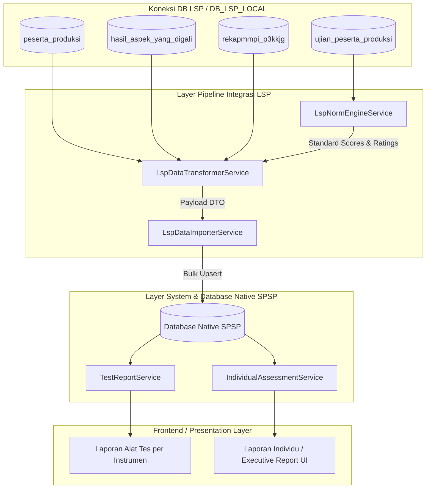

# Arsitektur & Spesifikasi Service Integrasi LSP

- **Modul**: Integrasi Database LSP (Quantum HRMI) $\rightarrow$ Native SPSP System
- **File Dokumentasi**: `docs/lsp_integration/06_LSP_SERVICES_ARCHITECTURE.md`
- **Tanggal Pembaruan**: 29 Juli 2026

---

## 1. Ikhtisar Arsitektur Multi-Service

Modul integrasi LSP menerapkan prinsip **Single Responsibility Principle (SRP)** dengan memisahkan tugas pipeline data ke dalam service-service modular:

---

## 2. Rincian & Peran Masing-Masing Service

### 1. `LspNormEngineService`
- **Lokasi File**: `app/Services/Lsp/LspNormEngineService.php`
- **Tanggung Jawab Utama**: Murni mengolah konversi norma psikometri dari skor mentah (*raw score*) ke *standard score*, IQ, Sten score, dan rating aspek/atribut (skala 1–5).
- **Independensi**: Tidak tergantung pada database SPSP, sehingga *reusable* untuk berbagai kebutuhan pengolahan norma.
- **Method Utama**:
  - `loadNormData()`: Pemuatan in-memory caching untuk `ist.json`, `kostik.json`, `personality.json`.
  - `processIstNorms($rawIst, $pendidikan, $usia)`: Mengonversi 9 subtest IST ke SW (Standard Score) & IQ.
  - `processKostikNorms($rawKostik)`: Mengolah 20 faktor kepribadian PAPI Kostik.
  - `process16pfNorms($rawPersonality, $usia)`: Mengonversi 16PF ke Sten Score (1–10) + koreksi MD.
  - `calculateProfilPotensiCached($db, $standarJabatan, $standarPenilaian, ...)`: Menghitung rating aspek potensi (skala 1–5) dari tabel `standar_atribute_alat_ukur`.

---

### 2. `LspDataTransformerService`
- **Lokasi File**: `app/Services/Lsp/LspDataTransformerService.php`
- **Tanggung Jawab Utama**: Pipeline ekstraksi dan transformasi data mentah dari koneksi DB LSP (`DB_LSP_LOCAL`) menjadi struktur DTO/array terstandar.
- **Catatan Penamaan**: Menggantikan peran `LspIndividualReportService` yang lama agar penamaannya secara tegas mencerminkan tugas aslinya sebagai data transformer untuk impor data legacy.
- **Method Utama**:
  - `getIndividualReport($username, $kodeProyek)`: Membaca & mentransformasi 1 peserta.
  - `getBatchIndividualReports(array $usernames, string $kodeProyek)`: Mengolah sekelompok (*batch/chunk*) peserta sekaligus dengan optimasi query N+1 hingga 95%.

---

### 3. `LspDataImporterService`
- **Lokasi File**: `app/Services/Lsp/LspDataImporterService.php`
- **Tanggung Jawab Utama**: Memasukkan (*import/sync*) payload DTO hasil kalkulasi transformer ke tabel-tabel native SPSP (`participants`, `psychological_tests`, `interpretations`, `aspect_assessments`, `sub_aspect_assessments`, `category_assessments`, `final_assessments`).
- **Fitur Utama**: *Idempotent upsert*, isolasi transaksi per peserta, dan *registry in-memory caching* untuk master data.

---

### 4. `TestReportService`
- **Lokasi File**: `app/Services/TestReportService.php`
- **Tanggung Jawab Utama**: Fondasi Service penyedia data **Laporan Alat Tes per Instrumen** (contoh: Laporan Detail IST, Laporan PAPI Kostik, Laporan 16PF) untuk disajikan di UI SPSP.
- **Sumber Data**: Membaca data mentah dari tabel SPSP Native `test_results` dan mengonversinya via `LspNormEngineService`.

---

### 5. `IndividualAssessmentService` (Core SPSP Existing)
- **Lokasi File**: `app/Services/IndividualAssessmentService.php`
- **Tanggung Jawab Utama**: Service resmi SPSP yang menjadi *Single Source of Truth* penyajian **Laporan Individu / Executive Report** di UI SPSP setelah data diimpor.

---

## 3. Matriks Perbandingan & Alur Penggunaan

| Pertanyaan | Service yang Bertanggung Jawab |
| :--- | :--- |
| *Di mana rumus konversi IST / IQ / PAPI Kostik dihitung?* | `LspNormEngineService` |
| *Service apa yang membaca DB LSP lama saat impor?* | `LspDataTransformerService` |
| *Service apa yang menulis data ke tabel SPSP?* | `LspDataImporterService` |
| *Service apa yang menyajikan Laporan Alat Tes di UI SPSP?* | `TestReportService` |
| *Service apa yang menyajikan Laporan Individu di UI SPSP?* | `IndividualAssessmentService` |

---

## 4. Panduan Ekstensi (Extensibility Guide)

### Menambahkan Alat Tes atau Norma Baru
1. Tambahkan file norma JSON baru di `resources/data/lsp_norms/` (jika berupa file norma).
2. Tambahkan method konversi baru pada `LspNormEngineService.php`.
3. Panggil method konversi tersebut di `LspDataTransformerService.php` (untuk integrasi LSP) atau `TestReportService.php` (untuk alat tes native SPSP).
