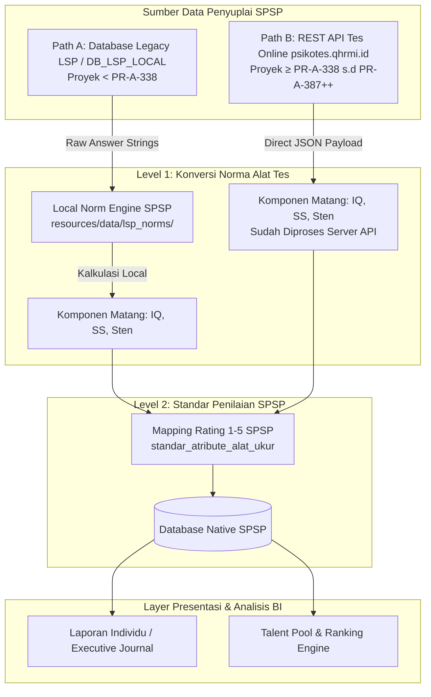

# 🏛️ Arsitektur Fondasi & Dual-Path Data Ingestion SPSP

- **Sistem**: Sistem Pemetaan & Statistik Psikologi (SPSP)
- **Tipe Sistem**: Business Intelligence (BI) & Analytical System
- **Terakhir Diperbarui**: 10 Agustus 2026

---

> [!IMPORTANT]
> **Prinsip Dasar SPSP**:
> SPSP **bukanlah sistem OLTP/CRUD** tempat pengguna meng-input jawaban tes satu per satu. SPSP adalah **sistem Business Intelligence (BI) & Analitik** yang mengagregasi, menganalisis, dan memvisualisasikan data hasil asesmen psikometri dari sumber data eksternal untuk kebutuhan pemetaan talenta, pemeringkatan (*ranking*), dan analisis *what-if*.

---

## 🌐 1. Arsitektur Dual-Path Data Ingestion

SPSP menerima data hasil ujian dan wawancara dari **dua pintu masuk (Dual-Path Data Ingestion)** utama yang terpisah berdasarkan era pelaksanaan proyek:



---

## 🔀 2. Spesifikasi Rinci Jalur Ingestion

### A. Jalur A: Legacy Database LSP (`DB_LSP_LOCAL`)
* **Cakupan Proyek**: Seluruh proyek asesmen historis lama sebelum gelombang API baru (**Kode Proyek `< PR-A-338`**).
* **Sumber Data**: Tabel MySQL database LSP (`peserta_produksi`, `ujian_peserta_produksi`, `rekapmmpi_p3kkjg`, `hasil_aspek_yang_digali`, `hasil_rekomendasi`).
* **Karakteristik Data Mentah**: Tabel `ujian_peserta_produksi` pada DB LSP hanya menyimpan string jawaban/skor mentah (misal IST: `"9,12,7,7,5,4,8,3,16"`). Komponen hasil matang **tidak disimpan di database LSP**.
* **Kebutuhan Engine**: Membutuhkan **Local Norm Engine SPSP** ([`LspNormEngineService.php`](file:///c:/laragon/www/spsp_new/app/Services/Lsp/LspNormEngineService.php)) yang memuat 5 file norma resmi pada [`resources/data/lsp_norms/`](file:///c:/laragon/www/spsp_new/resources/data/lsp_norms/):
  1. `ist.json` — Konversi 9 Subtest IST $\rightarrow$ Standard Score (SS) & Total IQ.
  2. `kostik.json` — Konversi 20 Faktor Kepribadian Kerja PAPI Kostik.
  3. `personality.json` — Konversi Sten Score 16PF (17 faktor) + Koreksi Motivasi Manipulasi (MD).
  4. `cfit3a.json` — Konversi Raw Score CFIT 3A $\rightarrow$ IQ CFIT.
  5. `cfit3b.json` — Konversi Raw Score CFIT 3B $\rightarrow$ IQ CFIT.

---

### B. Jalur B: REST API Tes Online Baru (`psikotes.qhrmi.id`)
* **Cakupan Proyek**: Seluruh proyek asesmen baru (**Kode Proyek `≥ PR-A-338`**, misalnya `PR-A-338` s.d `PR-A-387` dan seterusnya).
* **Sumber Data**: Endpoint REST API HTTP Client (`/api/ambil_semua`) disuplay via [`QuantumApiClient.php`](file:///c:/laragon/www/spsp_new/app/Services/Api/QuantumApiClient.php).
* **Keamanan Kredensial**: Endpoint URL & API Key dikonfigurasi secara aman melalui environment variables di `.env` (`QUANTUM_API_BASE_URL` & `QUANTUM_API_KEY`).
* **Karakteristik Data**: Backend server `psikotes.qhrmi.id` **sudah melakukan perhitungan norma psikometri langsung di servernya**. Payload JSON API sudah mengembalikan komponen hasil matang secara utuh:
  * IST (`A.5`): Mengembalikan `"iq": "91"`, `"hasil_kategori": "Rata-rata"`, dan `"label_values"` (SS per subtest: `SE`, `WA`, `AN`, `GE`, `ME`, `RA`, `ZR`, `FA`, `WU`).
  * 16PF (`B.2`): Mengembalikan `"MDStenScore"`, `"standart_final"`, dan `"nilaiAspek"` (Sten Score 1-10 yang terkoreksi MD).
* **Kebutuhan Engine**: **Bypass Local Norm Engine**. SPSP tidak perlu lagi menjalankan engine perhitungan norma ulang dari skor mentah, melainkan langsung membaca komponen matang dari API dan memetankannya ke skala rating 1–5 SPSP.

---

## ⚙️ 3. Pemisahan 2 Level Konversi Data

Untuk menjaga kejelasan arsitektur, pengolahan data pada SPSP memisahkan secara tegas dua tingkatan konversi:

```
[ LEVEL 1: Konversi Norma Alat Tes ]
Jawaban Mentah Peserta ────────(Diproses via Norm Engine / API)──────► Komponen Tes Matang (IQ, SS, Sten)
                                                                                  │
                                                                                  ▼
[ LEVEL 2: Standar Penilaian SPSP ]
Komponen Tes Matang ───────────(Diproses via DynamicStandardService)──► Rating Aspek Potensi & Kompetensi (Skala 1–5)
```

1. **Level 1 (Konversi Norma Alat Tes)**:
   * Mengubah respons/jawaban mentah peserta menjadi nilai standar instrumen psikometri (Standard Score IST, IQ, Sten Score 16PF, Skala 1–9 Kostik).
   * Ditangani oleh backend `psikotes.qhrmi.id` (Jalur B) atau oleh `LspNormEngineService` lokal (Jalur A).

2. **Level 2 (Standar Penilaian SPSP)**:
   * Mengubah komponen tes matang dari Level 1 menjadi **Rating Aspek Potensi & Kompetensi (Skala 1–5)** berdasarkan aturan *cut-off* pada tabel mapping `standar_atribute_alat_ukur` dan `standar_kompetensi_alat_ukur` sesuai level jabatan/formasi target.
   * Ditangani oleh engine SPSP dan disimpan ke tabel native `aspect_assessments` & `sub_aspect_assessments`.

---

## 🎯 4. Muara & Struktur Data Utama SPSP

Pada akhirnya, SPSP hanya menyimpan dan menyajikan data yang relevan untuk analitik BI:

```
Participant  ──►  Batch / Event  ──►  Position Formation  ──►  Aspect Assessments
                                                                 ├─ individual_rating (1–5)
                                                                 ├─ standard_rating (1–5)
                                                                 └─ gap_rating (individual - standard)
```

### Tabel Native Utama SPSP:
1. **`participants`**: Identitas peserta asesmen (Nama, NIP/No. Tes, Gender, Tgl Lahir, Pendidikan).
2. **`batches`**: Gelombang/Batch pelaksanaan proyek asesmen.
3. **`position_formations`**: Formasi jabatan target yang dilamar/diduduki peserta.
4. **`sub_aspect_assessments`**: Rating atribut sub-aspek potensi (1–5) beserta standar rating target.
5. **`aspect_assessments`**: Rekap rating aspek potensi & kompetensi (1–5), skor berbobot (Potensi 40% & Kompetensi 60%), dan GAP rating.
6. **`category_assessments`**: Aggregat total skor potensi dan total skor kompetensi.
7. **`final_assessments`**: Total skor akhir asesmen, persentase pencapaian, rekomendasi akhir (MS / MMS / TMS), dan metadata penandatangan TTD digital.
8. **`mmpi`**: Penampung hasil tes kejiwaan MMPI (Validitas, Stres, Psikogram, PQ, Klinik, Kesimpulan, dll).
9. **`interpretations`**: Teks naskah interpretasi psikologis per aspek/atribut.
10. **`test_results`**: Tabel *Single Source of Truth* penampung backup data mentah hasil ujian dengan penanda `source` (`'lsp_db'`, `'api'`, atau `'file_import'`).

---

## 🛠️ 5. Panduan Operasional Ingestion & Testing

```bash
# 1. Test Ingestion Jalur A (Proyek Legacy DB < PR-A-338) - Dry Run
php artisan lsp:test-report <username> PR-A-313

# 2. Synchronize Proyek Legacy DB < PR-A-338 ke Native SPSP
php artisan project:import PR-A-313

# 3. Test Ingestion Jalur B (Proyek API Baru ≥ PR-A-338) via REST API Client
php artisan test-results:import --fetch-api --event=1 --participant=15436

# 4. Automated Test Suite Verification
php artisan test --compact --filter=Lsp
```
