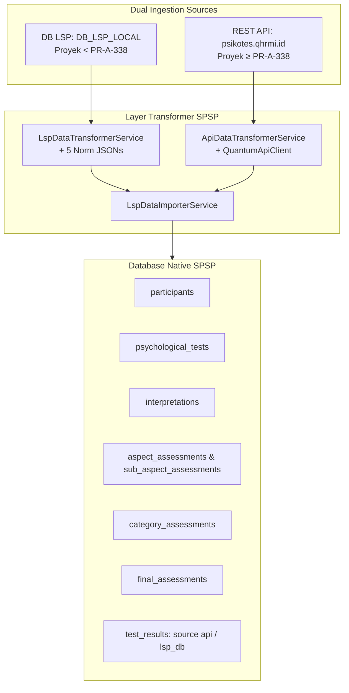

# 📖 Panduan Operasional Integrasi & Sinkronisasi Data LSP ke SPSP

[← Kembali ke Indeks Dokumentasi Integrasi LSP](./README.md)

- **Modul**: Integrasi LSP (Quantum HRMI) $\rightarrow$ Native SPSP System
- **File Service**:
  - [LspNormEngineService.php](file:///c:/laragon/www/spsp_new/app/Services/Lsp/LspNormEngineService.php) (Engine Perhitungan Norma Psikometri)
  - [LspDataTransformerService.php](file:///c:/laragon/www/spsp_new/app/Services/Lsp/LspDataTransformerService.php) (Transformer Data Impor LSP DB - Jalur A)
  - [ApiDataTransformerService.php](file:///c:/laragon/www/spsp_new/app/Services/Api/ApiDataTransformerService.php) (Transformer Data API Online - Jalur B)
  - [LspDataImporterService.php](file:///c:/laragon/www/spsp_new/app/Services/Lsp/LspDataImporterService.php) (Core Importer & Router Dual-Path Ingestion)
  - [QuantumApiClient.php](file:///c:/laragon/www/spsp_new/app/Services/Api/QuantumApiClient.php) (Client REST API psikotes.qhrmi.id)
- **File Command**: `TestLspIndividualReport.php` & `ImportLspData.php`
- **Lokasi Norma**: `resources/data/lsp_norms/` (`ist.json`, `kostik.json`, `personality.json`, `cfit3a.json`, `cfit3b.json`)
- **Tanggal Pembaruan**: 11 Agustus 2026

---

> [!NOTE]
> **Ikhtisar Dual-Path Data Ingestion**:
> Modul integrasi bertugas mengimpor data proyek dengan memisahkan alur secara otomatis:
> - **Jalur A (`< PR-A-338`)**: Mengambil data dari koneksi database LSP (`DB_LSP_LOCAL`), mengolah norma psikometri via `LspNormEngineService` (5 file norma JSON), dan mentransformasi data via `LspDataTransformerService`.
> - **Jalur B (`≥ PR-A-338`)**: Mengambil data komponen matang langsung dari REST API `psikotes.qhrmi.id` via `ApiDataTransformerService` dengan me-bypass local norm engine.
> Kredensial API aman disimpan pada environment variables `.env` (`QUANTUM_API_BASE_URL` & `QUANTUM_API_KEY`).

---

## 🏗️ 1. Diagram Alur Data Pipeline



---

## 💻 2. Penggunaan Command Artisan CLI

> [!TIP]
> **Dua Command Utama**:
> 1. `lsp:test-report`: Menguji transformer tanpa menulis ke database SPSP (Read-Only Test).
> 2. `project:import`: Mengimpor & menyinkronkan data proyek (Jalur A vs Jalur B). *Note: `lsp:import` tetap berfungsi sebagai alias.*

### A. Uji Coba Transformer & Laporan Individu (Dry-Run)
Menguji kalkulasi norma & transformasi data peserta secara instan dan menampilkan DTO/tabel pada terminal tanpa menyimpan ke database SPSP:
```bash
php artisan lsp:test-report <username_peserta> <kode_proyek>
```

*Contoh*:
```bash
php artisan lsp:test-report bntn01-001 PR-A-313
```

---

### B. Impor / Sinkronisasi Data ke Database Native SPSP
Mengimpor data peserta dari database LSP (Jalur A) atau REST API (Jalur B) dan menyinkronkannya ke tabel-tabel native SPSP:

```bash
# 1. Impor seluruh peserta dalam 1 proyek (Otomatis mendeteksi Jalur A vs Jalur B)
php artisan project:import <kode_proyek>

# 2. Impor spesifik 1 username peserta saja
php artisan project:import <kode_proyek> --username=<username_peserta>

# 3. Impor dengan menentukan ID Instansi SPSP spesifik
php artisan project:import <kode_proyek> --institution=<institution_id>
```

*Contoh*:
```bash
# Impor Jalur A (DB LSP Legacy < PR-A-338)
php artisan project:import PR-A-313 --username=bntn01-001 --institution=1

# Impor Jalur B (API psikotes.qhrmi.id >= PR-A-338)
php artisan project:import PR-A-338
```

---

## 🧪 3. Eksekusi Automated Test Suite

Untuk memastikan seluruh pengujian integrasi LSP berjalan tanpa error dan validasi norma 100% presisi:

| Test Target | Perintah Artisan Test | Status Assertions |
| :--- | :--- | :-: |
| **Seluruh Integrasi LSP** | `php artisan test --compact --filter=Lsp` | 🟢 **Passed** |
| **Dual-Path Ingestion** | `php artisan test --compact --filter=DualPathIngestionTest` | 🟢 **Passed (10 Assertions)** |
| **LspNormEngineService** | `php artisan test --compact --filter=LspNormEngineServiceTest` | 🟢 **Passed** |
| **LspDataTransformerService** | `php artisan test --compact --filter=LspIndividualReportServiceTest` | 🟢 **Passed** |
| **LspDataImporterService** | `php artisan test --compact --filter=LspDataImporterServiceTest` | 🟢 **Passed** |

---

## 📁 4. Lokasi & Struktur File Norma JSON (Jalur A)

File norma psikometri disimpan pada direktori:
`resources/data/lsp_norms/`

| Nama File Norma | Deskripsi & Kegunaan |
| :--- | :--- |
| **`ist.json`** | Norma konversi 9 subtest IST & kalkulasi total IQ berdasarkan tingkat pendidikan dan norma usia. |
| **`kostik.json`** | Norma konversi 20 faktor kepribadian kerja PAPI Kostik. |
| **`personality.json`** | Norma konversi Sten Score (1–10) 16PF dengan penyesuaian koreksi Motivasi Manipulasi (MD). |
| **`cfit3a.json`** | Norma konversi IQ alat tes CFIT 3A. |
| **`cfit3b.json`** | Norma konversi IQ alat tes CFIT 3B. |
