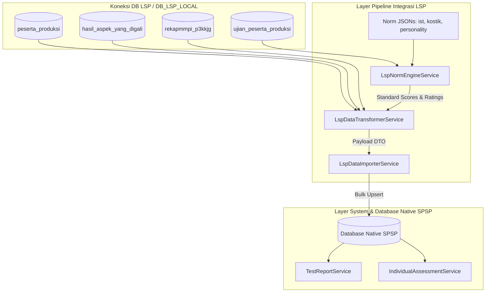

# 📑 LSP Integration & Legacy Data Synchronization — Documentation Index

Selamat datang di indeks dokumentasi **LSP Integration & Legacy Data Synchronization** pada Sistem Pemetaan & Statistik Psikologi (SPSP).

Modul ini bertanggung jawab untuk melakukan ekstraksi, transformasi norma psikometri, dan sinkronisasi data historis/real-time dari clone database LSP (Quantum HRMI / CodeIgniter 3 legacy) ke skema database native SPSP.

---

> [!NOTE]
> **Catatan Kedinamisan & Arsitektur Multi-Proyek**:
> Seluruh *pipeline* integrasi LSP beroperasi secara **100% dinamis dan generic** berbasis variabel proyek (`$kodeProyek`) dan nama pengguna (`$username`). Modul ini tahan terhadap variasi data legacy, mendukung berbagai instansi/proyek tanpa perubahan *source code*, serta terisolasi dari *error crash* data historis.

---

## 📚 Struktur Dokumentasi Integrasi LSP

Dokumentasi Integrasi LSP terbagi ke dalam 6 dokumen spesifikasi mendalam:

| No | Dokumen Spesifikasi | Deskripsi & Cakupan Utama | Status Pipeline |
| :-: | :--- | :--- | :-: |
| **01** | **[01_LEGACY_VIEW_ANALYSIS.md](./01_LEGACY_VIEW_ANALYSIS.md)** | Pemetaan lengkap view legacy `report_individu_p3k_kjg_2025.php` dan 23 tabel database LSP, norma IST/Kostik/16PF, MMPI, serta formula kelulusan (MS/MMS/TMS). | ✅ **DOCUMENTED** |
| **02** | **[02_DATA_MAPPING_ANALYSIS.md](./02_DATA_MAPPING_ANALYSIS.md)** | Analisis komparatif data CI3 legacy vs skema database SPSP (90% direct match & 10% data kualitatif/wawancara asesor). | ✅ **DOCUMENTED** |
| **03** | **[03_LSP_INTEGRATION_GUIDE.md](./03_LSP_INTEGRATION_GUIDE.md)** | Panduan operasional integrasi, eksekusi Artisan CLI (`lsp:test-report` & `lsp:import`), pengujian otomatis (`php artisan test`), dan lokasi norma JSON. | ✅ **DOCUMENTED** |
| **04** | **[04_DYNAMIC_MULTI_PROJECT_SUPPORT.md](./04_DYNAMIC_MULTI_PROJECT_SUPPORT.md)** | Arsitektur integrasi multi-proyek dinamis dan pemetaan rinci 17 tabel database LSP ke 7 tabel native SPSP. | ✅ **DOCUMENTED** |
| **05** | **[05_FALLBACK_AND_SAFETY_MECHANISMS.md](./05_FALLBACK_AND_SAFETY_MECHANISMS.md)** | Spesifikasi lengkap matriks *fallback* data mentah, pembatasan *error*, dan mekanisme isolasi transaksi impor 100-chunk. | ✅ **DOCUMENTED** |
| **06** | **[06_LSP_SERVICES_ARCHITECTURE.md](./06_LSP_SERVICES_ARCHITECTURE.md)** | Arsitektur multi-service SRP (`LspNormEngineService`, `LspDataTransformerService`, `LspDataImporterService`, `TestReportService`, `IndividualAssessmentService`). | ✅ **DOCUMENTED** |

---

## 🏗️ Ringkasan Arsitektur Service Pipeline

Integrasi LSP menerapkan arsitektur *Single Responsibility Principle* (SRP) yang memisahkan tugas pengolahan norma, ekstraksi data legacy, dan sinkronisasi database SPSP:



---

## ⚡ Panduan Ringkas Operasional (Quick Start)

> [!TIP]
> **Perintah CLI Utama Integrasi**:
> ```bash
> # 1. Uji coba kalkulasi norma & transformer 1 peserta (Tanpa simpan DB SPSP)
> php artisan lsp:test-report <username_peserta> <kode_proyek>
> 
> # 2. Impor / sinkronisasi seluruh peserta dalam 1 proyek LSP ke SPSP
> php artisan lsp:import <kode_proyek>
> 
> # 3. Impor single peserta spesifik dari proyek LSP
> php artisan lsp:import <kode_proyek> --username=<username_peserta>
> 
> # 4. Menjalankan automated test suite integrasi LSP
> php artisan test --compact --filter=Lsp
> ```

---

## 🎯 Prinsip Utama Integrasi

1. **SRP Multi-Service Architecture**: Memisahkan kalkulasi norma psikometri ([LspNormEngineService.php](file:///c:/laragon/www/spsp_new/app/Services/Lsp/LspNormEngineService.php)), transformasi data ([LspDataTransformerService.php](file:///c:/laragon/www/spsp_new/app/Services/Lsp/LspDataTransformerService.php)), dan impor native ([LspDataImporterService.php](file:///c:/laragon/www/spsp_new/app/Services/Lsp/LspDataImporterService.php)).
2. **Dynamic Project & User Scoping**: Setiap query database tersambung dengan pengisolasian `kode_proyek` dan `username` tanpa hardcoding instansi.
3. **Fault-Tolerant & Error Isolation**: Impor dilakukan dengan transaksi 100-chunk. Jika ditemukan data korup, sistem melakukan *rollback chunk* dan mengisolasinya ke per-peserta sehingga peserta sehat lainnya tetap berhasil terimpor.
4. **Data Immutability**: Menjaga data hasil rating individual dan tes peserta bersifat historis (immutable) sesuai kondisi asesmen.
