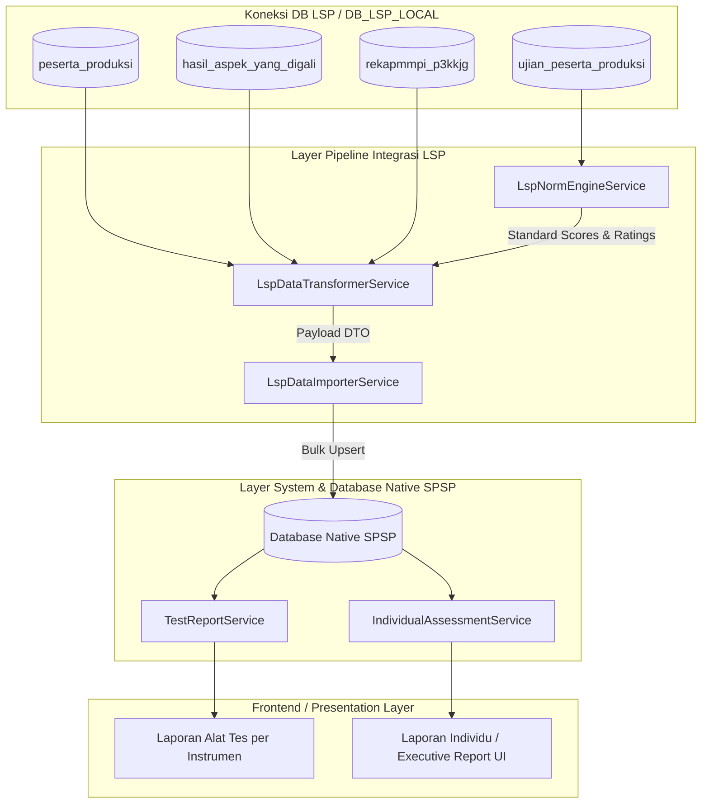

# 🏗️ Arsitektur & Spesifikasi Service Integrasi LSP

[← Kembali ke Indeks Dokumentasi Integrasi LSP](./README.md)

- **Modul**: Integrasi Database LSP (Quantum HRMI) $\rightarrow$ Native SPSP System
- **File Dokumentasi**: [docs/lsp_integration/SERVICES_ARCHITECTURE.md](./SERVICES_ARCHITECTURE.md)
- **Tanggal Pembaruan**: 29 Juli 2026

---

> [!NOTE]
> **Ikhtisar Arsitektur Multi-Service**:
> Modul integrasi LSP menerapkan prinsip **Single Responsibility Principle (SRP)** dengan memisahkan tugas pipeline data ke dalam service-service modular. Setiap service bertanggung jawab atas 1 tahap spesifik (Norm Calculation, Data Transformation, Importer, dan Presentation).

---

## 🏛️ 1. Diagram Alur Service Architecture

---

## 🧩 2. Rincian & Peran Masing-Masing Service

### 1. `LspNormEngineService`
- **Lokasi File**: [LspNormEngineService.php](file:///c:/laragon/www/spsp_new/app/Services/Lsp/LspNormEngineService.php)
- **Tanggung Jawab Utama**: Murni mengolah konversi norma psikometri dari skor mentah (*raw score*) ke *standard score*, IQ, Sten score, dan rating aspek/atribut (skala 1–5).
- **Independensi**: Tidak tergantung pada database SPSP, sehingga *reusable* untuk berbagai kebutuhan pengolahan norma.
- **Method Utama**:
  - `loadNormData()`: Pemuatan in-memory caching untuk `ist.json`, `kostik.json`, `personality.json`.
  - `processIstNorms($rawIst, $pendidikan, $usia)`: Mengonversi 9 subtest IST ke SW (Standard Score) & IQ.
  - `processKostikNorms($rawKostik)`: Mengolah 20 faktor kepribadian PAPI Kostik.
  - `process16pfNorms($rawPersonality, $usia)`: Mengonversi 16PF ke Sten Score (1–10) + koreksi MD.
  - `calculateProfilPotensiCached(...)`: Menghitung rating aspek potensi (skala 1–5) dari tabel `standar_atribute_alat_ukur`.

---

### 2. `LspDataTransformerService` (Jalur A - Legacy DB)
- **Lokasi File**: [LspDataTransformerService.php](file:///c:/laragon/www/spsp_new/app/Services/Lsp/LspDataTransformerService.php)
- **Tanggung Jawab Utama**: Pipeline ekstraksi dan transformasi data mentah dari koneksi DB LSP (`DB_LSP_LOCAL`) untuk proyek legacy (`< PR-A-338`) menjadi struktur DTO terstandar.
- **Method Utama**:
  - `getIndividualReport($username, $kodeProyek)`: Membaca & mentransformasi 1 peserta.
  - `getBatchIndividualReports(array $usernames, string $kodeProyek)`: Mengolah sekelompok (*batch/chunk*) peserta sekaligus dengan optimasi query N+1 hingga 95%.

---

### 3. `ApiDataTransformerService` (Jalur B - REST API Online)
- **Lokasi File**: [ApiDataTransformerService.php](file:///c:/laragon/www/spsp_new/app/Services/Api/ApiDataTransformerService.php)
- **Tanggung Jawab Utama**: Transformer data khusus proyek baru (`≥ PR-A-338`) yang membaca payload JSON dari REST API `psikotes.qhrmi.id` via `QuantumApiClient`.
- **Fitur Utama**: Mengekstrak komponen matang (IQ, SS IST, Sten 16PF terkoreksi MD, MMPI 9 domain) secara langsung tanpa melalui local norm engine, lalu mentransformantikannya menjadi DTO SPSP.
- **Method Utama**:
  - `getProjectIndividualReports($kodeProyek, $singleUsername)`: Membaca & mentransformasi seluruh peserta dalam satu proyek dari API `psikotes.qhrmi.id`.

---

### 4. `LspDataImporterService`
- **Lokasi File**: [LspDataImporterService.php](file:///c:/laragon/www/spsp_new/app/Services/Lsp/LspDataImporterService.php)
- **Tanggung Jawab Utama**: Core Importer & Router Dual-Path Ingestion yang memasukkan payload DTO hasil kalkulasi transformer (Jalur A atau Jalur B) ke tabel-tabel native SPSP.
- **Fitur Utama**:
  - `isLegacyProject($kodeProyek)`: Deteksi alur Ingest (Jalur A `< PR-A-338` vs Jalur B `≥ PR-A-338`).
  - *Idempotent upsert*, isolasi transaksi per peserta, dan *registry in-memory caching* untuk master data.

---

### 5. `TestReportService`
- **Lokasi File**: [TestReportService.php](file:///c:/laragon/www/spsp_new/app/Services/TestReportService.php)
- **Tanggung Jawab Utama**: Fondasi Service penyedia data **Laporan Alat Tes per Instrumen** untuk disajikan di UI SPSP.

---

### 6. `IndividualAssessmentService` (Core SPSP Existing)
- **Lokasi File**: [IndividualAssessmentService.php](file:///c:/laragon/www/spsp_new/app/Services/IndividualAssessmentService.php)
- **Tanggung Jawab Utama**: Service resmi SPSP yang menjadi *Single Source of Truth* penyajian **Laporan Individu / Executive Report** di UI SPSP setelah data diimpor.

---

## 📊 3. Matriks Perbandingan & Alur Penggunaan

| Pertanyaan / Pertimbangan | Service yang Bertanggung Jawab | Status Service |
| :--- | :--- | :-: |
| *Di mana rumus konversi IST / IQ / PAPI Kostik dihitung (Jalur A)?* | `LspNormEngineService` | 🟢 **Active Calculation** |
| *Service apa yang membaca DB LSP lama saat impor (< PR-A-338)?* | `LspDataTransformerService` | 🟢 **Active Transformer (Jalur A)** |
| *Service apa yang membaca REST API psikotes.qhrmi.id (≥ PR-A-338)?* | `ApiDataTransformerService` & `QuantumApiClient` | 🟢 **Active Transformer (Jalur B)** |
| *Service apa yang memandu alur dan menulis data ke tabel native SPSP?* | `LspDataImporterService` | 🟢 **Active Core Importer** |
| *Di mana kredensial API disimpan?* | Environment Variables `.env` (`QUANTUM_API_BASE_URL` & `QUANTUM_API_KEY`) | 🟢 **Secure Environment** |
| *Service apa yang menyajikan Laporan Alat Tes di UI SPSP?* | `TestReportService` | 🟢 **Active Native UI** |
| *Service apa yang menyajikan Laporan Individu di UI SPSP?* | `IndividualAssessmentService` | 🟢 **Active Executive UI** |

---

## 🛠️ 4. Panduan Ekstensi (Extensibility Guide)

> [!TIP]
> **Menambahkan Alat Tes atau Norma Baru**:
> 1. Tambahkan file norma JSON baru di `resources/data/lsp_norms/` (jika berupa file norma).
> 2. Tambahkan method konversi baru pada [LspNormEngineService.php](file:///c:/laragon/www/spsp_new/app/Services/Lsp/LspNormEngineService.php).
> 3. Panggil method konversi tersebut di [LspDataTransformerService.php](file:///c:/laragon/www/spsp_new/app/Services/Lsp/LspDataTransformerService.php) (untuk integrasi LSP) atau [TestReportService.php](file:///c:/laragon/www/spsp_new/app/Services/TestReportService.php) (untuk alat tes native SPSP).
